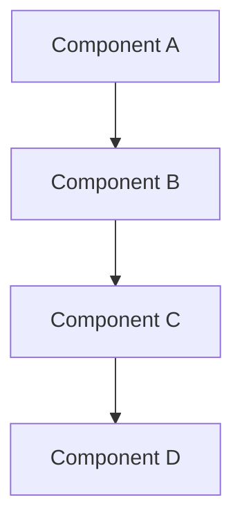
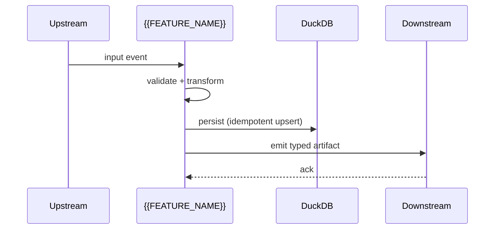

# Design: {{FEATURE_NAME}}

<!--
This template translates approved requirements into a technical plan.
Replace every {{...}} placeholder. Delete italic guidance comments
before sharing.
-->

## Document Information

- **Feature Name**: {{FEATURE_NAME}}
- **Version**: 0.1
- **Date**: {{DATE}}
- **Author**: {{AUTHOR}}
- **Reviewers**: {{REVIEWERS}}
- **Related Documents**:
  - Requirements: `./requirements.md`
  - Tasks: `./tasks.md`

## Overview

*Two paragraphs. What is the design approach, and how does it satisfy
the requirements? Cite the requirement numbers it covers
(e.g. "satisfies Requirement 1, 2.1, 3").*

### Design Goals

- *Goal 1 — usually traces to a specific requirement*
- *Goal 2*
- *Goal 3*

### Key Design Decisions

- **{{DECISION_TITLE}}** — *what we chose, what we considered, why
  we chose it.* Record any decision that future reviewers might
  question. Mirror this into `DECISIONS.md` if it shifts an
  architectural choice (per `architecture.mdc`).
- **{{DECISION_TITLE}}** — ...

---

## Architecture

### System Context

*Where this feature sits in the pipeline. Reference the canonical
ordering: `data → research → strategies → risk → execution →
monitoring`. Indicate which stage(s) the feature lives in and what it
imports vs. exposes.*

```mermaid
graph LR
    A[Upstream module] --> B[{{FEATURE_NAME}}]
    B --> C[Downstream module]
    D[External system / exchange] --> B
```

### High-Level Architecture

*One mermaid diagram showing the major internal components and how
they connect. Required when the feature spans more than two modules.*



### Technology Stack

| Layer | Technology | Rationale |
|---------------|----------------------|-------------------------------|
| Data | DuckDB / Parquet | per `architecture.mdc` |
| Numerics | pandas / numpy | f64 for vector math, Decimal for money |
| Validation | pydantic / pandera | per `coding-standards.mdc` |
| Async I/O | httpx + tenacity | per `coding-standards.mdc` |
| Logging | structlog | per `monitoring/logger.py` |
| Frontend | Next.js + TS | per `AGENTS.md` topology |

*Add or remove rows for the specific feature.*

---

## Components and Interfaces

### Component 1: {{COMPONENT_NAME}}

**Purpose:** *one sentence.*

**Module path:** `path/to/module.py`

**Responsibilities:**

- *bullet 1*
- *bullet 2*

**Interfaces:**

- **Input:** *typed signature, e.g.
  `process(df: pd.DataFrame, cfg: FeatureConfig) -> pd.DataFrame`*
- **Output:** *what is returned and its schema (column names, dtypes)*
- **Dependencies:** *modules / configs / env vars it requires*

**Implementation notes:**

- *Key implementation detail.*
- *Pitfalls to avoid (look-ahead, leakage, blocking calls in async).*

**Satisfies:** Requirement 1, 2.1

---

### Component 2: {{COMPONENT_NAME}}

*Repeat the block above per component.*

---

## Data Models

*Use pydantic models or pandera schemas. Show types, units, and
timezone-awareness explicitly.*

### {{MODEL_NAME}}

```python
from datetime import datetime
from decimal import Decimal
from pydantic import BaseModel, Field


class {{ModelName}}(BaseModel):
    id: str
    timestamp: datetime  # tz-aware UTC, per coding-standards.mdc
    symbol: str = Field(min_length=1)
    price: Decimal       # money / prices: Decimal
    size: float          # f64 for vectorized math
    side: str            # one of: "buy" | "sell"
```

**Validation rules:**

- *e.g. `timestamp.tzinfo is not None`*
- *e.g. `price > 0`, `size > 0`*

**Relationships:**

- *e.g. one Order has many Fills*

---

### Data Flow



---

## API Design

*Include this section if the feature exposes any interface — REST,
CLI, websocket, internal Python, queue topic. Drop sections that
don't apply.*

### REST endpoint: {{METHOD}} {{PATH}}

**Request:**

```json
{
  "field1": "string",
  "field2": 0,
  "field3": true
}
```

**Response (200):**

```json
{
  "id": "uuid",
  "field1": "string",
  "createdAt": "2026-01-01T00:00:00Z"
}
```

**Error responses:** 400 (validation) | 401 (auth) | 404 | 500.

**Validation:** *zod / pydantic / pandera reference.*

### CLI: `python -m {{MODULE}}.run`

| Flag | Type | Default | Description |
|---------------------|----------|--------------|-----------------------|
| `--symbol` | str | required | trading symbol |
| `--timeframe` | str | `1h` | OHLCV timeframe |
| `--days` | int | `365` | history depth |

### Internal Python API

*Public functions / classes that downstream modules import.*

---

## Error Handling

| Category | Exception | When raised | Caller action |
|---------------|------------------------|---------------------------|----------------------------|
| Validation | `pydantic.ValidationError` | bad input shape | retry with corrected data |
| Risk reject | `risk.errors.RiskCheckRejected` | order violates limits | log + skip |
| Exchange err | `execution.errors.BrokerError` | API failure | tenacity backoff |
| Drift | `monitoring.errors.DriftDetected` | live ≠ backtest | trigger kill-switch |

Module-specific exceptions live in `<module>/errors.py`
(per `coding-standards.mdc`).

---

## Testing Strategy

| Layer | Tooling | Coverage target |
|-------------------|--------------------|-------------------------|
| Unit | pytest | >= 80% on new code |
| Integration | pytest + fixtures | all public APIs |
| Property | hypothesis | numeric invariants |
| Determinism | pytest -m det | identical outputs |
| E2E / smoke | pytest tests/e2e | one full pipeline run |
| Backtest smoke | `backtests/run.py` | one realistic config |

**Critical paths that require dual happy + reject tests** (per
`coding-standards.mdc`): every check in `risk/`, every order path
in `execution/`.

---

## Security Considerations

*Address each item even if briefly. Tie back to `security.mdc`.*

- **Secrets:** which env vars / configs / Docker secrets does the
  feature read? How are they redacted from logs?
- **Risk path:** does any code path produce an order? If yes,
  confirm it routes through `risk.engine.RiskEngine.check_and_size`.
- **LLM isolation:** does any module under `execution/` import
  (transitively) anything in `research.llm`? It must not.
- **Network:** which hostnames are pinned? What is the timeout +
  retry policy?

---

## Performance Considerations

- **Expected load:** *e.g. 1k events/sec, 1M rows in memory.*
- **Latency budget:** *p50 / p95 / p99 targets.*
- **Throughput target:** *requests/sec or rows/sec.*
- **Memory budget:** *MB or GB ceiling.*
- **Optimizations applied:** *vectorization, caching, batch size,
  index choice.*
- **Monitoring hooks:** *which gauges / counters / histograms emit
  per requirement.*

---

## Deployment and Operations

- **Containers:** which container in `docker-compose.yml` will host
  this code? (`backend`, `trading-engine`, `frontend`?)
- **Configs:** new `configs/*.yaml` keys introduced.
- **Migrations:** any DuckDB / DB schema changes.
- **Rollback:** how to disable the feature without redeploying.
- **Health check / readiness probe:** what indicates the feature
  is healthy in `monitoring/`.

---

## Migration and Compatibility

- **Backward compatibility:** API versioning, schema evolution.
- **Data migration:** existing rows that need transformation.
- **Feature flag:** is the feature gated by a config flag during
  rollout?

---

## Open Questions

*Things you couldn't decide during design and want flagged for the
user before Phase 3.*

- [ ] *question 1*
- [ ] *question 2*

---

## Design Review Checklist

Run before marking Phase 2 approved:

### Architecture

- [ ] Fits the one-way pipeline (`data → research → strategies →
      risk → execution → monitoring`).
- [ ] Imports respect the rule from `architecture.mdc`.
- [ ] Components have single responsibilities and explicit
      interfaces.

### Requirements Alignment

- [ ] Every requirement in `requirements.md` is addressed by at
      least one component.
- [ ] Non-functional requirements (perf, reliability, security,
      observability, determinism) have a concrete plan.

### Project Rules

- [ ] All money / price fields use `Decimal`; all timestamps are
      tz-aware UTC (`coding-standards.mdc`).
- [ ] No bare `except:`. Module-specific exceptions defined.
- [ ] No `print` in library code; structured logging via
      `monitoring.logger.get_logger(__name__)`.
- [ ] Risk path is non-bypassable.
- [ ] No LLM imports under `execution/`.

### Implementation Readiness

- [ ] Data models are typed and validated.
- [ ] APIs (REST / CLI / internal) are fully specified.
- [ ] Error handling covers expected failure modes.
- [ ] Testing strategy is concrete and complete.

---

> **Next phase:** when this document is approved, fill in
> `./tasks.md` from `.cursor/spec-templates/tasks-template.md`.
