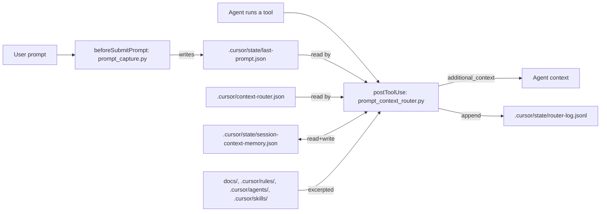
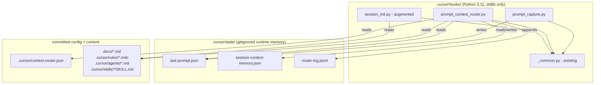
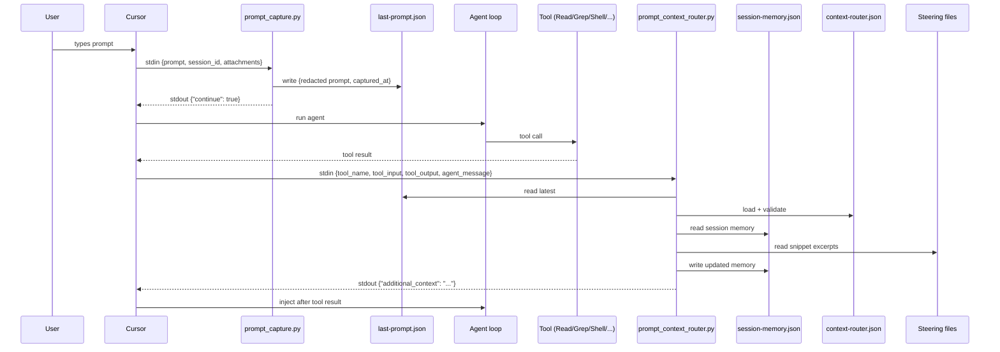

# Design: prompt-context-router

## Document Information

- **Feature Name**: prompt-context-router
- **Version**: 0.1
- **Date**: 2026-04-25
- **Author**: Brandon
- **Reviewers**: trading-lab maintainers
- **Related Documents**:
  - Requirements: `./requirements.md`
  - Tasks: `./tasks.md`
  - Cursor hooks reference: <https://cursor.com/docs/agent/hooks>

## Overview

The prompt-context-router is a pair of Cursor hook scripts plus a JSON
routing table that injects targeted excerpts of trading-lab steering
files (`docs/`, `.cursor/rules/`, `.cursor/agents/`,
`.cursor/skills/`) into the agent's context based on (a) what the user
just asked and (b) which tools the agent is using. Cursor's
`postToolUse` hook is the only per-turn event that supports
`additional_context` injection (verified against the official docs);
`beforeSubmitPrompt` cannot inject context but can persist the prompt
to disk for the post-tool router to read. We exploit both: a small
prompt-capture hook records the prompt, and the router reads it when
the agent's first tool call fires.

This satisfies Requirements 1 (prompt capture), 2 (post-tool routing),
3 (per-session deduplication), 4 (per-turn budget), 5 (data-driven
routing), 6 (augmented session-start), 7 (fail-open), 8
(observability), and 9 (operator README), and keeps the implementation
to two stdlib-only Python files plus one JSON routing table — well
under the 400 LOC ceiling.

### Design Goals

- **Deterministic and offline-testable.** Both hooks are pure
  stdin/stdout JSON pipes with no network and no LLM. Unit tests
  exercise them by feeding crafted JSON. (Requirements 7, NFR-Determinism.)
- **Fail-open by construction.** Every code path catches
  `BaseException`, writes `{}` to stdout, and exits 0.
  (Requirement 7.)
- **Data over code.** Adding a new topic is a JSON edit, not a Python
  change. (Requirement 5.)
- **Bounded blast radius.** Hard char budget per turn, per-snippet
  cap, deduplication memory, log truncation, env-var kill switch.
  (Requirements 3, 4, 8, 9.)
- **No new dependencies.** Stdlib + existing `_common.py` helpers.
  (NFR-Maintainability.)

### Key Design Decisions

- **Two-hook hybrid** (`beforeSubmitPrompt` + `postToolUse`). The
  Cursor docs ([Hook events](https://cursor.com/docs/agent/hooks))
  show that `beforeSubmitPrompt` returns
  `{ continue: bool, user_message?: string }` only — no
  context-injection field. `postToolUse` does support
  `additional_context`. We split: capture in the prompt hook, inject
  in the post-tool hook. Considered alternatives:
  - Inject only on `postToolUse` from tool-call signal alone — loses
    the user's stated intent.
  - Inject from `sessionStart` only — already exists; doesn't react
    to the conversation.
  - Use `preToolUse.agent_message` — only delivered on `deny`, not
    a viable injection channel.
- **Routing table at `.cursor/context-router.json` (committed),
  not `.cursor/state/`.** Routing rules are project knowledge; we
  want them version-controlled, code-reviewed, and shared with
  cloud agents. The `state/` dir holds runtime memory only.
- **Snippet excerpts via head + optional anchor.** v1 supports
  "first N chars of file" or "section under `## Header`". Heavier
  approaches (offset/length, jq-style queries, fuzzy match) are not
  needed for the eight v1 rules and would inflate the design.
- **Content-hash-based dedup invalidation.** Sha256 of the snippet
  text is stored in session memory; if the underlying file
  changes, the next match re-injects. Cheaper than file mtime,
  more accurate than rule id alone.
- **Fail-open everywhere; no `failClosed: true`.** A buggy router
  must never lock the user out of their own agent.
  (Per Cursor docs: omitting `failClosed` defaults to fail-open.)
- **No LLM**. Per `.cursor/rules/llm-usage.mdc` § Forbidden, the
  router is deterministic regex/glob matching. LLM-based routing
  could come later under a separate spec.
- **No imports from `risk/`, `execution/`, `research/`, `data/`,
  `strategies/`, `monitoring/`, `backend/`, or `frontend/`.** The
  router lives entirely under `.cursor/` and `tests/cursor_harness/`,
  preserving the one-way pipeline (`architecture.mdc`).

---

## Architecture

### System Context

The router lives outside the trading pipeline entirely. It is
agent-loop tooling under `.cursor/` and has no role in
`market_data → feature_engineering → … → execution → monitoring`.
It does not import anything from those packages and never observes
order flow.



### High-Level Architecture



### Technology Stack

| Layer | Technology | Rationale |
|---|---|---|
| Hook runtime | Python 3.11 stdlib | Existing convention in `.cursor/hooks/`; no new deps (NFR-Maintainability). |
| Hook IPC | JSON over stdin/stdout | Cursor hook contract. |
| Routing config | JSON | Editable without code changes; trivial to validate. |
| Persistence | Local filesystem (`.cursor/state/`) | No DB needed; bounded files; matches existing pattern. |
| Tests | pytest | Project default. Hooks are unit-testable as plain Python entry points. |

---

## Components and Interfaces

### Component 1: `prompt_capture.py` (beforeSubmitPrompt hook)

**Purpose:** Persist the user's most recent prompt so the post-tool
router can use it as a routing signal.

**Module path:** `.cursor/hooks/prompt_capture.py`

**Responsibilities:**

- Read JSON from stdin matching the documented `beforeSubmitPrompt`
  schema: `{ session_id?, prompt, attachments? }`.
- Redact obvious secret-like tokens via `_common.redact`.
- Truncate prompt to 8000 chars.
- Write `{ session_id, prompt, attachments, captured_at }` atomically
  to `.cursor/state/last-prompt.json`.
- Always emit `{"continue": true}` on stdout, exit 0.

**Interfaces:**

- **Input:** stdin JSON (Cursor schema for `beforeSubmitPrompt`).
- **Output:** stdout JSON `{"continue": true}`. Stderr lines on
  unexpected errors only.
- **Dependencies:** `_common.read_input`, `_common.redact`,
  `_common.PROJECT_DIR`, stdlib `json`, `pathlib`, `datetime`.

**Implementation notes:**

- Atomic write: write to `last-prompt.json.tmp`, then `os.replace`
  to `last-prompt.json`. Avoids the post-tool hook ever reading a
  half-written file.
- If `session_id` is missing, use `"unknown"`. Don't crash.
- All exceptions caught and swallowed at the top level
  (Requirement 7.3).
- Honour `TLAB_ROUTER_DISABLE`: when truthy, skip writing and
  return `{"continue": true}` immediately.

**Satisfies:** Requirements 1.1, 1.2, 1.3, 1.4, 1.5, 1.6, 7.

---

### Component 2: `prompt_context_router.py` (postToolUse hook)

**Purpose:** Inject relevant steering-file snippets into the agent's
context after each tool call, based on the user's prompt and the
tool call.

**Module path:** `.cursor/hooks/prompt_context_router.py`

**Responsibilities:**

- Load routing table from `.cursor/context-router.json`. Validate
  shape; on failure inject nothing and continue.
- Read last-prompt state (skipping if `captured_at` > 30 minutes
  old). Use mtime as a fallback freshness signal if `captured_at`
  is missing.
- Read post-tool input (`tool_name`, `tool_input`, `tool_output`).
- Match each rule's `match` block against (prompt, tool input
  string, tool name). Trigger keys (`prompt_regex`,
  `tool_input_regex`, `tool_output_regex`,
  `agent_message_regex`) are OR-combined: any one matching fires
  the rule. Entries within any single list-valued key are also
  OR-combined. `tool_name_in` is a filter (AND-ed with the trigger
  result): when present the current tool name must appear in the
  list. This OR-of-triggers semantics is what makes a rule like
  "risk-policy" fire from either a user question about risk or a
  tool call against `risk/engine.py`.
- For each matched rule: build snippets, dedup against per-session
  memory, apply per-snippet `max_chars` truncation, accumulate
  into a per-turn budget (default 3000 chars, override via
  `TLAB_ROUTER_BUDGET_CHARS`).
- Update per-session memory (prune entries older than 24 h,
  insert newly-injected snippets keyed by `(rule_id, path,
  anchor)` plus their content sha256).
- Append a JSONL audit record to
  `.cursor/state/router-log.jsonl` (truncate to last 5000 lines).
- Emit `{"additional_context": <text>}` on stdout if non-empty,
  else `{}`.

**Interfaces:**

- **Input:** stdin JSON (Cursor `postToolUse` schema):
  `{ tool_name, tool_input, tool_output, tool_use_id, cwd,
  duration?, model?, agent_message? }`.
- **Output:** stdout JSON `{"additional_context": "..."}` or `{}`.
- **Dependencies:** `_common`, stdlib `json`, `re`, `hashlib`,
  `pathlib`, `datetime`.

**Implementation notes:**

- The `tool_input` is a dict; we normalise it to a search string by
  joining stringified values (skipping fields whose name contains
  any `_common.SECRET_KEYS` token) before regex matching.
- The `tool_output` is documented as a string in the Cursor docs
  (e.g. `"{\"exitCode\":0,\"stdout\":\"All tests passed\"}"`); we
  match against the raw string.
- `agent_message` (the agent's narrative line that invoked the
  tool) is also matched if present — it often contains topical
  cues the prompt and tool call lack.
- `session_id` is taken from `last-prompt.json` (not from the
  postToolUse input — it isn't included in that schema).
- Snippet excerpts: an entry of the form
  `{path: "docs/RISK_POLICY.md", anchor: null, max_chars: 1200}`
  reads the head of the file. With `anchor: "## Limits"` it reads
  from that header to the next `## ` header (or end of file),
  capped at `max_chars`. Excess truncation appends `\n\n... [truncated]`.
- Atomic memory writes: same tmp-then-replace pattern.
- All exceptions caught at the top level; on any failure, write
  `{}` and exit 0.

**Satisfies:** Requirements 2, 3, 4, 5, 7, 8.

---

### Component 3: Augmented `session_init.py`

**Purpose:** Surface the existence of every steering file at session
start so the agent knows what to ask for.

**Module path:** `.cursor/hooks/session_init.py` (existing, modified)

**Responsibilities (added):**

- Walk `docs/*.md`, `.cursor/agents/*.md`, `.cursor/skills/*/SKILL.md`.
- For each file, extract the first H1 (`# Title`) or first non-empty
  line as a one-line title; fallback to the filename stem.
- Append a `## Steering files (read on demand)` section, listing
  `- relative/path.md — Title` per file.
- Append a `## How to invoke` section pointing at the
  `session-init` skill.
- Raise the existing `MAX_CONTEXT_CHARS` ceiling from 6000 to 8000.

**Interfaces:** unchanged hook contract (sessionStart input/output).

**Satisfies:** Requirement 6.

---

### Component 4: Routing table — `.cursor/context-router.json`

**Purpose:** The data-only definition of which patterns route which
snippets.

**Module path:** `.cursor/context-router.json`

**Schema (validated on load by `prompt_context_router.py`):**

```json
{
  "version": 1,
  "rules": [
    {
      "id": "string, unique",
      "priority": "integer, higher = more important",
      "description": "optional human-readable",
      "match": {
        "prompt_regex": ["regex"],
        "tool_input_regex": ["regex"],
        "tool_output_regex": ["regex"],
        "agent_message_regex": ["regex"],
        "tool_name_in": ["Read", "Grep", "Write", "StrReplace", "Shell", "..."]
      },
      "snippets": [
        {
          "path": "docs/RISK_POLICY.md",
          "anchor": null,
          "max_chars": 1200
        }
      ]
    }
  ]
}
```

Match semantics: trigger keys (`prompt_regex`, `tool_input_regex`,
`tool_output_regex`, `agent_message_regex`) are **OR-combined**
across keys — **any present trigger that matches fires the rule**.
Inside any single list-valued key, elements are also OR-combined.
`tool_name_in` is the only AND-style key: when present the current
tool name must appear in the list, but it does not by itself fire
a rule (a trigger must also match unless `tool_name_in` is the
only constraint and the agent calls a listed tool). Absent keys
are not constraints.

v1 ships **9 rules** (eight required by Requirement 5 + one
"workflow-discipline" reminder for `pytest`/`ruff`/`mypy` cues):

| id | trigger summary | injects |
|---|---|---|
| `risk-policy` | prompt: risk / kill switch / position size; tool input matches `risk/engine.py`, `configs/risk.yaml`, `risk/sizing.py` | `docs/RISK_POLICY.md` (head 1200) + `.cursor/rules/risk-management.mdc` (head 800) |
| `evaluation-gates` | prompt: backtest / walk-forward / purged / embargo / Sharpe / deflated; tool input under `backtests/`, `research/cv.py` | `docs/EVALUATION.md` (head 1500) + `.cursor/rules/backtesting.mdc` (head 800) |
| `signal-research` | prompt: signal / feature / look-ahead / IC / hypothesis; tool input under `research/features/`, `research/models/`, `SIGNALS.md` | `SIGNALS.md` (head 1000) + `.cursor/agents/signal.md` (head 1000) + `.cursor/rules/research-workflow.mdc` (head 800) |
| `data-ingest` | prompt: binance / coinbase / ccxt / ohlcv / ingest; tool input under `data/` | `docs/DATA_MODEL.md` (head 1200) + `.cursor/agents/research.md` (head 800) |
| `frontend-dashboard` | prompt: frontend / dashboard / Next.js; tool input under `frontend/` | `docs/UI_REQUIREMENTS.md` (head 1200) + `.cursor/rules/frontend.mdc` (head 600) |
| `infra-deployment` | prompt: docker / compose / container / deploy; tool input under `Dockerfile`, `docker-compose*.yml` | `docs/INFRASTRUCTURE.md` (head 1200) + `.cursor/rules/docker.mdc` (head 600) |
| `llm-isolation` | prompt: ollama / llm / prompt; tool input under `research/llm/` or any path mentioning `llm` | `.cursor/rules/llm-usage.mdc` (full) + AGENTS.md "LLM usage policy" anchor |
| `spec-workflow` | prompt: spec / requirements / design.md / tasks.md / kiro; tool input under `specs/` | `.cursor/rules/spec-sessions.mdc` (head 1200) |
| `workflow-discipline` | prompt or tool input mentions `pytest` / `ruff` / `mypy` / "definition of done" | `.cursor/rules/workflow.mdc` (head 800) |

**Satisfies:** Requirements 5.1-5.5.

---

### Component 5: Operator README

**Purpose:** Human-readable doc for extending the routing table.

**Module path:** `.cursor/hooks/README.md`

**Contents:** dataflow diagram, routing-table schema, how to add a
rule, env-var overrides (`TLAB_ROUTER_BUDGET_CHARS`,
`TLAB_ROUTER_DISABLE`), debugging tips
(`router-log.jsonl`, `last-prompt.json`).

**Satisfies:** Requirement 9.

---

### Component 6: Test suite

**Purpose:** Unit + smoke coverage of all router behaviours.

**Module path:** `tests/cursor_harness/` (existing directory; new
files added alongside `test_hook_scripts.py`).

Files:

- `tests/cursor_harness/test_router_io.py` — atomic writes,
  malformed JSON read, append + truncate.
- `tests/cursor_harness/test_routing_table.py` — schema sanity for
  `.cursor/context-router.json`: unique ids, regex compilation,
  every snippet path exists in repo.
- `tests/cursor_harness/test_router_load.py` — missing /
  malformed / wrong-version routing table; bad regex; path
  traversal; absolute path.
- `tests/cursor_harness/test_router_match.py` — prompt-regex,
  tool-input regex, tool-name filter, agent-message regex, OR
  between trigger keys, OR within a list, AND between trigger
  and `tool_name_in` filter, no-match.
- `tests/cursor_harness/test_router_excerpt.py` — head excerpt,
  anchored excerpt, missing anchor, missing file, truncation.
- `tests/cursor_harness/test_router_route.py` — happy path,
  budget overflow, dedup skip, sha256 invalidation re-inject.
- `tests/cursor_harness/test_router_dedup.py` — fresh kept,
  expired pruned, sha256 mismatch re-inject.
- `tests/cursor_harness/test_prompt_capture.py` — happy path,
  redact, truncate, missing `session_id`, write failure,
  `TLAB_ROUTER_DISABLE`.
- `tests/cursor_harness/test_router_main.py` — driving
  `prompt_context_router.py` as a Python module: stale prompt
  ignored, env-var disable, fail-open on forced exception.
- `tests/cursor_harness/test_hook_contract.py` — subprocess
  contract test for both new hooks (empty stdin, malformed stdin).
- `tests/cursor_harness/test_hooks_json.py` — schema regression
  for `.cursor/hooks.json`: both new hooks present, neither
  `failClosed: true`, both `timeout: 5`.
- `tests/cursor_harness/test_session_init_docmap.py` — augmented
  `session_init.py` lists doc map; budget cap respected.
- `tests/cursor_harness/test_router_determinism.py` — identical
  inputs → byte-identical `additional_context`.
- `tests/cursor_harness/test_smoke_e2e.py` — three synthesised
  turns fire ≥ 3 of the 9 v1 rules end-to-end (capture → router).

**Satisfies:** Requirement 7, Definition of Done test coverage,
NFR-Determinism.

---

## Data Models

The hooks use plain dicts (stdlib only — no pydantic; matches
existing `.cursor/hooks/` style). Schemas are documented as TypedDicts
in code for clarity and `mypy --strict` compliance.

### `LastPromptRecord`

```python
from typing import TypedDict

class LastPromptRecord(TypedDict):
    session_id: str            # "unknown" if Cursor did not provide one
    prompt: str                # redacted + truncated (≤ 8000 chars)
    attachments: list[dict]    # passthrough from Cursor input
    captured_at: str           # ISO-8601 UTC, microsecond precision
```

Persisted at `.cursor/state/last-prompt.json` (single document, not
JSONL). Atomic write via `tmp` + `os.replace`.

### `SessionMemory`

```python
class InjectedSnippet(TypedDict):
    rule_id: str
    path: str                  # repo-relative
    anchor: str | None
    sha256: str                # hex digest of the snippet text
    injected_at: str           # ISO-8601 UTC

class SessionMemoryFile(TypedDict):
    version: int               # 1
    sessions: dict[str, list[InjectedSnippet]]
```

Persisted at `.cursor/state/session-context-memory.json`. Pruned on
each invocation: drop any `injected_at` older than 24 h.

### `RouterLogRecord` (one JSONL line)

```python
class RouterLogRecord(TypedDict):
    timestamp: str             # ISO-8601 UTC
    session_id: str
    tool_name: str
    matched_rule_ids: list[str]
    injected_snippets: list[dict]   # {path, anchor, chars}
    total_chars: int
    skip_reason: str | None    # e.g. "deduplicated", "budget_exceeded"
```

Appended at `.cursor/state/router-log.jsonl`. Truncated to last 5000
lines at the end of each invocation (keeps the file bounded without
needing a logrotate sidecar).

### `RoutingRule`

```python
class MatchClause(TypedDict, total=False):
    prompt_regex: list[str]
    tool_input_regex: list[str]
    tool_output_regex: list[str]
    agent_message_regex: list[str]
    tool_name_in: list[str]

class SnippetSpec(TypedDict, total=False):
    path: str                  # required
    anchor: str | None
    max_chars: int             # required

class RoutingRule(TypedDict):
    id: str
    priority: int
    description: str
    match: MatchClause
    snippets: list[SnippetSpec]

class RoutingTable(TypedDict):
    version: int
    rules: list[RoutingRule]
```

**Validation rules:**

- `version` must equal `1`.
- Every `id` must be unique.
- Every `priority` must be an integer.
- Every `snippet.path` must be a relative path that does not start
  with `..` and does not begin with `/`. (Defence against
  path-escape via routing config.)
- Every regex compiles cleanly; otherwise the rule is dropped with
  a stderr warning.

### Data Flow



---

## API Design

### Cursor hook contracts (input/output)

**`prompt_capture.py`** — `beforeSubmitPrompt`:

```json
// stdin
{ "prompt": "...", "attachments": [...], "session_id": "..." }
// stdout
{ "continue": true }
```

**`prompt_context_router.py`** — `postToolUse`:

```json
// stdin
{
  "tool_name": "Read",
  "tool_input": { "path": "risk/engine.py" },
  "tool_output": "...",
  "tool_use_id": "abc",
  "cwd": "/project",
  "duration": 12,
  "model": "...",
  "agent_message": "Looking at the risk engine"
}
// stdout (if matched)
{ "additional_context": "## Auto-loaded: docs/RISK_POLICY.md (rule: risk-policy)\n..." }
// stdout (no match)
{ }
```

### Internal Python API

`prompt_context_router.py` exposes one public top-level function for
testing:

```python
def route(
    *,
    hook_input: dict,
    last_prompt: LastPromptRecord | None,
    routing_table: RoutingTable,
    session_memory: SessionMemoryFile,
    budget_chars: int,
    project_dir: pathlib.Path,
    now: datetime,
) -> tuple[str, SessionMemoryFile, RouterLogRecord]:
    """Pure function: returns (additional_context, updated_memory, log_record).

    Side-effect-free. The thin __main__ wrapper handles I/O.
    """
```

This makes unit testing straightforward — every test passes typed
dicts in and asserts on the tuple out.

### Env-var overrides

| Env var | Type | Effect |
|---|---|---|
| `TLAB_ROUTER_DISABLE` | truthy | Both hooks return `{}` immediately, do nothing else. Kill switch. |
| `TLAB_ROUTER_BUDGET_CHARS` | int | Override per-turn budget (default 3000). |

---

## Error Handling

| Category | Where | Behaviour |
|---|---|---|
| Malformed Cursor stdin | both hooks | `_common.read_input` returns `{}`; hooks emit `{}` / `{"continue": true}` |
| Missing routing table | router | Emit `{}`, log warning, exit 0 |
| Malformed routing table | router | Emit `{}`, log warning, exit 0 |
| Bad regex in a rule | router | Drop that rule, continue with others |
| Snippet file missing | router | Skip that snippet, continue with others |
| Memory file unreadable | router | Recreate it; treat session as empty |
| Disk full / write error | both hooks | Catch `OSError`, emit safe output, exit 0 |
| Unhandled `Exception` | both hooks | Top-level `try/except BaseException` writes `{}` / `{"continue": true}` and exits 0 with stderr line |

Exit codes are always 0 (fail-open). The hooks are configured
**without** `failClosed` in `hooks.json`.

This satisfies Requirements 7.3, 7.4, NFR-Reliability.

---

## Testing Strategy

| Layer | Tooling | Coverage target |
|---|---|---|
| Unit (router pure fn) | pytest | ≥ 90% lines on `prompt_context_router.py` |
| Unit (capture) | pytest | ≥ 90% lines on `prompt_capture.py` |
| Smoke e2e | pytest | 3 synthesised turns → 3 distinct rules fire |
| Determinism | pytest | Same inputs → byte-identical `additional_context` |
| Fail-open | pytest | Forced exception inside router → `{}` exit 0 |

Test layout: `tests/cursor_harness/` (existing dir; new files added). Tests do not require
Cursor running — they import the router as a Python module and
call `route(...)` directly, plus they spawn the hook as a subprocess
for the IPC contract test.

`pytest -m perf` (already a project marker per `coding-standards`
norms) runs a 50-rule routing-table benchmark to confirm the 200 ms
p95 NFR. Marker is opt-in so default `pytest -q` stays fast.

This satisfies Definition of Done coverage and Requirement 5.5
(eight rules ship; nine actually).

---

## Security Considerations

- **Secrets:** the router never reads any env var that contains
  secret material. The captured prompt passes through
  `_common.redact` before being written to disk. `_common.SECRET_KEYS`
  fields are skipped when stringifying `tool_input` for matching.
- **Risk path:** the router is not on the trading path. It cannot
  produce or modify orders. CI doesn't need a new check; the existing
  `tests/security/test_llm_isolation.py` continues to assert
  `execution/` doesn't import LLM code (router doesn't import LLM
  either, so the property holds transitively).
- **LLM isolation:** the router is deterministic regex code. It
  imports only from stdlib + `_common.py`. It does not import
  `research.llm.*`. The `llm-isolation` routing rule injects
  the rule text but never invokes the LLM.
- **Network:** zero outbound network calls. No `httpx`, no `urllib`,
  no MCP calls.
- **Path traversal:** snippet paths from the routing table are
  validated to be relative and not begin with `..` or `/` before
  any `Path.open`. The committed `.cursor/context-router.json` is
  reviewed via PR; an attacker would already have write access to
  the repo to abuse this.
- **Process boundaries:** hooks run as subprocesses with a 5 s
  timeout. They cannot block the parent indefinitely.

This satisfies Requirements 7.4, 7.5, NFR-Security 1-4.

---

## Performance Considerations

- **Expected load:** ≤ 1 prompt-capture / chat turn; ≤ 5-15
  postToolUse / chat turn (tool calls).
- **Latency budget:**
  - `prompt_capture.py`: p95 ≤ 100 ms.
  - `prompt_context_router.py`: p95 ≤ 200 ms with 50-rule table.
  - Both well below the 5 s `timeout` in `hooks.json`.
- **Memory footprint:** routing table is tiny (~10 KB); snippet
  reads cap at 1500 chars × 9 rules ≈ 14 KB peak. Fits trivially.
- **Optimisations applied:**
  - Compiled regex cached per process invocation (one process per
    hook fire — no need for global cache).
  - Snippets read lazily only when their rule fires.
  - JSONL log append is `O(1)`; the 5000-line truncation runs only
    when the file exceeds the cap.
- **Monitoring:** `router-log.jsonl` provides the per-turn
  observability. A trivial `awk`/`jq` over this file lets a
  maintainer answer "which rules fire most?".

This satisfies NFR-Performance 1-3.

---

## Deployment and Operations

- **Containers:** none. These hooks run in the local Cursor process
  (or in cloud agents). They are not part of `docker-compose.yml`.
- **Configs:** new committed file `.cursor/context-router.json`.
  Modified file `.cursor/hooks.json` (add the two new hook entries).
- **Migrations:** none. New `.cursor/state/*` files are auto-created.
- **Rollback:** set `TLAB_ROUTER_DISABLE=1` (kill switch) **or**
  remove the new entries from `.cursor/hooks.json`.
- **Health check:** `pytest -q tests/cursor_harness` runs in CI;
  failure means the router is broken even if Cursor doesn't crash.

---

## Migration and Compatibility

- **Backward compatibility:** `session_init.py` keeps its existing
  schema; only adds sections. Existing consumers (the agent) parse
  free-form markdown so no breakage.
- **Existing hooks:** unchanged. The new entries in `hooks.json` add
  to the `beforeSubmitPrompt` and `postToolUse` arrays without
  modifying other entries.
- **State files:** new state files (`last-prompt.json`,
  `session-context-memory.json`, `router-log.jsonl`) are added to
  `.gitignore`.
- **Feature flag:** `TLAB_ROUTER_DISABLE` env var.

---

## Open Questions

None blocking. Notes for future work, not Phase 3:

- v2 might support LLM-assisted routing (governed by
  `.cursor/rules/llm-usage.mdc`) for the long-tail of prompts.
- v2 might add cross-session memory keyed by repo + branch so a new
  chat in the same context resumes its dedup state.
- v2 might add Tab-completion routing.

---

## Design Review Checklist

### Architecture

- [x] Lives outside the `data → research → strategies → risk →
      execution → monitoring` pipeline. Imports nothing from those
      packages.
- [x] Imports respect `architecture.mdc` (router is `.cursor/`
      tooling).
- [x] Components have single responsibilities and explicit
      interfaces.

### Requirements Alignment

- [x] Every requirement (1-9) is covered by at least one component
      (mapping in `## Components and Interfaces` "Satisfies" lines).
- [x] NFRs (perf, reliability, security, observability,
      determinism, maintainability) have a concrete plan.

### Project Rules

- [x] No `Decimal` / timestamp issues — this feature does not handle
      money or market data.
- [x] No bare `except:`. Top-level `except BaseException` is the
      documented fail-open boundary; per-rule errors caught
      narrowly.
- [x] No `print` in library code; we use stderr lines via
      `sys.stderr.write` only on errors (matching existing
      `.cursor/hooks/` style).
- [x] Risk path unaffected; router cannot produce orders.
- [x] No LLM imports under `execution/`. Router has no LLM imports
      anywhere.

### Implementation Readiness

- [x] Data models typed (`TypedDict`) and validated (`route()`
      validates routing table).
- [x] APIs (hook contracts + internal `route()` fn) fully specified.
- [x] Error handling table covers expected failure modes.
- [x] Testing strategy concrete and complete.

---

> **Next phase:** when this document is approved, fill in
> `./tasks.md` from `.cursor/spec-templates/tasks-template.md`.
