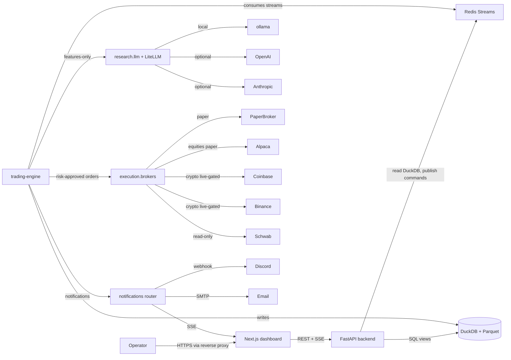
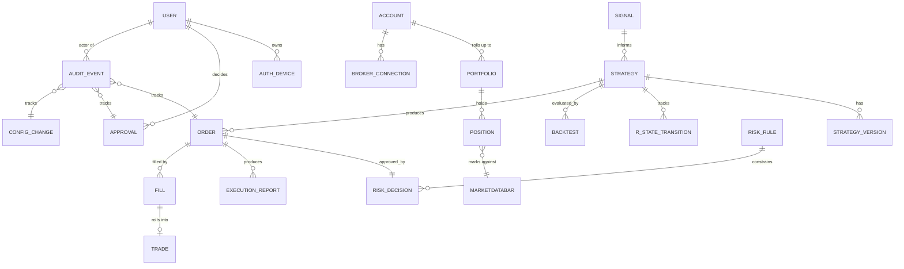
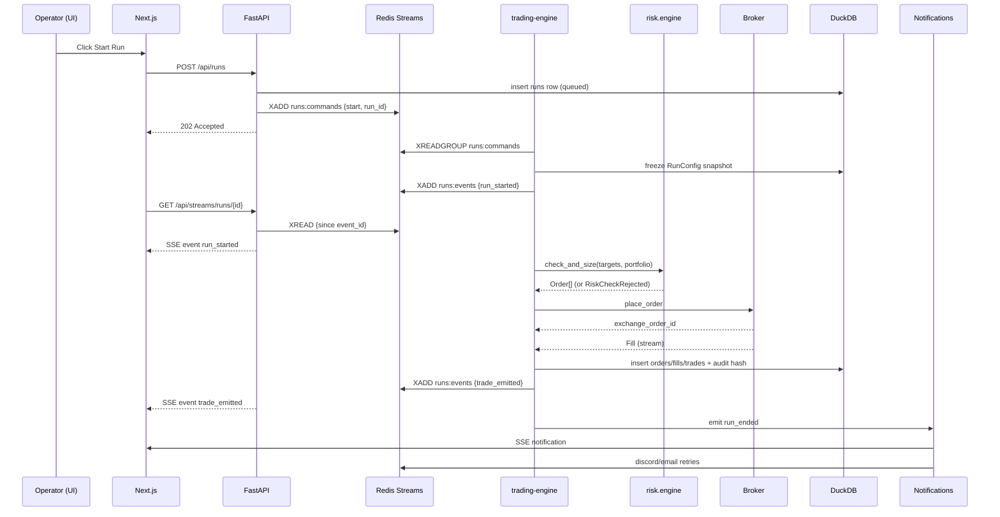
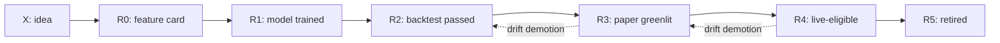
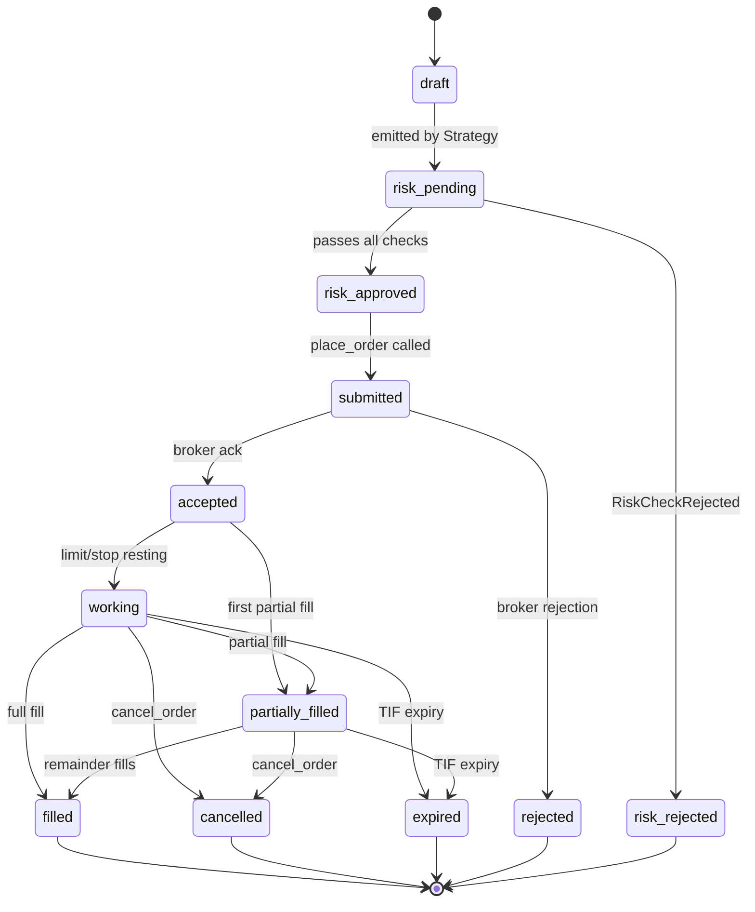
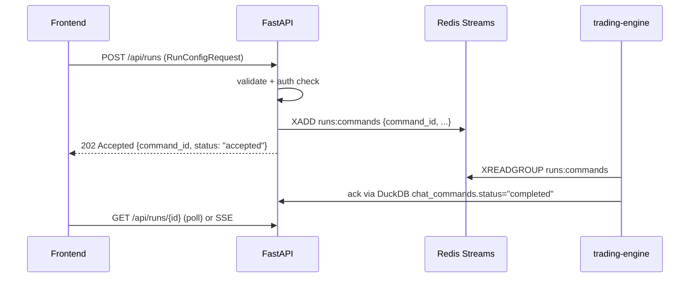
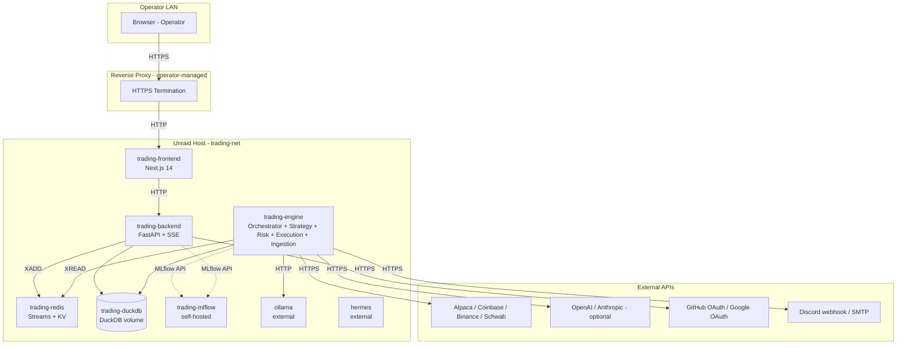
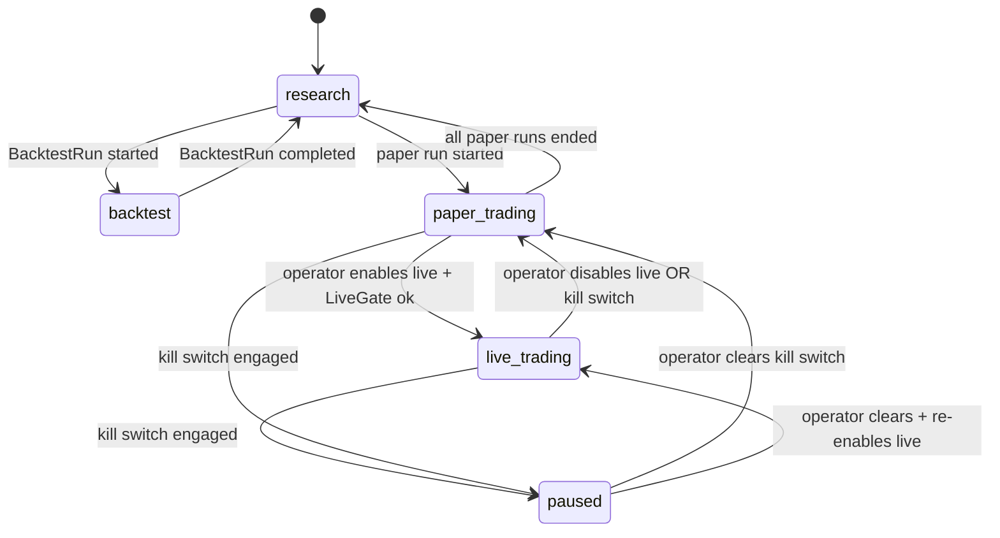

# Design: trading-lab-platform

## Document Information

- **Feature Name**: trading-lab-platform
- **Version**: 1.1 (addendum 2026-04-25: no-key ingest + optional Redis)
- **Date**: 2026-04-25
- **Author**: Brandon
- **Reviewers**: Brandon (operator)
- **Related Documents**:
  - Requirements: `./requirements.md`
  - Tasks: `./tasks.md` (next phase)
  - Architecture: `docs/ARCHITECTURE.md`, `docs/DESIGN.md`
  - Project rules: `.cursor/rules/architecture.mdc`, `.cursor/rules/risk-management.mdc`,
    `.cursor/rules/security.mdc`, `.cursor/rules/llm-usage.mdc`,
    `.cursor/rules/coding-standards.mdc`, `.cursor/rules/spec-sessions.mdc`,
    `.cursor/rules/research-workflow.mdc`, `.cursor/rules/backtesting.mdc`,
    `.cursor/rules/deployment.mdc`
  - Existing scaffold contracts: `AGENTS.md`, `DECISIONS.md`, `SIGNALS.md`,
    `data/schema.sql`, `risk/engine.py`, `backtests/engine.py`,
    `research/llm/client.py`, `tests/security/test_llm_isolation.py`

## Executive Summary

`trading-lab` is a self-hosted quantitative trading research and
paper-trading platform. The operator submits **runs** — atomic
experiments (`MarketScoutRun`, `StrategyTestRun`, `BacktestRun`,
`PortfolioReviewRun`) — that move signal hypotheses through a
deterministic pipeline of ingestion, feature engineering, model
training, backtesting, paper trading, and (eventually, behind a hard
gate) live trading. A Next.js dashboard owns every operator-tunable
knob; LLMs (LiteLLM behind a swappable port) are research assistants
that never reach the order path; risk is non-bypassable; audit is
hash-chained.

**What it does:** turns ideas into reproducible signals, evaluates them
through honest backtests with realistic costs, runs them in paper
trading until a six-condition live-readiness gate passes, and only then
exposes them to capital — under hard, non-bypassable risk limits and
broker-grade audit.

**Who it serves:** a single operator (you) on a self-hosted Unraid host
behind a reverse proxy; multi-user-capable design but single-operator
authorization in v1. AI/LLM agents act as research assistants only,
never as authorized actors against capital.

**Core architecture:** one-way pipeline `data → research → strategies →
risk → execution → monitoring`, with `runs/` and `learning/` as
coordinators. Persistence in DuckDB (canonical) + Parquet (snapshots);
async coordination via Redis Streams; FastAPI backend; Next.js 14
dashboard.

**Major subsystems (23):** ingestion, run engine, memory layers,
insight intake, strategy library + R-ladder, risk engine + kill switch,
broker adapters (paper-first, live-gated), reconciler, feature/model
registry, backtest engine (vectorbt default, pluggable), LLM provider
layer, chat command bus, approvals queue, learning/lever scoring,
notifications router, metrics + drift, hash-chained audit, REST + SSE
API, frontend dashboard, performance telemetry, governance harness.

**Key constraints:** library-first; non-bypassable risk; LLM isolation
(no `research.llm` import in `execution/`); deterministic backtests
(byte-identical `metrics.json`); UTC-aware timestamps; `Decimal` at
broker boundary; configs validated; runtime config in DuckDB; YAML for
seeds + import/export; secrets via `.env`; fail-closed restart;
single-operator + device-bound approvals; production-grade quality bar
(no TODOs, no placeholders).

**Major risks (mitigations in §17):**

- **Live capital with a flawed risk engine** → mitigated by single-path
  enforcement, CI greps, dual happy/reject tests for every check, and
  the six-condition `LiveEnablementGate` (no live order until each
  passes).
- **LLM hallucination influencing trading** → mitigated by classifying
  LLM outputs as `insight_only` until proven calibrated, calibration
  scoring, and the LLM-isolation CI test.
- **Determinism break in backtests** → mitigated by manifest+seed
  capture, content-hashed datasets, `pytest -m det` byte-equality
  fixture, and forbidden-pattern grep.
- **Audit chain compromise** → mitigated by hash-chain with `prev_hash`
  + `record_hash`, CI verifier on a fixture, admin CLI verifier on the
  live DB, and write-blocking on chain break.
- **Engine restart mid-run** → mitigated by fail-closed transition to
  `failed` with artifacts preserved + reconciliation against broker
  truth on boot.
- **Notification channels degraded** → mitigated by per-channel health
  + UI-only fallback + refusal to start new live runs when all CRITICAL
  channels are down ≥ 5 min.
- **Configuration drift between UI and code** → mitigated by DuckDB
  being the single runtime source of truth and `config_history` audit
  rows for every change.
- **Provider lock-in for LLM** → mitigated by `LLMProvider` port and
  Ollama as the always-available fallback.

**Recommended build sequence:** the first cut is **MVP-0** (see
§ MVP-0 Scope and Sequencing) — RiskEngine + canonical-JSON
determinism + PaperBroker + the three MVP-0 run types + crypto
ingestion + read-only dashboard + lever scoring v0 + hash-chain on
the five critical audit tables. After MVP-0 closes, the v1
expansion runs as the 12-step list under § MVP-0 → v1 Sequencing.
Live broker registration is forbidden until v1.1. The phased plan
in §22 is the binding pointer to `tasks.md`; the design here is
implementation-ready for any in-phase reordering chosen there.

## Goals and Non-Goals

> **Note on Goals split.** "MVP Goals" below is the historic v1 scope
> from the prior design pass; it has **not been removed**. The first
> production cut is now narrower — see "MVP-0 Goals" immediately
> below. Items in MVP Goals that are not in MVP-0 are tagged `[v1]`
> and land during the MVP-0 → v1 expansion.

### MVP-0 Goals (first production cut)

- Run engine that executes the **three** MVP-0 run types
  (`BacktestRun`, `PaperRun`, `StrategyTestRun`) end-to-end with
  isolated state, frozen `RunConfig`, append-only events, and
  canonical artifacts. (`MarketScoutRun`, `PortfolioReviewRun` are
  `[v1]`.)
- Honest backtests that are byte-deterministic for identical inputs,
  reject look-ahead via the existing validator, and serialize through
  `backtests.io.canonical_json`.
- Paper trading on `PaperBroker` (canonical) routed through
  `RiskEngine`. Alpaca paper is `[v1]`.
- Hash-chained audit on the **five critical tables** (`orders`,
  `fills`, `risk_decisions`, `approvals`, `config_history`).
  Append-only-only on the rest, hash chain expansion is `[v1]`.
- Read-only dashboard with `/styleguide` + `/runs/*` +
  `/runs/compare` + `/learnings`; YAML → DuckDB seed is the config
  source; UI write-of-config is `[v1]`.
- Lever scoring v0: strategy + source + feature + LLM-calibration
  scorers running on every run-close; full lever scoring is `[v1]`.
- LLMs via the `LLMProvider` port with `OllamaProvider`; LiteLLM
  multi-provider is `[v1]`.
- LLM `task_type` enforced at every call site; calibration tables
  populated; collectors running on schedule.
- Day-0 Invariants 1–8 (see § MVP-0 Scope) enforced and CI-tested.

### MVP Goals (historical / aspirational v1 — preserved)

- Run engine that executes the four run types end-to-end with isolated
  state, frozen `RunConfig`, append-only events, and canonical
  artifacts. `[v1]` for the `MarketScoutRun` + `PortfolioReviewRun`
  surface.
- Honest backtests that are byte-deterministic for identical inputs and
  reject look-ahead via the existing validator.
- Paper trading on the `PaperBroker` (canonical) and Alpaca paper
  (first external parity adapter, `[v1]`), routed through `RiskEngine`.
- Dashboard as runtime source of truth for every operator-tunable
  knob; YAML seeds + import/export; `.env` for secrets/deployment.
  `[v1]` for the write-of-config surface; MVP-0 dashboard is read-only.
- Multi-provider LLM via LiteLLM behind `LLMProvider`, with Ollama as
  fallback; classification of LLM outputs as `insight_only` in v1.
  `[v1]` for LiteLLM; MVP-0 ships `OllamaProvider` only.
- Hash-chained, append-only audit on every state-changing record;
  CI-verified. `[v1]` for the full hash-chain surface; MVP-0 hash-
  chains the five critical tables only.
- Notifications router with INFO/WARNING/CRITICAL severities across
  UI/Discord/Email and the seven canonical alert types. `[v1]`;
  MVP-0 ships UI-only fallback.
- Component-first frontend with a `/styleguide` route gating
  operator-facing UI.
- Cursor harness fully in place: rules, agents, skills, hooks, MCP
  registry, CONTRIBUTING.md, PR template, pre-commit.

### Production Goals (after v1, before live capital — i.e. v1.1)

- All six (or seven, with `audit_chain_full=true`) `LiveEnablementGate`
  conditions verifiable per `(broker, asset_class, strategy)` pair.
- `LiveBrokerRegistry.register(...)` succeeds for `(BinanceLive, ...)`
  and `(CoinbaseLive, ...)` once `live_adapters_unlocked=true`.
  Reconciliation, slippage anomaly alerting, and runaway-trade-loop
  detection green for ≥ 30 days in paper.
- Drift detection demoting strategies in real time when live ≠ backtest.
- Adaptive performance telemetry green against budgets for ≥ 3
  consecutive runs across every run type.
- Full Cursor governance loop (proposals → human ratification →
  DECISIONS.md) exercised at least once.
- Schwab CSV import in production use; Schwab read-only OAuth (`[v1.x]`)
  mirror operational with quarterly OAuth refresh drill documented.

### Explicit Non-Goals (v1)

- **Multi-tenant SaaS / multi-account user separation.** Single
  operator on a single LAN host; design is multi-user-capable but not
  multi-user-deployed.
- **HFT or latency-critical strategies.** Decision cadence ≤ 1 Hz;
  500 ms p95 SSE budget reflects UI updates, not order placement
  speed.
- **Options, futures, perps, FX live trading.** Crypto spot + US
  equities/ETFs only in v1 (Req 43.1).
- **Direct LLM execution authority.** LLMs cannot place orders, mutate
  risk limits, raise capital caps, change broker credentials, or
  promote strategies. CI enforces.
- **Margin / leveraged trading.** v1 uses cash accounts; `max_leverage
  = 1.0` (Req 43.2).
- **Auto-trading from news headlines.** News is a research input, never
  an order trigger (Req 43.3).
- **Real-money trading bots without operator approval.** Live mode
  requires multi-step operator confirmation including a typed code
  phrase and capital cap (Req 25.3).
- **Strategy / research code marketplace.** No third-party plug-in
  ingestion; everything lives in this repo (Req 43.5).
- **Cloud-hosted production.** Self-hosted on Unraid only (Req 37.1);
  cloud is out of scope until a `DECISIONS.md` entry says otherwise.
- **OpenTelemetry tracing in v1.** Hooks designed but not wired; logs
  with `run_id` / `command_id` / `decision_id` provide enough context
  for one-operator debugging.
- **Horizontal scaling.** v1 is single-host; vertical scaling on
  Unraid only.

### Future Roadmap (consolidated, post-v1)

- v1.1: live broker promotion (Coinbase + Binance) — runtime
  registration unlocked once paper has run ≥ 30 days clean and the
  pre-live test gate passes (§19). Adapters exist as interface-only
  stubs in v1; calling `register_live_adapter()` raises
  `LiveAdapterRegistrationForbidden` until the gate clears.
- v1.2: OpenTelemetry tracing wired in; tracing IDs flow through SSE.
- v1.3: Schwab live trading (gated by Schwab API maturity + a
  `DECISIONS.md` entry).
- v1.x: Schwab API integration (read-only OAuth) — v1 starts with
  CSV import only (operator-uploaded portfolio export); API
  integration follows after CSV path is proven.
- v1.4: equities corporate-actions handling beyond raw+adjusted bars
  (special-divs, spinoffs, M&A). Until v1.4, single-stock equities
  backtests with horizon > 5 years are flagged `degraded` in
  `dataset_versions.notes` and excluded from the live-readiness gate.
- v2.0: multi-operator + RBAC; cloud option behind a Terraform
  module.
- v2.x: futures / perpetual swaps support, contingent on `RiskAgent`
  redesign for funding + leverage.

## MVP-0 Scope and Sequencing

The full design above is the **target architecture**. The first
production-quality cut is **MVP-0**, a deliberately narrow slice that
proves the platform's safety spine and the run-improvement loop end
to end on paper. Every item not listed under MVP-0 below is preserved
elsewhere in this document tagged `[v1]`, `[v1.x]`, or `[v2]` /
`[FUTURE]`. **Nothing has been removed.**

### Day-0 Invariants (apply to MVP-0 and forever after)

These are non-negotiable and ship in MVP-0:

1. **Risk is non-bypassable.** Every order — backtest, paper, or live
   — passes through `risk.engine.RiskEngine.check_and_size`. No flag,
   env var, or column disables a check. CI greps the diff for
   forbidden patterns.
2. **LLM isolation.** `execution/` does not import `research.llm`,
   directly or transitively. CI test enforces (existing).
3. **Determinism.** Two runs of the same `BacktestSpec` produce a
   byte-identical `metrics.json` on a frozen Python + library set.
   Canonical JSON serialization (sorted keys, Decimal-as-string,
   UTC ISO with explicit `Z`, NaN/Inf forbidden) — see § Backtesting
   Design.
4. **Audit on critical paths.** Hash-chained append-only tables for
   `orders`, `fills`, `risk_decisions`, `approvals`, `config_history`
   on day one. The remaining audit-bearing tables are append-only
   (no UPDATE/DELETE) at MVP-0 and gain hash chaining incrementally
   in v1 (see § Compliance and Auditability — Staggered Hash-Chain).
5. **Run isolation.** Each run loads a frozen `RunConfig`; cross-run
   state writes raise `RunIsolationViolation` (Component 3).
6. **Fail-closed restart.** On boot, every `runs.status IN
   ('queued','running','paused')` transitions to `failed` with
   `reason="container_restart"`; reconciliation runs against broker
   truth before any new order (DD8).
7. **Redis is transport, DuckDB is truth.** All Redis Streams events
   are mirrored to DuckDB via the outbox pattern (DD2). Consumers
   are idempotent by `event_id` (Redis stream entry id) and the
   natural key of the payload. Replaying the same Redis entry never
   produces a duplicate side effect.
8. **No live adapter runtime registration.** `Coinbase` and `Binance`
   adapter classes exist as stubs implementing the `Broker` Protocol
   in v1; `LiveBrokerRegistry.register(...)` raises
   `LiveAdapterRegistrationForbidden` until the v1.1 pre-live gate
   clears. Importing the modules does not trigger registration; only
   an explicit registry call does.

### MVP-0 Deliverables

The first satisfying state of the platform — your Q3 answer ("being
able to do runs and see the improvements by run, and the learnings"):

**Engine + safety**

- `risk.engine.RiskEngine.check_and_size` with all six default checks
  loaded from `configs/risk.yaml` (kill switch, daily loss, drawdown,
  per-symbol weight, leverage, gross exposure).
- `runs.orchestrator` with `BacktestRun`, `PaperRun`, and
  `StrategyTestRun` (the three run types needed to "do runs and see
  the improvements"). `MarketScoutRun` and `PortfolioReviewRun` are
  `[v1]`.
- `PaperBroker` (canonical paper adapter) — Q10 + Q11 first target.
- Order lifecycle through the state machine in § Execution.
- Hash-chained audit on critical tables (per Day-0 Invariant 4).

**Data + research**

- DuckDB schema for all MVP-0 tables.
- `data.ingest.binance` + `data.ingest.coinbase` (existing scaffolds
  promoted to production-grade ingestion). Equities ingestion
  (Alpaca + yfinance) is `[v1]`.
- `data.adjust` with raw + adjusted bars for crypto; equities
  adjusted bars are `[v1]`.
- `research.features.validation.assert_no_lookahead` running in CI.
- Backtest engine (`vectorbt` default) producing the canonical
  artifact set (`manifest.json`, `equity.parquet`, `trades.parquet`,
  `metrics.json`).
- Determinism CI fixture green.
- Lever scoring foundation — strategy + source + feature +
  LLM-calibration (the four the reviewer recommended). The full
  lever-scoring scope (cost-model, prompt, cadence) is `[v1]`.

**Frontend (read-only)**

- `/login` + `/styleguide` + `/runs` + `/runs/[runId]` +
  `/runs/compare` + `/learnings` (the panels needed to "see the
  improvements by run and the learnings").
- Always-on header (mode pill, kill-switch, exposure, version).
- Read-only `/configuration/*` views surfacing the active YAML →
  DuckDB seed.
- Operator login via NextAuth credentials; OAuth (GitHub / Google) is
  `[v1]`.

**Backend**

- FastAPI app with `/api/runs/*`, `/api/strategies` (read), 
  `/api/system/health`, `/api/system/kill-switch/*`, `/api/sse/*`.
- Operator API key auth (signed JWT for SSE) — full session +
  approvals flow is `[v1]`.

**Config**

- YAML seeds in `configs/` are the source of truth in MVP-0; on boot
  they are imported into `config_kv` so the engine and dashboard
  read from one place. Edits land via PR + reseed in MVP-0 (read-only
  UI). UI-as-source-of-truth (write path with `config_history`
  approvals) is `[v1]` — your Q4 answer means the dashboard becomes
  mandatory **before the engine is autonomous**, which is a v1 gate,
  not an MVP-0 gate.

**Audit + observability**

- Hash-chained tables (5 critical) per Day-0 Invariant 4.
- structlog JSON logging with the full ID propagation set (`run_id`,
  `command_id`, `decision_id`, `client_id`, `actor_id`, `device_id`).
- prometheus-client metrics for the MVP-0-relevant gauges
  (`equity`, `gross_exposure`, `risk.reject`, `runs.active`,
  `runs.failed`, `errors.total`).
- `/api/system/health` with `{db_ok, redis_ok, audit_chain_ok}`.

**Process**

- `pytest -q -m "not slow and not integration"` green.
- `pytest -q -m det` green (determinism).
- `pytest -q tests/security/test_llm_isolation.py` green.
- `ruff check .` and `mypy --strict .` green.
- Strict Cursor harness on every PR (Q9 — strict_always).

### What is NOT in MVP-0 (preserved as `[v1]` / `[v1.x]` / `[v2]`)

- `[v1]` `MarketScoutRun`, `PortfolioReviewRun`.
- `[v1]` `Insight Intake` (Component 5).
- `[v1]` Chat Panel + chat command bus (Components 13).
- `[v1]` Approvals queue + multi-step live-enable ceremony
  (Component 14).
- `[v1]` Notifications router with all 7 alert types + Discord +
  Email (UI-only fallback in MVP-0).
- `[v1]` LiteLLM with multi-provider; MVP-0 has Ollama-only via the
  `LLMProvider` port.
- `[v1]` Full lever scoring (cost-model, prompt, cadence) and
  bandit allocator.
- `[v1]` LLM calibration by task type (sentiment / run_summary /
  asset_id / trade_thesis) — see § AI/ML Design.
- `[v1]` UI-as-source-of-truth write path (`/configuration/*` editable
  with approvals + `config_history` full surface).
- `[v1]` Equities ingestion (Alpaca + yfinance) and adjusted bars.
- `[v1]` Hash-chain audit expanded to all audit-bearing tables.
- `[v1]` MLflow self-hosted promotion workflow.
- `[v1]` Memory layers full surface (`experiments` queries,
  `pending_changes` UI).
- `[v1]` Adaptive performance regression telemetry.
- `[v1]` GitHub / Google OAuth.
- `[v1.x]` Schwab API integration (CSV-first in v1; API in v1.x).
- `[v1.1]` Live broker adapters runtime-registered (Coinbase, Binance).
- `[v1.2]` OpenTelemetry tracing wired in.
- `[v1.3]` Schwab live trading.
- `[v1.4]` Equities corporate-actions beyond raw+adjusted (spinoffs,
  M&A). Until v1.4, single-stock equities backtests with horizon
  > 5 years are flagged `degraded`.
- `[v2.0]` Multi-operator + RBAC + cloud option.
- `[v2.x]` Futures / perpetual swaps; horizontal scaling; Postgres
  migration.

### MVP-0 Acceptance

The MVP-0 milestone is closed when **all** are true:

- Day-0 Invariants 1–8 are enforced and tested.
- An operator can run a `BacktestRun` from CLI + dashboard, see its
  artifacts, and re-run it with byte-identical `metrics.json`.
- An operator can run a `PaperRun` against `PaperBroker`, see the
  fills land, and have the risk engine reject orders that violate
  any default check (with the rejection visible in
  `/runs/[runId]/audit`).
- An operator can compare two runs side-by-side at `/runs/compare`
  and see the lever scores update in `/learnings` after each run
  closes.
- Hash-chain audit verifier (`python -m monitoring.audit verify
  --tables critical`) is green.
- `LiveBrokerRegistry.register(Coinbase())` raises
  `LiveAdapterRegistrationForbidden`; CI test asserts this.
- All MVP-0 code paths pass `ruff` + `mypy --strict` + the
  test-suite gates above.

### MVP-0 → v1 Sequencing

Once MVP-0 closes, v1 expands in this order (each item is a
`tasks.md` epic):

1. Equities ingestion + adjusted bars + Alpaca paper broker.
2. Insight Intake + memory layers full surface.
3. Notifications router + 7 alerts + Discord + Email channels.
4. Multi-step live-enable ceremony + approvals queue.
5. Chat panel + chat command bus (forbidden actions enforced).
6. UI-as-source-of-truth write path with `config_history` approvals.
7. LiteLLM multi-provider behind `LLMProvider` port; calibration
   by task type.
8. MarketScoutRun + PortfolioReviewRun.
9. Hash-chain audit expanded to all audit-bearing tables.
10. Adaptive performance telemetry + drift demotion.
11. Schwab CSV import.
12. GitHub / Google OAuth.

After step 12, the v1.1 pre-live gate may be opened; live adapter
registration unlocks via §19 Pre-Live-Trading Test Gate + the
six-condition `LiveEnablementGate`.

---

## Overview

This design translates the 51 functional requirements, the non-functional
sections, and the 26 Guiding Principles in `requirements.md` into the v1
target architecture for a self-hosted, run-loop based market-intelligence and
paper-trading platform. The design preserves the one-way pipeline
`data → research → strategies → risk → execution → monitoring` defined in
`.cursor/rules/architecture.mdc`, treats the dashboard as the runtime source
of truth for configuration (Requirement 33), and keeps every order — backtest,
paper, or live — on the single non-bypassable path
`Strategy.target_positions → RiskEngine.check_and_size → Broker.place_order`
(Requirements 20, 23, 24).

The design is **target-architecture only**: it specifies every component,
contract, model, API, error mode, security boundary, and operational
expectation needed for v1, but it does not define an implementation
sequence. Phase 3 (`tasks.md`) will decompose this design into epics,
features, supporting docs, and executable leaf tasks. The design is
**library-first** (Requirement 47): runtime concerns are absorbed by
DuckDB, Redis, FastAPI, Next.js, vectorbt, MLflow, LiteLLM, APScheduler,
and existing CCXT/`alpaca-py`/`schwab-py` clients wherever they exist;
custom code is reserved for trading-specific policy (the run engine, the
risk engine, the R-ladder, the audit chain, the learning loop, the chat
command bus, and the styleguide).

### Design Goals

- **G1 — Singular goal traceability.** Every component traces to the
  north-star "learn to make money over time" (Requirement 1.6). § 22
  Requirement Traceability lists every requirement against the components
  that satisfy it.
- **G2 — Non-bypassable risk and LLM isolation.** Orders only leave the
  system through `risk.engine.RiskEngine.check_and_size`; `execution/`
  imports nothing from `research.llm` (Requirements 20, 23, 24).
- **G3 — Run isolation and reproducibility.** Each run owns a frozen
  `RunConfig`, an isolated paper sub-ledger, an append-only event stream,
  and a canonical artifact folder; backtests are byte-deterministic given
  identical inputs (Requirements 6, 7, 12, 26).
- **G4 — Dashboard-owned configuration.** DuckDB is the runtime source of
  truth for all knobs; YAML is import/export and seed defaults; `.env`
  carries deployment/secret values (Requirement 33).
- **G5 — Asynchronous, event-driven core.** Run lifecycle, ingestion,
  decisions, chat actions, approvals, and notifications are processed via
  Redis Streams + DuckDB outbox so the system is robust, fast, and
  recoverable without becoming an HFT system (Requirements 6, 21, 31, 35).
- **G6 — Broker-grade audit.** Every decision, order, fill, approval,
  config change, and state transition is recorded in a hash-chained
  append-only audit log so v1 has a defensible reconstruction story before
  it ever touches real capital (Requirements 36, 41, 42).
- **G7 — Production-grade quality bar.** No TODOs, stubs, or placeholder
  paths in shipped code; quality tests over quantity (Requirement 46).
  The Cursor harness (`.cursor/rules/`, `.cursor/agents/`,
  `.cursor/skills/`, `.cursor/hooks/`, `.cursor/mcp.json`) is the
  enforcement layer (Requirements 49, 51).

### Key Design Decisions

- **DD1 — Runtime config in DuckDB; YAML is import/export; secrets via env.**
  Requirements 33.2 and 33.4 demand the UI be the source of truth, with
  YAML used as a versioned import/export format. The design adopts a
  three-tier config model: (a) `.env` for deployment + secret values
  (`OLLAMA_HOST`, broker API keys, OAuth client secrets), (b) DuckDB
  `config_kv` + `config_history` tables for everything operator-tunable,
  (c) `configs/*.yaml` as committed seed defaults loaded into DuckDB on
  first install and exposed as import/export in the UI. Considered
  alternatives: pure-YAML (rejected: contradicts Requirement 33.2),
  pure-DuckDB-from-day-one (rejected: throws away the existing seed
  defaults that satisfy `.cursor/rules/coding-standards.mdc`'s "configs
  over code" principle).
- **DD2 — Event bus = Redis Streams + DuckDB outbox.
  *Redis is transport, DuckDB is truth.*** Per the user's "simple
  first, extensible later" guidance and Requirement 35.4's "resume
  from last seen `event_id`" expectation, the design uses Redis Streams
  with consumer groups for ordered run/notification/chat events, and a
  DuckDB `events` outbox/audit table as the durable, replayable record.
  **Invariant (binding):** every Redis Streams message is mirrored
  to a DuckDB row before any side effect commits; consumers are
  idempotent by `(stream, event_id)` (Redis entry id) **and** by the
  natural key of the payload (`client_id` for orders, `command_id`
  for chat commands, `decision_id` for risk decisions). Replaying
  the same Redis entry, or replaying the DuckDB row after a Redis
  flush, never produces a duplicate side effect. The outbox writer
  uses an idempotent insert (`INSERT … ON CONFLICT DO NOTHING` on
  the natural key + `event_id` composite) and the consumer
  acknowledges Redis only after the DuckDB row exists. CI test
  `tests/integration/test_outbox_idempotency.py` injects a duplicate
  Redis entry and asserts at-most-once side effects.
  Considered alternatives: Pub/Sub only (rejected: no resume cursor),
  in-process queues (rejected: no cross-container delivery).
- **DD3 — LLM = LiteLLM behind an internal `LLMProvider` port.** Per the
  user's confirmation, LiteLLM is adopted as the multi-provider client
  but is wrapped in a project-owned `research.llm.provider.LLMProvider`
  protocol so a future swap to first-party SDKs is a single-adapter
  change. CI continues to enforce that `execution/*` cannot import
  `research.llm` (Requirement 23). Considered alternatives: Ollama-first
  custom interface (rejected: slows multi-provider rollout), per-provider
  first-party SDKs (rejected: more code surface for the same outcome).
- **DD4 — Backtest engine pluggable; vectorbt default.** Requirements
  26.4 and 47.1 are honored by introducing `backtests.engine.BacktestEngine`
  as a `Protocol` with `VectorbtEngine` as the v1 default. Determinism
  manifests are engine-agnostic.
- **DD5 — Live order paths designed; paper-first implementation.** Per
  user direction and Requirement 25.2, every broker adapter contract
  models the full order lifecycle — market, limit, stop, stop-limit
  (Requirement 12 → q12) — but only the `PaperBroker` is wired into
  the run engine in MVP-0. Alpaca paper is `[v1]`. Live broker
  adapters (`Coinbase`, `Binance`) exist as **interface-only stubs**
  in v1: classes implement the `Broker` Protocol but
  `LiveBrokerRegistry.register(...)` raises
  `LiveAdapterRegistrationForbidden` until both (a) the v1.1
  pre-live test gate passes (§ Testing Strategy), and (b) the
  six-condition `LiveEnablementGate` clears for the
  `(broker, asset_class)` pair (Requirement 4.3). Importing a live
  module never registers — only an explicit registry call does, and
  the registry refuses until the feature flag
  `live_adapters_unlocked=true` is set in `config_kv` by an approved
  `RiskAgent` decision.
- **DD6 — Hierarchical portfolios.** Each run owns an isolated paper
  sub-ledger; sub-ledgers roll up into a per-broker `Account` view; live
  brokers expose a global account state per `(broker, asset_class)`. This
  satisfies Requirement 7.4 (no cross-write) while reflecting real-world
  account constraints (Requirement 24.1 max gross exposure).
- **DD7 — Hash-chained append-only audit.** Every record in
  `events`, `decisions`, `orders`, `fills`, `approvals`, `config_history`,
  `state_transitions` carries `prev_hash` + `record_hash`. Tamper-evidence
  is verified by a CI test and a `monitoring.audit.verify_chain` admin
  command (Requirements 36, 42).
- **DD8 — Fail-closed on engine restart.** Per user direction, in-flight
  runs transition to `failed` on container restart with their artifacts
  preserved; the run engine reconciles broker state on boot (Requirement
  37.5; Reliability NF.3). A future "resume from checkpoint" milestone is
  designed but not implemented in v1.
- **DD9 — Auth = NextAuth Credentials + optional GitHub/Google.** Per
  user direction, NextAuth provides a Credentials provider (local
  username/password, scrypt-hashed in DuckDB) and optional GitHub/Google
  providers. The reverse proxy in front of Unraid handles HTTPS and is
  treated as the public-edge boundary; the FastAPI backend trusts session
  JWTs forwarded by Next.js (Requirements 25.3, 33.5, 34.4).
- **DD10 — Notification degradation blocks new live runs but does not
  trigger the kill switch.** A CRITICAL channel outage means paging is
  broken; new live runs are blocked until at least one CRITICAL channel
  recovers, but in-flight runs continue with degraded alerts (Requirement
  31.6, 32). Trading-path safety still ends at the risk engine and kill
  switch, not at the notification layer.

---

## Architecture

### System Context

The platform is one Docker Compose stack on the operator's Unraid host,
joined to the existing `trading-net` external network alongside `ollama`
and `hermes` (Requirement 37). The reverse proxy fronting Unraid handles
HTTPS and forwards LAN/remote operator traffic to the Next.js dashboard.



### High-Level Architecture

The platform is composed of nine logical subsystems. The boxes correspond
to Python packages (`data/`, `research/`, `strategies/`, `risk/`,
`execution/`, `monitoring/`, `backend/`, `runs/`, `learning/`) plus the
`frontend/` Next.js app. The arrows respect the import rule from
`.cursor/rules/architecture.mdc` (no upstream imports; `monitoring/` is a
pure observer).

```mermaid
graph TB
    subgraph ingest [Ingestion]
        DataIngest[data.ingest]
        InsightIntake[runs.intake]
        SchwabRO[execution.brokers.schwab read-only]
    end
    subgraph research [Research]
        Features[research.features]
        Models[research.models]
        Labels[research.labels]
        LLM[research.llm + LiteLLM]
        Prompts[research.llm.prompts]
    end
    subgraph engine [Run engine]
        Orchestrator[runs.orchestrator]
        RunRegistry[runs.registry]
        Memory[runs.memory]
        ChatBus[runs.chat]
        Approvals[runs.approvals]
        Learning[learning.scorers]
    end
    subgraph trading [Trading path]
        Strategies[strategies]
        Composer[strategies.composer]
        Risk[risk.engine]
        Brokers[execution.brokers]
        Reconciler[execution.reconciler]
    end
    subgraph observe [Observability]
        Logger[monitoring.logger]
        Metrics[monitoring.metrics]
        Audit[monitoring.audit]
        Drift[monitoring.drift]
        NotifRouter[monitoring.notifications]
    end
    subgraph store [Persistence]
        DuckDB[(DuckDB)]
        Parquet[(Parquet snapshots)]
        Streams[(Redis Streams)]
        Mlflow[(MLflow)]
    end
    subgraph ui [UI]
        FastAPI[backend.api]
        Dashboard[frontend Next.js]
        Styleguide[/styleguide]
    end

    DataIngest --> Features
    InsightIntake --> LLM
    LLM --> Features
    Features --> Models
    Models --> Strategies
    Strategies --> Composer
    Composer --> Risk
    Risk --> Brokers
    Brokers --> Reconciler
    Reconciler --> Memory
    Orchestrator --> Strategies
    Orchestrator --> RunRegistry
    Orchestrator --> Memory
    ChatBus --> Approvals
    Approvals --> Orchestrator
    Memory --> Learning
    Learning --> Approvals
    Brokers --> Audit
    Risk --> Audit
    Approvals --> Audit
    Orchestrator --> Audit
    Audit --> DuckDB
    Memory --> DuckDB
    Orchestrator --> Streams
    NotifRouter --> Streams
    FastAPI --> DuckDB
    FastAPI --> Streams
    Dashboard --> FastAPI
    Dashboard --> Styleguide
    Models --> Mlflow
    Features --> Parquet
```

### Pipeline Order (immutable)

```
data → research → strategies → risk → execution → monitoring
                                        ↑
                            runs (orchestrator/memory/chat/approvals)
                                        ↑
                            learning (scorers, bandit, recommendations)
```

Both `runs/` and `learning/` are *coordinators*: they import from upstream
modules but never short-circuit them. `monitoring/` is the only module
allowed to import from anywhere.

### Technology Stack

| Layer | Technology | Rationale |
|---|---|---|
| Persistence | DuckDB ≥ 1.0 + Parquet | per `.cursor/rules/architecture.mdc`; embedded, deterministic, supports SQL views |
| Streaming | Redis Streams (`redis:7-alpine`) | ordered, replayable, resume cursors (Req 35.4) |
| Backend | FastAPI ≥ 0.115, uvicorn | per `pyproject.toml`; async + Pydantic-native |
| Run scheduler | APScheduler (in-process) | Req 39.2 free-only; cron + interval triggers |
| Backtest | vectorbt ≥ 0.26 (default) behind `BacktestEngine` Protocol | DD4; pluggable per Req 26 |
| Numerics | pandas, numpy, pyarrow | f64 for vectors, `Decimal` for money at broker boundary |
| Validation | pydantic v2, pandera | per `.cursor/rules/coding-standards.mdc` |
| Async I/O | httpx + tenacity | retries + exponential backoff (Req NF Reliability.1) |
| LLM | LiteLLM ≥ 1.50, behind `research.llm.provider.LLMProvider` | DD3 |
| Local LLM runtime | Ollama (existing container) | Req 22.1, 39 |
| Bandit allocation | mabwiser ≥ 2.7 | Req 15.3, 44 (assumption Req 44) |
| Experiment tracking | MLflow ≥ 2.13 (self-hosted) | Req 12.5, 39.2 |
| Logging | structlog ≥ 24 | per `monitoring/logger.py` |
| Metrics | prometheus-client (in-process gauges/counters wrapped by `monitoring.metrics`) | Req 41 |
| Notifications | `discord-webhook`, `smtplib`, in-app SSE | Req 31.2 |
| Frontend | Next.js 14 App Router, React 18, TypeScript, Tailwind, shadcn/ui, TradingView Lightweight Charts, TanStack Table, TanStack Query, Zustand, NextAuth | Req 33, 50, 51 |
| Component tests | Vitest + React Testing Library + Playwright (component) | Req 50.7 |
| Auth | NextAuth Credentials + GitHub + Google providers; scrypt password hash | DD9, Req 33.5 |
| Secrets store | `.env` mounted at runtime; Docker secret-files for Schwab OAuth refresh tokens | Req 5.6, NF Security.1 |
| CI | GitHub Actions (hosted) | Req 40 |
| Audit | DuckDB hash-chained append-only tables | DD7, Req 36, 42 |

---

## Components and Interfaces

The component list below is exhaustive for v1. Each component declares its
module path, responsibilities, public interface (typed signatures), and
the requirements it satisfies. Implementation pitfalls and "do not do"
notes are included where they have already produced or threatened bugs.

### Component 1: `data.ingest` — Market & News Ingestion

**Purpose:** Collect price OHLCV, news/RSS, macro calendar, and Schwab
read-only data into DuckDB and Parquet, with per-source freshness
tracking.

**Module path:** `data/ingest/`
- `data/ingest/base.py` — `Ingestor` Protocol, `SourceHealth` model.
- `data/ingest/ohlcv/{binance,coinbase,alpaca,yfinance}.py` — async
  WebSocket + REST clients with `tenacity` retries and circuit breakers.
- `data/ingest/news/{rss,finnhub}.py` — polled feeds (≤ 10 min, Req 19.1).
- `data/ingest/calendar/{macro,earnings_stub}.py` — macro events; earnings
  defined as deferred-but-pluggable.
- `data/ingest/insights/runner.py` — wraps Insight Intake submissions.
- `data/ingest/health.py` — staleness + circuit-breaker registry.

**Responsibilities:**
- Maintain `last_received_at` per `(source, symbol)` and emit
  `data_feed_stale` / `data_feed_recovered` notifications (Req 30, 32).
- Persist OHLCV via the `market_data` repository (existing in
  `data/repositories/`); persist insights to `data/insights/<date>/`.
- Apply circuit-breaker semantics (NF Resilience): N=5 failures within
  T=60 s opens the circuit for `T_cool=300 s`.
- Never overwrite a published dataset snapshot; new versions only
  (Req 28.4).

**Interfaces:**

```python
from typing import Protocol, AsyncIterator
from datetime import datetime
from pydantic import BaseModel

class IngestEvent(BaseModel):
    source: str
    symbol: str | None
    ts: datetime  # tz-aware UTC
    payload: dict[str, object]

class Ingestor(Protocol):
    name: str
    async def stream(self) -> AsyncIterator[IngestEvent]: ...
    async def health(self) -> SourceHealth: ...
```

**Implementation notes:**
- All ingestors run in the `trading-engine` container under one
  `asyncio` event loop, supervised by `runs.orchestrator`.
- Exchange and Schwab hostnames are pinned in code per
  `.cursor/rules/security.mdc`.
- Equities canonical source: Alpaca for paper/live quote compatibility;
  yfinance fallback for research/backfill (DD1).

**Satisfies:** Requirements 3, 5, 19, 28, 30, 32 (alerts 3 & 4),
NF Reliability.1, NF Resilience.1–3.

---

### Component 2: `data.repositories` — Typed DuckDB Access

**Purpose:** All SQL goes through repository classes; business code never
writes raw queries (per `docs/DESIGN.md` § 3.1).

**Module path:** `data/repositories/`

**Responsibilities:**
- Idempotent upserts on `(exchange, symbol, timeframe, ts)` for OHLCV.
- Append-only inserts for `events`, `decisions`, `trades`, `orders`,
  `fills`, `audit_log` (Component 18).
- Read views for the FastAPI backend (`/api/*` endpoints).

**Interfaces (representative):**

```python
class TradesRepo:
    def insert(self, trade: Trade) -> None: ...
    def list(self, *, strategy_id: str | None = None,
             venue: Literal["backtest","paper","live"] | None = None,
             limit: int = 100) -> list[Trade]: ...

class RunsRepo:
    def insert_run(self, run: RunRow) -> None: ...
    def transition(self, run_id: str, to_status: RunStatus,
                   actor: ApproverIdentity, reason: str) -> None: ...
    def get(self, run_id: str) -> RunRow | None: ...
```

**Satisfies:** Requirements 7.3, 8, 12, 26.5, 36.3, 41, 42.

---

### Component 3: `runs.orchestrator` — Run Engine

**Purpose:** The atomic experiment loop. Owns RunConfig snapshot, run
status transitions, scheduling, isolation, artifact writing, and broker
reconciliation on boot.

**Module path:** `runs/orchestrator.py`, `runs/registry.py`,
`runs/types.py`, `runs/state_machine.py`, `runs/scheduler.py`,
`runs/artifacts.py`, `runs/recovery.py`.

**Responsibilities:**
- Define run types via `runs.registry.RunType` Protocol (Req 11.6):
  `MarketScoutRun`, `StrategyTestRun`, `BacktestRun`, `PortfolioReviewRun`.
- Freeze `RunConfig` on start; refuse to mutate frozen config; log every
  status transition (Req 6.5–6.7).
- Run ≥ 4 runs concurrently with isolated state (Req 7.1).
- Publish `RunEvent` records to Redis Stream `runs:events` and
  DuckDB `events` table.
- On container restart, query open runs and transition them to `failed`,
  preserving artifact folders (DD8, Req 37.5, NF Reliability.3).
- Refuse AI-initiated triggers for any run that has `mode == "live"`
  (Req 6.4, 10.2).

**Interfaces:**

```python
class RunOrchestrator:
    def submit(self, config: RunConfig, *, trigger: RunTrigger,
               actor: ApproverIdentity) -> RunHandle: ...
    def cancel(self, run_id: str, *, actor: ApproverIdentity) -> None: ...
    def pause(self, run_id: str, *, actor: ApproverIdentity) -> None: ...
    def resume(self, run_id: str, *, actor: ApproverIdentity) -> None: ...
    async def join(self, run_id: str) -> RunResult: ...
```

**Implementation notes:**
- One `asyncio.Task` per active run, supervised by a `TaskGroup`.
- Each run gets its own structlog `contextvar` binding (`run_id`,
  `experiment_id`, `parent_run_id`).
- Artifact folder template:
  `runs/<YYYY-MM-DD>_<run_id>/{config.json, events.jsonl,
  decisions.jsonl, trades.jsonl, metrics.json, summary.md,
  recommendations.json, run_audit.log}` (Req 12.1).

**Satisfies:** Requirements 1, 2, 6, 7, 10, 11, 12, 25.1, 35.1,
NF Reliability.3, NF Determinism.

---

### Component 4: `runs.memory` — Per-Run / Experiment / Global Memory

**Purpose:** Three explicit memory layers, with auto-apply vs
approval-required separation (Req 8, 17).

**Module path:** `runs/memory.py`

**Tables (DuckDB):**
- `runs(run_id, parent_run_id, experiment_id, run_type, mode, status,
  config_snapshot_id, started_at, finished_at, artifact_dir,
  config_hash, git_commit, ...)`.
- `experiments(experiment_id, run_type, started_at, last_run_id,
  rolling_metrics_json)`.
- `global_memory_kv(key, value_json, source_run_id, applied_at,
  approver_id)`.
- `pending_changes(change_id, kind, payload_json, evidence_json,
  origin_run_id, status, created_at, decided_at, decider_id)`.

**Interfaces:**

```python
class Memory:
    def write_per_run(self, run_id: str, event: RunEvent) -> None: ...
    def aggregate_experiment(self, run_id: str) -> ExperimentSummary: ...
    def propose_global_change(self, change: PendingChange) -> str: ...
    def apply_global_change(self, change_id: str,
                            approver: ApproverIdentity) -> None: ...
    def read_global(self, key: str) -> object | None: ...
```

**Implementation notes:**
- Auto-apply rules are policy-coded in `runs.memory.policy.py`
  (Req 17.1). Out-of-bounds auto-apply attempts are rerouted to
  approval-required and emit `event="auto_apply_promoted_to_approval"`
  (Req 17.5).
- Per-run memory is archived (not deleted) per Requirement 39.1.

**Satisfies:** Requirements 8, 17, 39.

---

### Component 5: `runs.intake` — Insight Intake `[v1]`

**Phase:** Not in MVP-0. Lands during the v1 expansion (step 2 in
the MVP-0 → v1 sequencing under § MVP-0 Scope).

**Purpose:** Operator pastes text/URLs; LLM produces a structured
interpretation classified as `insight_only` in v1.

**Module path:** `runs/intake.py`, `research/llm/prompts/intake.py`.

**Interfaces:**

```python
class InsightIntakeRequest(BaseModel):
    submission_id: str
    text: str | None
    url: str | None
    submitted_by: ApproverIdentity
    submitted_at: datetime

class InsightIntakeResponse(BaseModel):
    submission_id: str
    assets: list[str]
    catalyst: str
    sentiment: Literal["bullish","bearish","neutral"]
    confidence: float = Field(ge=0, le=1)
    time_horizon: Literal["intraday","day","week","month","quarter"]
    recommendation: str
    trade_allowed: Literal[False] = False  # v1 hard-coded
    reason: str
    supporting_evidence: list[str]
    risk_factors: list[str]
    entity_match_score: float = Field(ge=0, le=1)
```

**Storage:** `data/insights/<YYYY-MM-DD>/<submission_id>.json` plus a
DuckDB `insights` row.

**Satisfies:** Requirements 9, 18, 23.4 (LLM only feeds research).

---

### Component 6: `strategies` — Strategy Library and Composer

**Purpose:** Implement `Strategy.target_positions(state) -> [TargetPosition]`
and a composer for blending multiple strategies.

**Module path:** existing `strategies/{base.py, composer.py, examples/}`,
extended with `strategies/registry.py` (R-state metadata) and
`strategies/versioning.py` (Req 27).

**Interfaces:**

```python
@dataclass(frozen=True)
class StrategySpec:
    strategy_id: str
    version: str        # v<N>; immutable once published
    author: str
    creation_date: datetime
    notes: str
    universe: list[str]
    timeframe: str
    feature_versions: dict[str, str]
    model_id: str | None
    model_version: str | None
    r_state: Literal["X","R0","R1","R2","R3","R4","R5"]

class Strategy(ABC):
    spec: StrategySpec
    @abstractmethod
    def target_positions(self, state: MarketState) -> list[TargetPosition]: ...
    def warmup_bars(self) -> int: ...
```

**Implementation notes:**
- Strategies are immutable once published (Req 27.2). The composer
  produces blended target weights but never sizes positions
  (Req 20.2, sizing belongs to the risk engine).
- The R-state advancement logic lives in
  `strategies/registry.py:RStateLadder` and is the only writer to the
  `strategy_states` table.

**Satisfies:** Requirements 13, 14, 20, 27, 29.

---

### Component 7: `risk.engine` — The Single Order Path

**Purpose:** Convert risk-engine-approved orders. The only path to a
broker (Req 20.1, 24.2).

**Module path:** existing `risk/{engine.py, sizing.py, limits.py,
types.py, errors.py}`, extended with `risk/kill_switch.py` and
`risk/policy_loader.py`.

**Interfaces:** existing
`RiskEngine.check_and_size(targets, portfolio, marks, realized_vol)
-> list[Order]` plus:

```python
class KillSwitch:
    def is_engaged(self) -> bool: ...
    def engage(self, *, reason: str, actor: ApproverIdentity) -> None: ...
    def clear(self, *, actor: ApproverIdentity, code_phrase: str) -> None: ...

class RiskPolicyLoader:
    """Loads RiskLimits from DuckDB config_kv with YAML fallback."""
    def load(self, *, broker: str | None = None) -> RiskLimits: ...
```

**Implementation notes:**
- `KillSwitch.clear` requires the operator to type a confirmation phrase
  (Req 24.5, 34.4); the API enforces this and writes a
  `state_transitions` row.
- Risk limits are loaded from DuckDB at process start and re-validated on
  every order (Req 24.6, security.mdc).
- Order types extended in `risk/types.py` to include `STOP`, `STOP_LIMIT`,
  with `stop_price` and `time_in_force` validations (q12).

**Satisfies:** Requirements 4 (per-broker policy), 20, 23 (no LLM
import), 24, 25, NF Security.3.

---

### Component 8: `execution.brokers` — Broker Adapters

**Purpose:** Place orders, reconcile fills, and expose account state. The
only callers of broker APIs.

**Phase tagging:**

- `[MVP-0]` `PaperBroker` — canonical paper adapter; the only adapter
  registered in MVP-0.
- `[v1]` `AlpacaPaper` — equities paper trading.
- `[v1]` `SchwabCsvImporter` — operator-uploaded portfolio export
  parsed into the read-only `Account` view (replaces the original
  v1 read-only OAuth scope).
- `[v1.x]` `SchwabReadOnlyAPI` — read-only OAuth integration.
- `[v1.1]` `BinanceLive`, `CoinbaseLive` — interface-only stubs in v1
  whose runtime registration is **forbidden** until the pre-live
  gate clears.

**Module path:** existing `execution/brokers/{base.py, paper.py,
binance.py, coinbase.py}`, extended with `execution/brokers/alpaca.py`,
`execution/brokers/schwab_csv.py` `[v1]`,
`execution/brokers/schwab_readonly.py` `[v1.x]`, and
`execution/{enablement.py, reconciler.py, account_state.py,
live_registry.py}`.

**Interfaces:**

```python
class Broker(ABC):
    name: str
    asset_classes: frozenset[Literal["crypto_spot","crypto_perp",
                                     "us_equity","us_etf"]]
    @abstractmethod
    async def place_order(self, order: Order) -> str: ...
    @abstractmethod
    async def cancel_order(self, exchange_order_id: str) -> None: ...
    @abstractmethod
    async def get_positions(self) -> dict[str, Position]: ...
    @abstractmethod
    async def get_balances(self) -> dict[str, Decimal]: ...
    @abstractmethod
    def stream_events(self) -> AsyncIterator[Fill]: ...

class LiveEnablementGate:
    def check(self, *, broker: str, asset_class: str,
              strategy: StrategySpec) -> EnablementVerdict: ...

class LiveBrokerRegistry:
    """v1 stub registry. Refuses live adapter registration until
    `live_adapters_unlocked=true` is written to `config_kv` by an
    approved RiskAgent decision *and* the v1.1 pre-live test gate
    has been recorded green in `gate_results`."""
    def register(self, broker: Broker) -> None:
        if not self._is_unlocked():
            raise LiveAdapterRegistrationForbidden(
                broker=broker.name,
                reason="pre_live_gate_not_passed_or_flag_off",
            )
        self._registered[broker.name] = broker

    def _is_unlocked(self) -> bool: ...
```

**Implementation notes:**
- `Order.client_id` is the idempotency key (Req NF Security; Req 4
  six-condition gate).
- `LiveEnablementGate.check` returns a verdict listing every failing
  condition; the engine logs `event="live_gate_reject"` and emits a
  CRITICAL alert when any of (a)–(f) fail (Req 4.4).
- `PaperBroker` uses `configs/costs.yaml` for fees/slippage/latency and
  is the canonical determinism anchor for paper-parity tests (Req 4.3.b).
- **Live broker adapters are interface-only stubs in v1.** The
  classes `BinanceLive` and `CoinbaseLive` exist (so the run engine
  can be written against the `Broker` Protocol with no
  paper-vs-live branching), but `LiveBrokerRegistry.register(...)`
  raises `LiveAdapterRegistrationForbidden`. Importing the modules
  has no side effects; only an explicit registry call does. CI test
  `tests/security/test_live_registration_forbidden.py` asserts the
  registry refuses both adapters in v1.
- `SchwabCsvImporter` `[v1]` parses an operator-uploaded portfolio
  CSV (Schwab's standard export format) into the read-only `Account`
  view; `SchwabReadOnlyAPI` `[v1.x]` follows once the CSV path is
  proven. Both raise `BrokerOperationDisabled("read_only")` from any
  order method (Req 5.4).
- Money is `Decimal` at every public broker boundary
  (`.cursor/rules/coding-standards.mdc`).

**Satisfies:** Requirements 3, 4, 5, 7, 12, 20, 23, 24, NF Security.1.

---

### Component 9: `execution.reconciler` — Fill Reconciliation & Account State

**Purpose:** Maintain a local view of positions, PnL, and open orders;
reconcile against exchange truth on every event (Req NF Reliability.2).

**Module path:** `execution/reconciler.py`, `execution/account_state.py`.

**Interfaces:**

```python
class Reconciler:
    async def on_fill(self, fill: Fill, *, broker: str,
                      run_id: str | None) -> None: ...
    async def reconcile_account(self, broker: str) -> ReconcileReport: ...
    def emit_quality_metrics(self) -> ExecutionQualityMetrics: ...

class HierarchicalAccount:
    """Per-run sub-ledgers roll up into per-broker account state (DD6)."""
    def get_run_ledger(self, run_id: str) -> Portfolio: ...
    def get_broker_account(self, broker: str) -> Portfolio: ...
```

**Implementation notes:**
- Partial fills are reconciled before further orders are placed
  (NF Reliability.2).
- Slippage anomalies (observed vs decision price) emit
  `execution.slippage_anomaly` (Req 32 alert 5).
- Runaway-trade detection (orders/min spike, duplicates) emits
  `execution.runaway_trade_loop` (Req 32 alert 6).

**Satisfies:** Requirements 7.4, 32 (alerts 5 & 6), NF Reliability.2.

---

### Component 10: `research.features`, `research.models`, `research.labels`

**Purpose:** Point-in-time features, label functions, model registry and
training (existing scaffold; this design adds the registry surface and
feature usefulness scoring).

**Module path:** existing `research/{features/, models/, labels.py,
cv.py}`, extended with `research/features/registry.py` and
`research/models/registry.py` (existing) wired through MLflow.

**Interfaces:**

```python
class FeatureCard(BaseModel):
    name: str
    version: str
    inputs: list[str]
    lookback_window: int  # bars
    output_column: str
    author: str
    look_ahead_caveats: str
    created_at: datetime

class FeatureFn(Protocol):
    card: FeatureCard
    def __call__(self, df: pd.DataFrame) -> pd.Series: ...

class ModelRegistry:
    def register(self, model_id: str, version: str,
                 manifest: ModelManifest) -> None: ...
    def get(self, model_id: str, version: str) -> Model: ...
```

**Implementation notes:**
- `research.features.validation.assert_no_lookahead` is run in CI on
  every registered feature (Req 29.2).
- Model artifacts live under `research/models/registry/<model_id>/<version>/`
  with `manifest.json` containing `git_commit`, `seeds`, `data_range`,
  `features`, `metrics`, `cost_model_version` (Req 26.2).

**Satisfies:** Requirements 26, 27, 28, 29.

---

### Component 11: `backtests` — Deterministic Simulation

**Purpose:** Realistic backtests with byte-deterministic outputs given
identical inputs (Req 26).

**Module path:** existing `backtests/{run.py, engine.py, manifest.py,
metrics.py, smoke.py}`, with `engine.py` refactored to a `Protocol`
(`BacktestEngine`) and `engine_vectorbt.py` as the v1 default (DD4).

**Interfaces:**

```python
class BacktestEngine(Protocol):
    def run(self, spec: BacktestSpec) -> BacktestResult: ...

class BacktestSpec(BaseModel):
    strategy_id: str
    strategy_version: str
    dataset_id: str
    dataset_version: str
    feature_set_version: str
    params_hash: str
    config_hash: str
    git_commit: str
    seed: int
    cost_model_version: str
    risk_policy_version: str
    capital: Decimal
    started_at: datetime  # tz-aware
```

**Manifest:** existing `backtests/manifest.py` writes `manifest.json`
matching Req 26.2 keys.

**Determinism:** Re-running with the same `BacktestSpec` produces a
byte-identical `metrics.json`. CI asserts this on a tiny fixture
(Req NF Determinism.1).

**Satisfies:** Requirements 14, 26, 27, 28, 29, NF Determinism.

---

### Component 12: `research.llm` — Multi-Provider LLM Layer

**Phase tagging:**

- `[MVP-0]` `LLMProvider` Protocol + `OllamaProvider` adapter only.
  Calls land via `research.llm.client.chat()` with `task_type`
  required. The single-provider variant is enough for the MVP-0
  read-only LLM features (run summary at run-close, lever-score
  rationales). `task_type` enum is defined and enforced from
  day 0 even though LLM use is light, because adding it later
  would require backfill.
- `[v1]` `LiteLLMProvider` adapter (multi-provider: OpenAI,
  Anthropic, Ollama). Existing `OllamaProvider` stays as a fallback
  and as the default for research. Per-task-type calibration
  surface lights up.
- `[v1]` `LLMCalibrationCollector` schedule for every task type.

**Purpose:** Single entrypoint for every LLM call. Behind a provider port
so v1 uses LiteLLM but the rest of the platform never depends on it.

**Module path:** `research/llm/{provider.py, client.py, prompts/,
calibration.py, audit.py}`.

**Interfaces:**

```python
class LLMRequest(BaseModel):
    prompt_name: str
    prompt_version: str
    rendered_prompt: str
    system: str | None
    temperature: float
    seed: int
    top_p: float
    max_tokens: int
    declared_confidence: float | None
    metadata: dict[str, str]

class LLMResponse(BaseModel):
    text: str
    provider: str
    model: str
    prompt_tokens: int
    completion_tokens: int
    total_tokens: int
    duration_ms: int
    finish_reason: str

class LLMProvider(Protocol):
    name: str  # "ollama" | "openai" | "anthropic"
    async def chat(self, request: LLMRequest) -> LLMResponse: ...
    async def health(self) -> ProviderHealth: ...

class LLMClient:
    """Routes a request to the configured provider, with fallback to Ollama."""
    async def chat(self, request: LLMRequest, *,
                   provider: str | None = None) -> LLMResponse: ...
```

**Implementation notes:**
- `LiteLLMProvider` is the default implementation of `LLMProvider`,
  configured via `litellm.completion`. A first-party
  `OllamaProvider` (existing `client.py`) remains as the fallback when
  paid providers are absent or rate-limited (Req 22.3).
- All calls are recorded in DuckDB `llm_calls` (prompt name + version,
  provider, model, temperature, seed, token counts, prompt SHA-256,
  response — secrets always redacted) (Req 16.1, 41.1, NF Observability.4).
- LLM token spend is metered per provider; `monthly_token_spend_usd >
  $20` triggers fallback to Ollama with a CRITICAL alert (Req 45.5).
- **Hard rule:** `execution/*` cannot import this module, transitively.
  Enforced by `tests/security/test_llm_isolation.py` (existing).

**Satisfies:** Requirements 16, 18, 21, 22, 23, 39 (free-only),
45.5, NF Security.2, NF Observability.4.

---

### Component 13: `runs.chat` — Dashboard Chat Command Bus `[v1]`

**Phase:** Not in MVP-0. Lands during the v1 expansion (step 5 in
the MVP-0 → v1 sequencing under § MVP-0 Scope). MVP-0 has no chat
panel; the dashboard surfaces a read-only `LLMSummaryCard` on
`/runs/[runId]` with the run-close summary.

**Purpose:** The only LLM conversation surface in v1 (Req 21.1). Chat
actions are commands routed asynchronously through an audited bus.

**Module path:** `runs/chat/{router.py, commands.py, tools.py,
sessions.py}`, plus FastAPI router `backend/api/routers/chat.py`.

**Interfaces:**

```python
class ChatCommand(BaseModel):
    command_id: str
    session_id: str
    actor: ApproverIdentity
    kind: Literal[
        "qa", "propose_change", "apply_change", "start_run",
        "pause_run", "resume_run", "cancel_run", "place_paper_trade"
    ]
    payload: dict[str, object]
    created_at: datetime

class ChatCommandResult(BaseModel):
    command_id: str
    status: Literal["accepted","rejected","completed","failed"]
    outcome: dict[str, object]
    audit_log_ids: list[str]
```

**Tool surface available to chat:** read-only Q&A tools (runs, signals,
backtests, Schwab read-only); proposal tools (queue an approval-required
change); approval tools (operator-only); run-control tools; `place_paper_trade`
within an active paper run subject to that run's policy.

**Implementation notes:**
- `place_live_trade` is **not** exposed; live orders require the full
  six-condition gate plus operator confirmation in the trade ticket
  (Req 21.4).
- Every command is persisted in `chat_commands` and audit-chained
  (Req 21.5).
- Streaming responses go back to the dashboard over the SSE channel
  `/api/streams/chat?session_id=…`.

**Satisfies:** Requirements 10, 16, 17, 18, 21, 22, 23, 25.4, 36.

---

### Component 14: `runs.approvals` — Approval Queue

**Purpose:** Operator inbox for approval-required changes (Req 17, 33.5).

**Module path:** `runs/approvals.py`, FastAPI router
`backend/api/routers/approvals.py`.

**Tables:**
- `pending_changes(change_id, kind, payload_json, evidence_json,
  origin_run_id, severity, status, created_at, decided_at,
  decider_id, decider_device, reason_code, audit_hash)` — DD7.
- `approval_history(change_id, decided_at, decider_id, decider_device,
  decision, reason)`.

**Implementation notes:**
- `apply` requires (a) actor authenticated, (b) device fingerprint, and
  (c) optional code phrase for high-blast-radius items (live mode, kill
  switch override, raising capital cap) (Req 25.3, 34.4, q18).
- Approvals are append-only; correcting an approval requires a new
  superseding record (DD7).

**Satisfies:** Requirements 8.4, 10.4, 13.4, 14.3–14.4, 17, 21.3,
24.6, 33.5, 42.

---

### Component 15: `learning` — Learning Loop and Lever Scoring

**Phase tagging:**

- `[MVP-0]` Four-lever foundation: `strategy_scores`,
  `source_scores`, `feature_scores`, `llm_calibration`. Schema
  shipped, scorers running on every run-close, dashboard
  `/learnings` surface live (read-only; no auto-apply for any
  lever in MVP-0).
- `[v1]` Full lever scoring expanded: `model_scores`,
  `universe_scores`, `prompt_scores`, `cost_model_scores`,
  `cadence_scores`, `risk_advisory`. Bandit allocator
  (`mabwiser`-backed) for the universe lever. `RecommendationsDoc`
  surfaced in operator approvals queue.
- `[v1]` Auto-apply for *non-risk* levers (universe weight, prompt
  template choice, source weight) gated by the per-lever
  `auto_apply_threshold` set in `configs/learning.yaml`. Risk-
  sensitive levers (cost model, kill-switch parameters) remain
  approval-required forever.

The MVP-0 cut matches the four levers the reviewer recommended
(strategy / source / feature / LLM-calibration); the user's Q7
answer ("full lever scoring") is implemented in v1, not skipped.

**Purpose:** Score every controllable lever, recommend changes, never
auto-apply without operator approval where the lever is risk-sensitive
(Req 44).

**Module path:** `learning/{scorers/, bandit.py, recommendations.py,
calibration.py}`.

**Interfaces:**

```python
class Scorer(Protocol):
    name: str
    table: str  # one of source_scores, feature_scores, ...
    def update(self, run_summary: RunSummary) -> list[ScoreUpdate]: ...

class RecommendationsBuilder:
    def build(self, run_summary: RunSummary) -> RecommendationsDoc: ...

class BanditAllocator:
    """Wraps mabwiser; produces an exploration/exploitation universe."""
    def select(self, *, core: list[str], candidate: list[str],
               discovery: list[str], split: float = 0.8) -> list[str]: ...
```

**Tables (one per lever class, all stamped with `run_id`, `timestamp`,
`score_version`):** `source_scores`, `feature_scores`, `strategy_scores`,
`model_scores`, `universe_scores`, `llm_calibration`, `prompt_scores`,
`cost_model_scores`, `cadence_scores`, `risk_advisory`.

**Implementation notes:**
- LLM-driven proposals demote to `insight_only` when
  `llm_calibration_score < 0.5` over a rolling 30-day window (Req 16.3).
- Risk-limit, capital-cap, broker-credential, and kill-switch parameters
  are **advisory-only** outputs; no path mutates them (Req 44.6).
- Insufficient evidence (`< min_observations`) is surfaced to the UI as
  `insufficient_evidence`, never as a recommendation (Req 44.7).
- **OOS-only scoring (Req 44.9, MVP-0).** Every `Scorer.update()` reads
  from `RunSummary.oos_metrics` (walk-forward holdout, purged-k-fold
  with embargo, or post-decision paper / live outcomes). Reading
  `RunSummary.in_sample_metrics.*` from a scorer is a CI failure
  (`tests/learning/test_no_in_sample_scoring.py`). `RunSummary` exposes
  the two namespaces as separate Pydantic models so the boundary is
  type-checked. _Rationale: the
  `pocs/learning_feedback/run_poc.py` POC ranked an injected-edge
  signal **last** when scored on raw IS PnL with realistic noise; an
  OOS rule is the cheapest correctness barrier we can install before
  any auto-apply path is unlocked in v1._

**Satisfies:** Requirements 8, 13, 14, 15, 16, 17, 22, 24 (advisory),
26, 32, 44, 45.

---

### Component 16: `monitoring.notifications` — Severity Routing

**Purpose:** Route INFO/WARNING/CRITICAL to UI/Discord/Email with
exponential-backoff retries and channel-degradation handling (Req 31).

**Module path:** `monitoring/notifications/{router.py,
channels/{ui.py, discord.py, email.py}, schema.py, alerts.py}`.

**Interfaces:**

```python
class Notification(BaseModel):
    event_type: str
    severity: Literal["INFO","WARNING","CRITICAL"]
    message: str
    strategy: str | None
    run_id: str | None
    timestamp_utc: datetime
    channels: list[Literal["ui","discord","email"]]
    payload: dict[str, object]

class NotificationRouter:
    async def emit(self, n: Notification) -> NotificationResult: ...
    def health(self) -> dict[str, ChannelHealth]: ...
```

**Implementation notes:**
- Channel health is exposed at `/api/system/notifications/health`.
- When all CRITICAL channels (Discord+Email) are degraded for ≥ 5 min,
  the orchestrator refuses to start any new live-mode run and surfaces
  `event="live_gate_reject", reason="critical_notif_channels_down"`
  (DD10, Req 31.6).
- Seven canonical alerts (Req 32) are wired in
  `monitoring/notifications/alerts.py` with synthetic CI fixtures.

**Satisfies:** Requirements 24.3, 24.4, 30.3, 31, 32.

---

### Component 17: `monitoring.metrics` & `monitoring.drift`

**Purpose:** Gauges, counters, histograms, and drift detection. Pure
observer; can read but not mutate (per `architecture.mdc`).

**Module path:** existing `monitoring/{metrics.py, drift.py}` plus
`monitoring/perf.py` (per-run telemetry, Req 45).

**Required gauges/counters (Req 41.3):** `equity`, `gross_exposure`,
`net_exposure`, `risk.reject{rule}`, `risk.orders_emitted`,
`runs.active`, `runs.failed`, `runs.completed`, `llm.tokens{model}`,
`llm.calibration_score`, `data_feed.staleness{source}`, `notif.channel_health`,
`run.wall_clock_ms`, `decision_to_trade_latency_ms_p95`,
`db.query_p95_ms`, `ws.reconnects`, `errors.total{kind}`.

**Implementation notes:**
- PnL/exposure metrics emit at least every 30 s while the engine runs
  (NF Observability.2).
- Drift detection runs after each backtest and during live runs; a
  threshold breach triggers the `strategy_performance_degradation`
  alert (Req 32 alert 7).

**Satisfies:** Requirements 24, 32, 41, 45, NF Observability.

---

### Component 18: `monitoring.audit` — Hash-Chained Audit Log

**Purpose:** Broker-grade tamper-evident audit (DD7).

**Module path:** `monitoring/audit/{chain.py, verify.py, schema.py}`.

**Tables:** every append-only table (`events`, `decisions`, `orders`,
`fills`, `approvals`, `config_history`, `state_transitions`,
`chat_commands`, `notifications`) carries:

```sql
record_id    VARCHAR  PRIMARY KEY
prev_hash    VARCHAR  NOT NULL  -- SHA-256 of previous record's record_hash
record_hash  VARCHAR  NOT NULL  -- SHA-256(prev_hash || canonical_json(payload))
ts           TIMESTAMPTZ NOT NULL
actor_id     VARCHAR
device_id    VARCHAR
reason_code  VARCHAR
payload      JSON
```

**Verifier:** `monitoring.audit.verify_chain(table)` re-hashes from the
genesis row and confirms continuity. CI runs the verifier against a
fixture; an admin CLI runs it against the live DB.

**Satisfies:** Requirements 6, 7, 8, 12, 13, 17, 21, 24, 36, 41, 42.

---

### Component 19: `backend.api` — Read & Write API Surface

**Purpose:** The HTTP layer the dashboard talks to. Read-heavy by
default; mutating endpoints exist only for explicit operator actions
already gated by approval/auth.

**Module path:** existing `backend/api/{app.py, routers/}`, extended
substantially. See § API Design for the full route inventory.

**Implementation notes:**
- Read endpoints are served from DuckDB directly; mutating endpoints
  publish a command to Redis Streams and wait for acknowledgement from
  the trading-engine (asynchronous command pattern, q16).
- Authentication: every `/api/*` request requires a NextAuth JWT
  forwarded as `Authorization: Bearer <jwt>`. Backend validates the JWT
  signature using the shared `NEXTAUTH_SECRET` (DD9).
- CORS is restricted to the dashboard origin (no wildcard).

**Satisfies:** Requirements 21, 33, 34, 35, 36, 41, 42, 50, 51.

---

### Component 20: `backend.streams` — SSE/WebSocket Push

**Purpose:** Sub-500 ms push of run/decision/trade events to the
dashboard (Req 35.1, NF Performance.1).

**Module path:** `backend/streams/{run_stream.py, chat_stream.py,
notifications_stream.py}`.

**Choice:** **Server-Sent Events** for run events, chat tokens, and
notifications. Rationale: simpler than WebSocket, native HTTP
reconnection, easy to terminate at the reverse proxy, fully sufficient
for one-way server→client streaming. WebSocket reserved for future
duplex channels if needed.

**Endpoints:**
- `GET /api/streams/runs/{run_id}?since={event_id}` — replays from
  last seen event_id (Req 35.4).
- `GET /api/streams/chat?session_id={id}` — token-by-token chat output.
- `GET /api/streams/notifications` — UI bell.

**Implementation notes:**
- Each stream is backed by a Redis Streams consumer group; the SSE
  handler `XREAD` from the last `event_id` provided by the client.
- Heartbeat every 15 s; auto-reconnect with exponential backoff in the
  frontend client.

**Satisfies:** Requirements 21, 35, NF Performance.1.

---

### Component 21: `frontend` — Next.js 14 Dashboard

**Purpose:** The operator's only v1 interaction surface. Source of truth
for every config knob (Req 33).

**Module path:** existing `frontend/`, expanded per § Frontend Page
Inventory below. Follows component-first delivery (Req 50).

**Key technology:** App Router, Tailwind, shadcn/ui, TradingView
Lightweight Charts, TanStack Table, TanStack Query, Zustand for client
state, NextAuth for auth, Vitest + Playwright (component) for tests.

**Implementation notes:**
- The `/styleguide` route is a self-contained app with mock data
  (Req 50.3) and a "Run component tests" affordance per entry
  (Req 50.7). The styleguide must work with `BACKEND_URL` unset
  (Req 50.6).
- The dashboard header always shows: live-mode badge, capital cap,
  operational mode, kill-switch state (Req 25.5, 34.5, 42.3).

**Satisfies:** Requirements 21, 25, 33, 34, 35, 36, 50, 51.

---

### Component 22: `monitoring.perf` — Adaptive Performance Telemetry

**Purpose:** Self-aware performance: emit per-run latency, throughput,
spend, error-rate metrics; warn when budgets are crossed for ≥ 3
consecutive runs (Req 45).

**Module path:** `monitoring/perf.py` plus `run_metrics` DuckDB table.

**Satisfies:** Requirements 45, NF Performance.

---

### Component 23: `governance` — Cursor Harness & Contribution Layer

**Purpose:** Enforce Requirement 49 (Cursor harness) and Requirement 51
(coding standards / contribution guide). This is governance, not
runtime.

**Deliverables (specified now, implemented later):**
- New `.cursor/rules/component-first.mdc` (Req 50.9).
- New `.cursor/skills/styleguide-add-component/SKILL.md` (Req 50,
  Req 51 wiring).
- New `.cursor/skills/contribute/SKILL.md` (Req 51.11).
- New `.cursor/hooks/component_first.py` (Req 50.4).
- New `.cursor/hooks/pr_template_check.py` (Req 51.3).
- `CONTRIBUTING.md` and `.github/{pull_request_template.md,
  ISSUE_TEMPLATE/{bug.md,feature.md,research.md}}` (Req 51.2–4).
- `LIBRARIES.md` index (Req 47.7).
- Pre-commit hooks (`.pre-commit-config.yaml`) running the same
  `ruff check`, `ruff format --check`, `mypy --strict`, eslint, tsc,
  no-shortcuts grep, no-risk-bypass grep, styleguide-first check
  (Req 51.5).

**Satisfies:** Requirements 23, 46, 47, 48, 49, 50, 51.

---

## Domain Model

The platform's bounded contexts are: **research** (signals, features,
models, backtests), **trading** (strategies, runs, decisions, orders,
fills, portfolios, accounts), **governance** (users, approvals,
audit), **observability** (notifications, metrics, source health), and
**market data** (bars, insights, datasets). Each entity below names
its bounded context, purpose, key fields, relationships, ownership
boundary, and persistence target. Pydantic + DuckDB representations
appear in § Data Models below; this section is the conceptual contract.

### User (governance)

- **Purpose:** identifies an authenticated principal capable of
  approving changes (Req 33.5).
- **Key fields:** `user_id` (ULID), `username`, `email`, `password_hash`
  (scrypt; null when OAuth-only), `oauth_links` (`{provider:
  github|google, subject_id}`), `roles` (`["operator"]` in v1),
  `created_at`, `last_login_at`.
- **Relationships:** owns 0..N `auth_devices`; appears as `actor` in
  `decisions`, `approvals`, `state_transitions`, `chat_commands`,
  `config_history`.
- **Ownership boundary:** `runs.approvals` and `backend.api` are the
  only writers; `monitoring.audit` is read-only.
- **Persistence:** DuckDB `users`, `oauth_links`, `auth_devices`,
  `sessions`.

### Account (trading)

- **Purpose:** the broker-side perspective of capital. One per
  `(broker, asset_class)`. Lives outside the run-isolation boundary so
  exposure caps can roll up across runs (DD6).
- **Key fields:** `account_id`, `broker`, `asset_class` (`crypto_spot`
  / `crypto_perp` / `us_equity` / `us_etf`), `currency`, `status`
  (`enabled` / `disabled` / `degraded`), `last_reconciled_at`.
- **Relationships:** owns 1..N `Portfolio` (per-run sub-ledger and a
  broker-level rollup); owns 0..N `BrokerConnection`.
- **Ownership boundary:** `execution.reconciler` is the only writer;
  `risk.engine` is the only reader for global limit checks.
- **Persistence:** DuckDB `accounts`.

### Portfolio (trading)

- **Purpose:** the cash + positions + realized/unrealized PnL view.
  Hierarchical (DD6): per-run sub-ledger ⊆ per-account ⊆ global.
- **Key fields:** `portfolio_id`, `account_id`, `run_id` (null for
  account-level), `cash` (`Decimal`), `realized_pnl_today` (`Decimal`),
  `high_water_mark` (`Decimal`), `as_of` (UTC).
- **Relationships:** owns 0..N `Position` rows; consumed by
  `risk.engine` and the dashboard.
- **Ownership boundary:** `execution.reconciler` writes; `risk.engine`
  and `backend.api` read.
- **Persistence:** DuckDB `portfolios`, `portfolio_snapshots` (per-bar
  for run audit).

### Position (trading)

- **Purpose:** a held quantity of one symbol at a known average price.
- **Key fields:** `symbol`, `quantity` (`Decimal`), `avg_price`
  (`Decimal`), `currency`, `last_mark`.
- **Relationships:** child of `Portfolio`; never written directly —
  always derived from cumulative `Fill` records (audit truth).
- **Ownership boundary:** `execution.reconciler` materializes;
  `risk.engine` reads.
- **Persistence:** DuckDB `positions` (current state) + derived from
  `fills`.

### Order (trading)

- **Purpose:** a risk-engine-approved instruction to a broker.
- **Key fields:** `client_id` (idempotency key), `run_id`,
  `strategy_id`, `strategy_version`, `symbol`, `side` (`buy`/`sell`),
  `quantity` (`Decimal`), `order_type` (`market` / `limit` / `stop` /
  `stop_limit`), `limit_price`, `stop_price`, `time_in_force` (`gtc` /
  `ioc` / `fok` / `day`), `reduce_only`, `risk_decision_id`,
  `submitted_at`, `state` (see § Order State Machine in Component 8).
- **Relationships:** produced by `RiskEngine.check_and_size`; consumed
  by `Broker.place_order`; produces 0..N `Fill` and exactly one
  `ExecutionReport`.
- **Ownership boundary:** only `risk.engine` produces; only
  `execution.brokers.*` mutates `state`.
- **Persistence:** DuckDB `orders` (append-only with hash chain);
  current state derived via materialized view.

### Trade (trading)

- **Purpose:** a "round-trip" view used for PnL reporting (entry +
  exit; or per-fill if positions are partial).
- **Key fields:** `trade_id`, `client_order_id`, `strategy_id`,
  `exchange`, `symbol`, `side`, `quantity`, `price`, `fee`, `pnl`,
  `venue` (`backtest`/`paper`/`live`), `ts`.
- **Relationships:** derived from `Fill` records (existing schema).
- **Ownership boundary:** `execution.reconciler` writes; backend reads.
- **Persistence:** DuckDB `trades` (existing).

### Strategy (trading)

- **Purpose:** the deterministic policy that emits target weights.
  Lives behind a versioned `StrategySpec`.
- **Key fields:** `strategy_id`, `version`, `author`,
  `creation_date`, `notes`, `universe`, `timeframe`,
  `feature_versions`, `model_id`, `model_version`, `r_state`
  (`X`/`R0`/`R1`/`R2`/`R3`/`R4`/`R5`).
- **Relationships:** owns 1..N `RStateTransition`; references 0..1
  Model; consumed by run engine, backtests, paper/live runs.
- **Ownership boundary:** `strategies.registry` is the only writer to
  `strategy_versions` and `strategy_states`; immutable after publish
  (Req 27.2).
- **Persistence:** DuckDB `strategies`, `strategy_versions`,
  `strategy_states`, `r_state_transitions`.

### Signal (research)

- **Purpose:** a hypothesis backlog row tracked in `SIGNALS.md` and
  mirrored in DuckDB.
- **Key fields:** `signal_id` (e.g. `SIG-001`), `name`, `intuition`,
  `timeframe`, `status` (`hypothesis`/`research`/`backtest`/`paper`/
  `live`/`retired`), `owner`, `updated_at`.
- **Relationships:** can produce 0..N candidate `Strategy` (one signal
  often becomes a feature inside many strategies).
- **Ownership boundary:** `ResearchAgent` writes via the
  `research-signal` skill; CI parses `SIGNALS.md` to keep the table in
  sync.
- **Persistence:** DuckDB `signals` + `SIGNALS.md`.

### Backtest (research)

- **Purpose:** a reproducible performance measurement of a
  `StrategySpec` against a `(dataset_version, feature_set_version)`
  with a known cost model and seed (Req 26).
- **Key fields:** `run_id` (`<strategy>-<utc>-<commit>-<cfg-hash>`),
  `strategy_id`, `strategy_version`, `dataset_id`, `dataset_version`,
  `feature_set_version`, `params_hash`, `config_hash`, `git_commit`,
  `seed`, `cost_model_version`, `risk_policy_version`, `capital`,
  `started_at`, `finished_at`, headline metrics.
- **Relationships:** child artifacts (`equity.parquet`,
  `trades.parquet`, `metrics.json`, `manifest.json`, `report.html`)
  under `backtests/results/<run_id>/`.
- **Ownership boundary:** `backtests/run.py` writes once and never
  mutates; the `BacktestEngine` Protocol is the only producer.
- **Persistence:** DuckDB `backtests` + parquet/HTML artifacts on disk.

### MarketDataBar (market data)

- **Purpose:** a point-in-time OHLCV record. Both **raw** (provider
  output) and **adjusted** (corporate-action-aware) variants are
  stored (q3, DD11 below).
- **Key fields:** `(exchange, symbol, timeframe, ts)` PK, `open`,
  `high`, `low`, `close`, `volume`, `quote_volume`,
  `adjustment_factor` (1.0 if none), `is_adjusted` (bool).
- **Relationships:** consumed by `data.repositories.market_data`;
  features/strategies always read **adjusted** variants; the audit
  store reads **raw**.
- **Ownership boundary:** `data.ingest.*` writes raw; `data.adjust`
  writes adjusted; nothing mutates after write (Req 28.4).
- **Persistence:** DuckDB `market_data` (raw, existing) +
  `market_data_adjusted` (new) + `corporate_actions` (new).

### RiskRule (governance)

- **Purpose:** a single named limit enforced by `risk.engine`.
- **Key fields:** `rule_name` (e.g. `max_gross_exposure`,
  `max_per_symbol_weight`, `max_drawdown_pct`, `max_daily_loss_pct`,
  `max_leverage`, `min_order_notional`, `target_annual_vol`,
  `kill_switch`), `value` (typed), `scope` (`global` / `(broker)` /
  `(broker, asset_class)` / `(strategy_id)`), `effective_from`,
  `effective_to`, `source` (`yaml_seed` / `ui` / `learning_advisory`),
  `approved_by`.
- **Relationships:** consumed by `RiskEngine.check_and_size` on every
  call.
- **Ownership boundary:** UI + `runs.approvals` writes; `RiskEngine`
  reads only. Learning loop emits *advisory* rows (`risk_advisory`),
  never live rules (Req 44.6).
- **Persistence:** DuckDB `risk_rules`, `risk_rule_history`,
  `risk_advisory`.

### ExecutionReport (trading)

- **Purpose:** the broker-confirmed lifecycle event for an order:
  acknowledgement, partial fill, final fill, rejection, cancellation,
  expiration.
- **Key fields:** `report_id`, `client_id`, `exchange_order_id`,
  `state`, `cumulative_filled_qty`, `last_fill_price`, `last_fill_ts`,
  `reject_reason`, `cancel_reason`, `extra` (broker-specific), `ts`.
- **Relationships:** appended by `Broker.stream_events` and the
  `Reconciler`; one Order has 1..N reports culminating in a terminal
  state.
- **Ownership boundary:** `execution.reconciler` writes; nothing else.
- **Persistence:** DuckDB `execution_reports` (hash-chained).

### BrokerConnection (trading)

- **Purpose:** the durable handle for a broker session, including
  enablement state, credential reference, and current health.
- **Key fields:** `connection_id`, `broker`, `asset_class`,
  `credential_ref` (env-var name or secret-file path; never the secret
  itself), `status` (`enabled`/`disabled`/`degraded`), `last_heartbeat_at`,
  `error_count`, `circuit_state` (`closed`/`open`/`half_open`), `enabled_at`,
  `enabled_by`.
- **Relationships:** owned by an `Account`; consumed by the broker
  adapter at process start.
- **Ownership boundary:** UI + `runs.approvals` toggle; broker adapter
  updates `last_heartbeat_at` and `circuit_state`.
- **Persistence:** DuckDB `broker_connections`,
  `broker_connection_history`. Credentials never persisted here.

### AuditEvent (governance)

- **Purpose:** the unified hash-chained record for every
  state-changing operation across runs, decisions, orders, fills,
  approvals, config changes, kill-switch transitions, R-state
  transitions, chat commands, and notifications. Tamper-evident
  (DD7).
- **Key fields:** `record_id`, `table` (the source family), `payload`
  (canonical JSON), `prev_hash`, `record_hash`, `ts`, `actor_id`,
  `device_id`, `reason_code`.
- **Relationships:** every append-only table inherits this skeleton
  (Component 18); the unified `audit_log` view UNIONs them for
  cross-table queries.
- **Ownership boundary:** writers go through
  `monitoring.audit.append`; no module mutates `prev_hash` or
  `record_hash` directly.
- **Persistence:** DuckDB per-family tables + `audit_log` view.

### Domain Model Diagram



---

## Data Models

All models are Pydantic v2; tz-aware UTC timestamps; `Decimal` for any
broker boundary; `float` (f64) inside research/numeric vectors. Money
units are explicit (`USD`, `quote_ccy`, etc.) where ambiguity is
possible.

### RunConfig (frozen on start)

```python
class RunConfig(BaseModel):
    run_id: str
    parent_run_id: str | None
    experiment_id: str
    run_type: Literal["MarketScoutRun","StrategyTestRun",
                      "BacktestRun","PortfolioReviewRun"]
    duration: Literal["15m","1h","4h","overnight",
                      "until-stopped","custom"]
    duration_seconds: int | None  # required when duration == "custom"
    mode: Literal["paper","live","backtest","intelligence"]
    objective: str
    universe_policy: UniversePolicyRef    # references universe_versions
    sources: list[SourceRef]
    strategy: StrategySpecRef | None
    decision_policy: DecisionPolicyRef
    risk_profile: RiskPolicyRef
    learning_policy: LearningPolicyRef
    notification_policy: NotificationPolicyRef
    started_at: datetime
    config_hash: str          # SHA-256 of canonical JSON
    git_commit: str
    seeds: dict[str, int]     # numpy, torch, model libs
```

**Validation:** `mode == "live"` requires `trigger != "ai"`,
`strategy.r_state == "R4"`, `LiveEnablementGate.check(...)` returns
`approved`.

### RunEvent (append-only)

```python
class RunEvent(BaseModel):
    event_id: str           # ULID
    run_id: str
    event_type: str         # run_started, decision_made, order_emitted, ...
    severity: Literal["INFO","WARNING","CRITICAL"]
    payload: dict[str, object]
    ts: datetime
    prev_hash: str
    record_hash: str
```

### Decision

```python
class Decision(BaseModel):
    decision_id: str
    run_id: str
    ts: datetime
    symbol: str
    side: Literal["buy","sell","flat"]
    classification: Literal["insight_only","paper_trade_candidate",
                            "live_trade_candidate"]
    confidence: float = Field(ge=0, le=1)
    confirming_sources: list[str]
    feature_snapshot_id: str
    model_id: str | None
    model_version: str | None
    llm_call_ids: list[str]   # FK -> llm_calls
    risk_outcome: Literal["approved","rejected","skipped"]
    risk_rule: str | None     # populated on reject
    why: str
    prev_hash: str
    record_hash: str
```

### Order, Fill (Decimal at broker boundary)

```python
class Order(BaseModel):
    client_id: str
    run_id: str | None
    strategy_id: str
    strategy_version: str
    symbol: str
    side: Literal["buy","sell"]
    quantity: Decimal
    order_type: Literal["market","limit","stop","stop_limit"]
    limit_price: Decimal | None
    stop_price: Decimal | None
    time_in_force: Literal["gtc","ioc","fok","day"]
    reduce_only: bool
    risk_decision_id: str
    submitted_at: datetime

class Fill(BaseModel):
    fill_id: str
    client_id: str
    exchange_order_id: str
    broker: str
    symbol: str
    side: Literal["buy","sell"]
    quantity: Decimal
    price: Decimal
    fee: Decimal
    fee_currency: str
    pnl: Decimal | None
    venue: Literal["backtest","paper","live"]
    ts: datetime
    prev_hash: str
    record_hash: str
```

### ApproverIdentity

```python
class ApproverIdentity(BaseModel):
    actor_id: str             # NextAuth user.id
    actor_kind: Literal["operator","ai","system"]
    device_id: str | None     # browser fingerprint, q18
    auth_method: Literal["credentials","github","google","system"]
    ts: datetime
```

### Strategy R-state Transition

```python
class RStateTransition(BaseModel):
    transition_id: str
    strategy_id: str
    strategy_version: str
    from_state: Literal["X","R0","R1","R2","R3","R4","R5"]
    to_state: Literal["X","R0","R1","R2","R3","R4","R5"]
    evidence_run_id: str
    evidence_summary: dict[str, object]
    approver: ApproverIdentity   # "auto" for auto-eligible transitions
    ts: datetime
    prev_hash: str
    record_hash: str
```

### DuckDB Table Families (additions to `data/schema.sql`)

| Family | Tables | Purpose |
|---|---|---|
| Runs | `runs`, `run_events`, `run_metrics`, `run_artifacts` | Run lifecycle, ordered events, telemetry, artifact paths |
| Memory | `experiments`, `global_memory_kv`, `pending_changes`, `approval_history` | Memory layers + approval inbox (Req 8, 17) |
| Strategies | `strategies` (existing, extended), `strategy_versions`, `strategy_states`, `r_state_transitions` | Versioning + R-ladder (Req 13, 14, 27) |
| Features | `features`, `feature_versions`, `feature_usefulness` | Feature registry + scoring (Req 29) |
| Datasets | `datasets`, `dataset_versions` | Versioned snapshots (Req 28) |
| Backtests | `backtests` (existing, extended) | Headline metrics + manifest path (Req 26) |
| Trading | `orders`, `fills`, `trades` (existing), `executions_quality` | Idempotent order + fill records, slippage metrics |
| LLM | `llm_calls`, `llm_calibration`, `prompt_scores` | Per-call audit, calibration, prompt registry (Req 16, 22) |
| Notifications | `notifications`, `notification_channel_health` | Severity routing + retry state (Req 31) |
| Audit | `audit_log`, `state_transitions`, `config_history`, `chat_commands` | Hash-chained governance (DD7, Req 36, 42) |
| Auth | `users`, `sessions`, `auth_devices`, `oauth_links` | NextAuth-compatible local auth (DD9) |
| Source health | `source_health`, `circuit_breakers` | Stale-data, circuit-breaker state (Req 30, NF Resilience) |
| Schwab | `schwab_balances`, `schwab_positions`, `schwab_transactions`, `schwab_quotes` | Read-only mirror (Req 5) |
| Insights | `insights`, `insight_responses` | Manual paste-in artifacts (Req 18) |
| Learning | `source_scores`, `feature_scores`, `strategy_scores`, `model_scores`, `universe_scores`, `cost_model_scores`, `cadence_scores`, `risk_advisory` | Lever scoring (Req 44) |

DDL for every new table is delivered as part of `data/schema.sql`
revisions and migrations live in `data/migrations/<NNNN>_<name>.sql`.

### Data Flow at Runtime



---

## Data Architecture

### Storage Choices and Rationale

| Concern | Technology | Why |
|---|---|---|
| OLTP-style writes (orders, fills, runs, approvals, config_history, audit) | **DuckDB** in-process, with append-only tables and UPSERTs on natural keys | Embedded, transactional, fits a single-host deployment (Req 37.1) without operating a Postgres process; supports the hash-chain pattern with cheap `INSERT … RETURNING` |
| Analytical queries (PnL roll-ups, run summaries, lever scoring, dashboard reads) | **DuckDB** SQL views over the same tables | Columnar engine; sub-second on 100M-row workloads; no ETL hop |
| Time-series market data | **DuckDB** `market_data` + `market_data_adjusted` tables, indexed `(symbol, ts)` | DuckDB's columnar layout makes range scans on `(symbol, ts)` cheap; we are below the threshold where TimescaleDB / ClickHouse would justify their ops cost |
| Backtest artifacts (equity curve, per-trade log) | **Parquet** files under `backtests/results/<run_id>/` referenced from DuckDB by `artifact_dir` | Self-describing, deterministic, byte-comparable for the determinism CI test |
| Run artifacts (events.jsonl, decisions.jsonl, summary.md, recommendations.json) | JSONL + Markdown on disk under `runs/<date>_<run_id>/` | Append-only files survive crashes; greppable for ad-hoc forensics |
| Cache / coordination / streaming | **Redis 7** Streams + key-value | Ordered, replayable, consumer groups, native resume cursors (Req 35.4) |
| Model artifacts | **MLflow** (self-hosted, file-backed) under `mlflow/` | Standardized model registry + experiment tracking; free + self-hostable (Req 39.2) |
| LLM prompt+response payloads | **DuckDB** `llm_calls` + JSON column for full text; redacted at write | Audit-aligned, queryable, single store |
| Backups | **zstd tarballs** under `/data/backups/` | Cheap, restorable, covered by Unraid appdata backup |

**Why a single DuckDB and not Postgres + TimescaleDB?** v1 has one
operator on one host; transactional volume is at most a few hundred
writes per minute even in busy paper runs; a single embedded engine
means one schema, one backup, one migration tool, and no inter-process
coordination. A Postgres migration is an explicit v2.x non-goal that
would only be triggered by multi-tenant deployment (`DECISIONS.md`
entry required).

### Hot vs Cold Paths

| Path | Backed by | Latency budget |
|---|---|---|
| Live order placement | DuckDB write → Redis Streams XADD → broker call | < 100 ms p95 |
| SSE event delivery | Redis XREAD blocking | < 500 ms p95 |
| Dashboard `/api/runs/...` reads | DuckDB query + TanStack Query cache | < 250 ms p95 |
| Backtest metric snapshot | DuckDB read of `backtests` row | < 50 ms p95 |
| Run-event replay (resume from `event_id`) | Redis Streams XREAD; falls back to DuckDB `run_events` for entries trimmed beyond `MAXLEN ~ 100k` | < 1 s for 10k events |
| Audit chain verify (single table) | DuckDB scan + SHA-256 | < 10 s for 1M rows |

### Partitioning Strategy

DuckDB does not natively partition tables, but we apply
partition-by-convention:

- **`market_data` / `market_data_adjusted`:** primary key `(exchange,
  symbol, timeframe, ts)`. Hot working set (last 30 days) lives in a
  per-symbol Parquet snapshot under `data/snapshots/<symbol>/<yyyymm>.parquet`
  for fast cold reload after a restart; the canonical read path is
  always DuckDB.
- **`run_events`:** rolling-window cleanup; keeps 90 days hot in
  DuckDB, archives older partitions to `/data/backups/run_events/<yyyymm>.parquet.zst`
  via the `runs.archive` CLI (Req 38).
- **`fills` / `orders` / `execution_reports`:** never archived
  automatically (audit). Indices on `(strategy_id, ts)` and
  `(symbol, ts)`.
- **`audit_log` family:** never partitioned, never archived
  automatically; verified end-to-end by `monitoring.audit verify`.
- **Parquet datasets:** content-hashed filenames so two runs with the
  same input produce the same artifact path (determinism aid).

### Cache Strategy

- **Redis Streams** is the durable async coordination store; its keys
  are not generic cache. Stream keys (e.g. `runs:events`) carry
  `MAXLEN ~ 100000` so memory stays bounded.
- **Redis KV** is used only for: session blacklist, rate-limit
  counters, and `last_seen_event_id` markers per consumer.
- **TanStack Query** in the frontend handles UI-side caching with
  stale-while-revalidate (5 s for run lists, 30 s for strategy lists,
  5 min for static config).
- **No application-level cache between FastAPI and DuckDB.** DuckDB is
  fast enough that a Redis cache would only add invalidation bugs.

### Retention Policy

| Data | Hot retention | Cold retention | Owner action |
|---|---|---|---|
| `market_data` (raw) | 30 days hot in DuckDB; full history in Parquet snapshots | indefinite | none |
| `market_data_adjusted` | rolling 5 years (configurable) | indefinite | reload from snapshots |
| `run_events`, `decisions` | 90 days | indefinite (archived to `/data/backups`) | `runs.archive` CLI |
| `orders`, `fills`, `execution_reports`, audit families | indefinite hot | n/a | none |
| LLM call payloads | 365 days hot; archived after | indefinite | configurable in `/configuration/llm` |
| Backtest artifacts | indefinite (cheap; 10s of MB per run) | n/a | operator-initiated archive |
| Insight Intake submissions | indefinite hot (small) | n/a | none |

### Backup Strategy

- Unraid appdata backup is the canonical mechanism. `/data/backups/`
  is the primary backup root (Req 38.4).
- An admin CLI `python -m monitoring.audit verify --all` runs against
  every audit-bearing table before each major release and on a
  quarterly cadence (operator-driven).
- DuckDB file is stopped (engine quiesced) for the backup window; the
  trading-engine cooperates by entering `paused` mode during the
  scheduled window. Live orders cannot be placed while paused.
- Restore drill (manual, not automated in v1): copy snapshot back,
  start engine, run audit verify; documented in `docs/RUNBOOK.md`
  (deliverable, see §22 → tasks.md).

### Migration Strategy

Migrations live in `data/migrations/<NNNN>_<name>.sql` and are applied
transactionally by `data.db.connect()` at boot. The current schema
version lives in `schema_version(version, applied_at, sha256)`.

- **Forward migrations** are additive when possible (new tables, new
  columns with defaults).
- **Destructive migrations** (column drops, type changes) require a
  `DECISIONS.md` entry and a one-time backup snapshot before apply.
- **Failure mode:** any migration failure aborts boot, emits a CRITICAL
  alert, and leaves the previous schema intact (transaction-rolled-back).
- **Down-migrations** are not maintained. Recovery from a bad migration
  is to restore the pre-migration backup.

### Data Quality and Validation

- Pandera schema validators live next to every dataframe-returning
  function in `data/`, `research/features/`, `backtests/`.
- `research.features.validation.assert_no_lookahead` runs in CI on every
  registered feature (Req 29.2).
- Determinism is the highest validation gate: byte-identical
  `metrics.json` for two runs with the same `BacktestSpec` (CI fixture).

---

## Market Data Design

This section pins down the cross-cutting concerns that span Component 1
(`data.ingest`), Component 2 (`data.repositories`), and the new
`data.adjust` module.

### Supported Sources (v1)

| Source | Asset class | Mode | Role |
|---|---|---|---|
| Alpaca Market Data API | US equities + ETFs | WS + REST | canonical for paper & (later) live |
| yfinance | US equities + ETFs + indices | REST batch | research backfill + benchmarks |
| Coinbase Advanced Trade WS | crypto spot | WS | live + paper |
| Binance Spot WS | crypto spot | WS | live + paper |
| RSS / Finnhub free tier | news | REST polled | ResearchAgent inputs (Req 19) |
| FMP / RSS macro calendar | macro events | REST polled | ResearchAgent inputs |
| Schwab API | accounts + holdings | REST polled | read-only mirror only (Req 5) |
| Operator paste (Insight Intake) | text/url | UI | manual research input (Req 18) |

### Symbol Mapping

Symbols are stored in their **canonical form** as upper-case strings
without exchange prefixes (e.g. `AAPL`, `BTC-USD`). A
`symbol_mapping(canonical, source, source_symbol, asset_class,
exchange, active_from, active_to)` table translates per source:

- `BTC-USD` ↔ Coinbase `BTC-USD`, Binance `BTCUSDT`, Alpaca `BTC/USD`.
- `AAPL` ↔ Alpaca `AAPL`, yfinance `AAPL`, Schwab `AAPL`.

`data.symbols.canonicalize(source, source_symbol)` and `to_source(canonical, source)`
are the only translators; ingestors use them on every event so DuckDB
only ever stores canonical symbols. Ticker changes (e.g.
`FB → META`) are modeled with `active_to` on the old row and a new row
with `active_from`.

### Real-Time Data Flow

```
Source WS  --asyncio-->  data.ingest.<source>  --canonicalize-->  Repository.upsert
                                  |
                                  +--SourceHealth-->  monitoring.notifications
```

- Each WS client is one `asyncio.Task` supervised by the
  `runs.orchestrator` event loop.
- WS messages parse to a typed `IngestEvent`; canonical symbol +
  tz-aware UTC `ts` are computed before the upsert.
- A heartbeat watcher updates `last_received_at` per
  `(source, symbol)` every event; `>5 s` since last heartbeat marks
  the source `degraded` (Req 30.1).

### Historical Ingestion

- One-shot CLI `python -m data.ingest run --source <name> --depth <years>`
  performs a paginated REST backfill.
- Tenacity retries 3× with exponential backoff (1s..8s) per page.
- Backfilled rows go through the same canonicalization + upsert path;
  duplicates are no-ops thanks to the natural-key PK.
- A `dataset_versions(dataset_id, version, content_hash, started_at,
  finished_at, source, symbol_set, depth)` row is written on completion;
  features and backtests reference `dataset_version` for reproducibility
  (Req 28).

### Normalization Rules

- Time: every timestamp normalized to tz-aware UTC at ingest.
  Source-local timestamps converted via `pytz` or `zoneinfo`.
- Currency: prices stored in source quote currency. The
  `currency` column on `market_data_adjusted` makes the unit explicit;
  cross-currency PnL conversions go through a `data.fx` module that
  loads daily reference rates from yfinance.
- Numeric precision: OHLCV stored as `DOUBLE` (f64) for vector ops;
  conversions to `Decimal` happen only at the broker boundary
  (`coding-standards.mdc`).
- Volume vs quote-volume: both stored; some sources only emit one,
  in which case the other is derived (`quote_volume = close * volume`).

### Corporate Actions, Splits, Dividends (q3 → store_both)

- Each ingested OHLCV row is stored **raw** in `market_data` exactly
  as the provider returned it.
- A daily `data.adjust` job pulls corporate-action records from the
  provider (Alpaca corporate actions endpoint for US equities; trivial
  for crypto) and writes them to `corporate_actions(symbol, ts,
  kind, ratio, cash_amount, source, ingested_at)` where `kind ∈
  {split, reverse_split, cash_dividend, special_dividend, spinoff}`.
- A second pass writes `market_data_adjusted` from the join of
  `market_data ⨝ corporate_actions`, applying back-adjustment
  (Reuters convention: divide pre-event prices by the cumulative
  adjustment factor).
- **Backtests, features, and strategies always read
  `market_data_adjusted`** to avoid spurious gaps on ex-div / split
  days.
- **The audit store always reads `market_data` (raw)** for forensic
  reconstruction.
- **Spinoffs and M&A** are recorded but not auto-adjusted in v1
  (limited cases for crypto; deferred to v1.4 for equities, see
  Roadmap).

### Missing Data Handling

- Gap detection runs at the end of each ingest pass per
  `(source, symbol, timeframe)`. Gaps > one bar emit
  `event_type="ingest.gap_detected"`.
- Strategies and backtests fail loudly on missing bars (no silent
  forward-fill); the `runs.orchestrator` aborts the run with
  `RunIsolationViolation("missing_bars")` so the operator knows to
  rerun ingestion.
- For the daily timeframe, weekends/holidays are filtered via a
  `is_market_open(symbol, ts)` helper that consults an exchange
  calendar (`pandas_market_calendars`).

### Replay Support for Backtesting

- Backtests read from the `market_data_adjusted` table directly; no
  extra replay layer is needed for offline runs.
- For "what-if-this-strategy-had-run-yesterday" replays, the run
  engine supports `mode="replay"` (a sub-mode of `backtest`) that
  iterates through `market_data_adjusted` for the chosen window and
  emits decisions/orders into a paper sub-ledger.

### Rate Limits

- Each REST client has a per-source rate limiter (token bucket) with
  values from `configs/sources.yaml`. Limits respected even during
  manual backfills (the CLI uses the same limiter).
- WS reconnects use exponential backoff and a jittered cap of 60 s.
- `ws.reconnects` counter (Component 17) alerts when reconnects
  exceed 5 per minute.

---

## Strategy Engine Design

### Strategy Interface

Strategies emit *target weights* per symbol; sizing is the risk
engine's job (Req 20.2):

```python
@dataclass(frozen=True)
class StrategySpec:
    strategy_id: str
    version: str
    author: str
    creation_date: datetime
    notes: str
    universe: list[str]
    timeframe: str
    feature_versions: dict[str, str]
    model_id: str | None
    model_version: str | None
    r_state: Literal["X","R0","R1","R2","R3","R4","R5"]

class Strategy(ABC):
    spec: StrategySpec
    @abstractmethod
    def target_positions(self, state: MarketState) -> list[TargetPosition]: ...
    def warmup_bars(self) -> int: ...
```

### Signal Generation

A strategy may consume one or more **trained models** (lightgbm /
xgboost / pytorch) plus engineered features. The model registry
(Component 10) returns a frozen `Model` instance; `target_positions`
calls `Model.predict(features)` and converts predictions to weights via
a documented blending policy (rank-blend, regime-gate, hierarchical
risk-parity).

### Feature Pipeline

- Features are point-in-time pure functions in `research/features/`
  with a `FeatureCard` describing inputs, lookback, and look-ahead
  caveats.
- The feature pipeline is invoked at every bar inside the run loop;
  results are cached per `(symbol, ts, feature_version)` in DuckDB
  `features` for replay.
- `research.features.validation.assert_no_lookahead` runs in CI for
  every registered feature.

### Scheduling Model

- **APScheduler** (in-process) drives time-based triggers (cron + interval).
- **Event-driven** triggers come from Redis Streams (`runs:commands`
  for operator-initiated runs; `data:ingest:health` for source-aware
  reruns).
- Decision cadence per run is set in `RunConfig.decision_policy.cadence`
  (defaults: backtest = per-bar; paper crypto = 1 min; paper equity =
  per-bar of the strategy timeframe).

### Strategy Versioning (Req 27)

- A `StrategySpec` is **immutable after publish**; any change creates a
  new `version` row in `strategy_versions` with a content hash.
- The R-state ladder (`X → R0 → … → R5`) is the only place a strategy's
  *operational* state changes (`r_state` column is mutated via
  `r_state_transitions`, never via direct UPDATE).
- The dashboard `/strategies/[id]/versions` shows a diff between two
  versions: config keys, feature_versions, model_version, code-file
  SHAs.

### Strategy Configuration

- Defaults seeded from `configs/strategies/<name>.yaml`.
- Runtime overrides from DuckDB `strategy_configs(strategy_id, version,
  key, value, source, approved_by, ts)`.
- The `StrategySpec` is rendered fresh per run by merging `(YAML defaults
  ∪ DuckDB overrides)` and writing the merge into the `RunConfig`
  snapshot.

### Strategy Isolation

- Each run loads its strategy in a fresh Python module instance
  (`importlib.reload` in dev; per-run `asyncio.Task` group in prod).
- Cross-run state writes raise `RunIsolationViolation` (Component 3).
- Each run's `Strategy` instance only sees the bars from that run's
  universe (no peeking into other runs' data).

### Strategy Permissions

v1 has a single role (`operator`) and AI/LLM agents act as research
assistants only. The dashboard enforces:

- Only the operator can publish a new `StrategySpec` version.
- Only the operator can advance an R-state transition for an
  `r_state ∈ {R3, R4}` (≥ paper trading).
- Chat commands (Component 13) cannot promote or demote R-states; they
  can only **propose** transitions that land in the approval queue
  (Req 17.4).

### Dry-Run Mode (q4 → skip)

- v1 does **not** add a separate `dry_run` flag. The two existing
  modes already cover the use case:
  - `mode="intelligence"` (`MarketScoutRun`): observes the market,
    emits decisions classified as `insight_only`, never produces orders.
  - `mode="paper"`: runs the full strategy → risk → broker path
    against `PaperBroker` (or an external paper broker), with no
    real-money side effects.
- Documented explicitly so future contributors do not reintroduce a
  redundant flag.

### Live Trading Promotion Flow

A strategy reaches paper or live only via the R-ladder + the
`LiveEnablementGate`:



Promotion `R3 → R4` requires the six-condition gate (Req 4):
(a) backtest pass, (b) paper window ≥ N days, (c) drift within
tolerance, (d) per-`(broker, asset_class)` policy approved,
(e) operator + device approval, (f) all CRITICAL notification channels
healthy.

---

## Backtesting Design

### Engine Choice (DD4)

- `backtests.engine.BacktestEngine` is a `Protocol`; v1 default is
  `VectorbtEngine`. Alternatives may register via the same Protocol
  without affecting the rest of the platform (q14).
- Every engine implementation must produce the same canonical
  artifacts (`manifest.json`, `equity.parquet`, `trades.parquet`,
  `metrics.json`, optional `report.html`) under
  `backtests/results/<run_id>/`.

### Historical Replay

- Reads `market_data_adjusted` for the chosen window.
- Strategy receives `MarketState` with **only rows where `index <= t`**;
  the runner enforces this slice and `assert_no_lookahead` is run
  during CI on every feature.

### Lookahead-Bias Prevention

- Features are point-in-time (Req 29).
- Labels are computed *after* features; backtests never feed `label[t]`
  back into the model at time `t`.
- The CI determinism test re-runs a fixture twice and asserts
  byte-identical `metrics.json`.

### Survivorship-Bias Considerations

- Datasets include delisted symbols. Provider-level survivorship is
  documented in the `dataset_versions` row (`source` + `depth` columns).
- yfinance backfills are *known* to have survivorship bias for older
  windows; the `dataset_versions.notes` field flags this so the
  `evaluation` agent demotes the result accordingly.

### Equities Corporate-Actions Constraint (until v1.4)

Equities backtests in v1 use **adjusted OHLCV only**
(`market_data_adjusted`). Raw bars are stored alongside in
`market_data_raw` for traceability but are not the input to the
backtest engine. This sidesteps splits, regular cash dividends, and
ordinary issuance. Three classes of corporate action remain
**unhandled** in v1:

| Action | v1 behavior | v1.4 behavior |
|---|---|---|
| Splits | Adjusted bars correct (provider-applied) | Same |
| Cash dividends (ordinary) | Adjusted bars correct (provider-applied) | Same |
| Special dividends | May distort total return | Explicit `corp_actions` table |
| Spin-offs | Backtest may diverge from real-world equity | Cost-basis allocation table |
| M&A / delisting | Backtest holds delisted stub | Symbol mapping + cash-out event |
| Ticker change | Backtest sees a gap | `symbol_history` mapping |

**Long-horizon single-stock backtests guard:** any equities
`BacktestSpec` with `(asset_class == "us_equity") and
(len(universe) == 1) and (window_days > 5 × 365)` is automatically
flagged `degraded=true` in `manifest.json` and `dataset_versions.notes`,
the resulting `metrics.json` is annotated with
`"corp_actions_warning": "uncovered"`, and the `evaluation` agent
caps the run's R-state at `R-1` (no R-2 promotion). The dashboard
renders a yellow chip `Long-horizon single-stock — corp actions
not modeled (v1.4)` on the run detail page. The same guard applies
when the strategy concentrates > 80% of its time in a single equity
even if `len(universe) > 1`.

This guard is removed in v1.4 once the explicit corporate-action
event tables ship.

### Slippage Modeling

- `configs/costs.yaml` defines `slippage_bps` and an impact model.
- v1 default: `5 bps` constant + `0.5 × ADV%` participation impact for
  orders > `1% ADV`.
- Each backtest run can override the cost model; overrides are written
  to the manifest and emit a WARNING.

### Fees / Commissions

- v1 defaults: `taker_fee_bps = 10`, `maker_fee_bps = 2`. Crypto
  defaults derived from public Binance/Coinbase tier 0; equities
  defaults assume Alpaca commission-free.
- Per-broker overrides go in `configs/costs/<broker>.yaml`.

### Partial Fills

- The vectorbt default approximates partial fills as 1-bar fill delay
  + at-most VWAP price within bar.
- A higher-fidelity `partial_fill_model` ("queue position" simulation)
  is available behind a flag in `BacktestSpec`; defaults off in v1.

### Liquidity Constraints

- Per-bar order quantity is capped at `liquidity_cap_pct × bar_volume`
  (default 5%). Orders exceeding the cap are *skipped* with a
  `WARNING` and a counter increment (`backtest.liquidity_capped`).

### Time Alignment

- All timestamps are tz-aware UTC. Bar boundaries are
  exchange-natural-day for daily and minute-aligned for intraday.
- A 1-bar fill delay is the floor (per `configs/costs.yaml`); orders
  emitted at bar `t` execute at the open of bar `t+1`.

### Benchmark Comparison

- Each run computes metrics against two benchmarks:
  - **Buy-and-hold** of the universe equal-weighted (always).
  - **Market index** specified in the run config (e.g. `SPY` for US
    equities, `BTC` for crypto). Optional.
- Benchmark Sharpe / max DD / CAGR appear next to the strategy's
  metrics in `metrics.json` and the dashboard.

### Performance Metrics (required)

| Metric | Formula / library | In `metrics.json` |
|---|---|---|
| CAGR | `(equity_end/equity_start)^(1/years) - 1` | yes |
| Sharpe | `mean(daily_excess) / std(daily_excess) × sqrt(252)` | yes |
| Sortino | `mean(daily_excess) / std(downside) × sqrt(252)` | yes |
| Max drawdown | `min(equity / cummax(equity) - 1)` | yes |
| Win rate | `wins / (wins + losses)` | yes |
| Profit factor | `sum(gains) / abs(sum(losses))` | yes |
| Exposure | `sum(\|net_position\|) / equity` averaged over time | yes |
| Volatility | `std(daily_returns) × sqrt(252)` | yes |
| Average trade duration | `mean(exit_ts - entry_ts)` | yes |
| Tail risk | `5%-CVaR(daily_returns)` and `1%-VaR(daily_returns)` | yes |
| Turnover | `sum(\|trades_qty × price\|) / mean(equity)` | yes |
| Hit rate | per-decision direction accuracy | yes |
| Deflated Sharpe / PSR | López de Prado formulation | yes |

### Reproducibility

- Manifest contains: `git_commit`, `config_hash`, `dataset_id`,
  `dataset_version`, `feature_set_version`, `params_hash`, `seed`
  (numpy / random / torch / lightgbm / xgboost), `cost_model_version`,
  `risk_policy_version`, `python_version`, `pinned_deps_hash`
  (sha256 of `requirements.lock`).
- The CI determinism test re-runs the same `BacktestSpec` twice and
  diffs `metrics.json`. Any drift fails CI (Req NF Determinism).

### Canonical JSON Serialization (MVP-0)

Determinism is fragile across `numpy`, `pandas`, `vectorbt`,
`scikit-learn`, and Python's stdlib `json`. Without canonicalization,
two byte-for-byte identical `BacktestSpec` runs can produce
non-identical `metrics.json` because of float repr drift, key
ordering, locale-formatted timestamps, NaN/Inf, or set/dict
non-determinism.

The platform defines **one** canonical serializer in
`backtests.io.canonical_json.dumps(obj) -> bytes`. Every artifact
written to `backtests/results/<run_id>/` and every
`metrics.json` MUST go through it. The serializer obeys:

| Rule | Spec |
|---|---|
| Key ordering | `sort_keys=True` recursively; nested dicts also sorted. |
| Numerics | All floats converted to `Decimal` first; serialized as a JSON string (`"0.123400"`). Precision is fixed per metric in `metrics_schema.yaml` (Sharpe = 6 dp, PnL = 8 dp, weights = 6 dp). |
| Booleans / None | JSON `true`/`false`/`null`. |
| Timestamps | ISO 8601 UTC with explicit `Z` suffix (`"2026-04-25T13:30:00.000000Z"`); microseconds always 6 digits. Naive timestamps are forbidden. |
| Date-only | `"YYYY-MM-DD"` (no timezone). |
| NaN / Inf | Forbidden. The serializer raises `NonFiniteValueError` with the field path. Convert to `null` upstream if a metric is genuinely undefined. |
| Sets | Forbidden in artifacts; convert to sorted lists. |
| Tuples | Serialized as JSON arrays. |
| Floats with negative zero | Normalized to `"0.000000"`. |
| Encoding | UTF-8, no BOM, LF line endings (`\n`), trailing newline. |
| Pretty-print | Single-space `,` and `:` separators (`json.dumps(..., separators=(",", ":"))`); no whitespace. |
| Schema version | Top-level field `schema_version: "1"`; bumping invalidates determinism caches. |
| Library pin contribution | `pinned_deps_hash` and `python_version` are written into `manifest.json` (not `metrics.json`) so a change in dependencies is visible without breaking the metrics determinism contract. |

`backtests.io.canonical_json` is the **only** way to write a JSON
artifact under `backtests/results/`. A CI test
`tests/backtests/test_canonical_json.py` asserts that every
`*.json` file under that path round-trips through the canonical
serializer with zero diff.

Re-running the same `BacktestSpec` on a different machine — but with
the same `python_version` + `pinned_deps_hash` — MUST produce a
byte-identical `metrics.json`. If the dependency hash changes,
`manifest.json.pinned_deps_hash` changes, the operator is asked to
re-baseline, and the `lever_scores` table records the dependency
delta as a confound for that run-pair comparison.

### Backtest-to-Live Gap Analysis

- After ≥ 7 days of paper trading, `monitoring.drift.detect_drift`
  computes (live PnL − backtest PnL) per day and flags ≥ 2σ deviations.
- Drift > tolerance for 3 consecutive days demotes the strategy R-state
  by one (Component 6) and emits the `strategy_performance_degradation`
  alert.

---

## Risk Management Design

### Pre-Trade Checks

Run inside `RiskEngine.check_and_size` (Component 7) before any order
is emitted:

1. Kill-switch engaged → reject all.
2. `equity > 0`.
3. Daily realized PnL > `-max_daily_loss_pct × equity`.
4. `(HWM − equity)/HWM ≤ max_drawdown_pct`.
5. `|target.weight| ≤ max_per_symbol_weight`.
6. Mark + realized vol available for sizing (else skip).
7. Aggregate post-trade simulation: gross/net exposure, leverage all
   within limits.
8. Per-broker / per-asset-class overrides applied (e.g. crypto and
   equities can carry different `max_per_symbol_weight`).

### Post-Trade Checks (new in v1)

After fills land, the reconciler runs continuous checks (Component 9):

- **Slippage anomaly:** observed price vs decision-time price exceeds
  3× the configured slippage; emits the `execution.slippage_anomaly`
  alert.
- **Fill-vs-target drift:** cumulative filled qty deviates from the
  target by > 5% for ≥ 5 min; pauses new orders for that strategy.
- **Position vs broker truth:** local position ≠ broker position after
  reconciliation; halts the run and emits CRITICAL.
- **Daily PnL post-trade re-check:** if a fill pushes realized PnL
  below the daily-loss limit, the strategy's queue is paused
  immediately (subsequent orders rejected before placement).
- **Runaway-trade-loop:** > 10 orders/min/strategy or > 3 duplicate
  `client_id`s in 1 min triggers the kill switch.

### Position Sizing

- Volatility-targeted: `qty = (target_weight × equity / mark) ×
  (target_annual_vol / realized_vol)`.
- Clipped to `min_order_notional` from the bottom and to
  `liquidity_cap_pct × bar_volume` from the top in backtest.

### Kill Switch

- Single boolean in `risk_rules` (`kill_switch=true`) plus a
  `monitoring.audit` row.
- Engages automatically on:
  - `max_drawdown_pct` breach.
  - `max_daily_loss_pct` breach.
  - Audit-chain integrity failure on a write.
  - Runaway-trade-loop detection.
- Engages manually via `/api/system/kill-switch/engage`.
- Clearing requires:
  - Operator + device-bound auth.
  - Typed code phrase (`/api/system/kill-switch/clear`, body must
    contain the exact phrase shown on screen — distinct each time).
  - A `state_transitions` row with reason.

### Circuit Breakers (data + execution layer)

- **Source circuit breaker:** N=5 failures within 60s opens for 300s.
  When open, dependent decisions are flagged `degraded`.
- **Broker circuit breaker:** same semantics; when open, no new orders
  are placed against that broker; existing positions remain.
- Circuit-breaker state is observable at `/health` and via metrics.

### Strategy-Level vs Portfolio-Level Risk

- **Per-strategy limits** (`max_per_symbol_weight`, `max_strategy_gross`):
  enforced first by the engine; allow per-strategy capital allocation.
- **Per-account / portfolio limits** (`max_gross_exposure`,
  `max_leverage`, `max_drawdown_pct`, `max_daily_loss_pct`): enforced
  on the rolled-up account view (DD6).
- **Per-broker limits** (`max_orders_per_min`, `max_open_orders`):
  enforced at broker boundary, observable in `executions_quality`.

### User / Account-Level Risk

- Single operator in v1; account-level limits ARE the user-level
  limits.
- Capital cap per `(broker, asset_class)` is loaded at process start
  and re-validated on every order (Req 24.6).

### Broker / Account Reconciliation

- `Reconciler.reconcile_account(broker)` runs every 60s while a run is
  active and on every fill event.
- Discrepancies > `reconciliation_tolerance` (configurable; default
  0.0001 for crypto, 1 share for equities) emit
  `reconciliation_failed` and pause the strategy until resolved.

### Manual Override Policy

- **No bypass flag exists.** No env var, CLI flag, or DuckDB column
  can disable a check (Req 24.2). CI greps the diff for forbidden
  strings (`skip_risk`, `bypass_risk`, `RISK_BYPASS`, `DISABLE_RISK`,
  `--no-risk`).
- Operators can **change a limit** (raise `max_per_symbol_weight`
  from 0.25 to 0.30) but the change goes through the approval queue,
  is hash-chained in `config_history`, and takes effect on the **next**
  order (in-flight orders are not affected).
- Operators can **engage the kill switch** unilaterally; clearing it
  requires the multi-step ceremony described above.
- Operators can **flatten a position** unilaterally via a
  "force-flatten" UI action that emits a market sell with a
  `FlattenReason` payload. The risk engine still validates the
  resulting order (it is not a bypass; it is a normal order whose
  target weight is 0).

### Manual Override Ceremony

```mermaid
flowchart LR
    A[Operator opens limit form] --> B[Type new value]
    B --> C[Show diff + impact]
    C --> D[Operator clicks Submit]
    D --> E[Code phrase shown]
    E --> F[Operator types phrase]
    F --> G[Submit lands in approvals queue]
    G --> H[Operator approves with device fingerprint]
    H --> I[config_history hash-chain row written]
    I --> J[Limit takes effect on next order]
```



---

## Execution System Design

### Broker Abstraction

```python
class Broker(ABC):
    name: str
    asset_classes: frozenset[Literal["crypto_spot","crypto_perp",
                                     "us_equity","us_etf"]]
    @abstractmethod async def place_order(self, order: Order) -> str: ...
    @abstractmethod async def cancel_order(self, exchange_order_id: str) -> None: ...
    @abstractmethod async def get_positions(self) -> dict[str, Position]: ...
    @abstractmethod async def get_balances(self) -> dict[str, Decimal]: ...
    @abstractmethod def stream_events(self) -> AsyncIterator[Fill]: ...
```

### Supported Order Types (q12)

| Type | Fields | Lifecycle |
|---|---|---|
| `market` | quantity | accepted → filled |
| `limit` | quantity, limit_price, time_in_force | accepted → working → (filled / cancelled / expired) |
| `stop` | quantity, stop_price | accepted → triggered → filled |
| `stop_limit` | quantity, stop_price, limit_price, tif | accepted → triggered → working → (filled / cancelled / expired) |

### Order Lifecycle State Machine



### Idempotency

- Every Order carries a `client_id` (UUIDv4) generated by the risk
  engine. Brokers persist `(client_id → exchange_order_id)` mappings
  and refuse duplicate submissions (HTTP 409 or broker-equivalent).
- A retry of `place_order` with the same `client_id` returns the
  original `exchange_order_id`; no duplicate orders.

### Retries

- Network-class errors retry with `tenacity` (3 attempts, exponential
  backoff 1s..8s).
- Application-class errors (`InsufficientFunds`, `MarketClosed`,
  `OrderTooSmall`) do not retry; they are recorded as terminal
  rejections.

### Broker Rate Limits

- Per-broker token-bucket limiter in
  `execution.brokers.<name>.limiter`. Limits live in
  `configs/brokers/<name>.yaml`.
- Rate-limit-exceeded errors back-off and re-attempt the **same**
  client_id, never duplicating.

### Partial Fills

- The Reconciler accumulates `cumulative_filled_qty` per client_id and
  emits `partial_fill` events to `runs:events`.
- Subsequent strategy decisions consume the *current* position
  (post-partial), not the original target — this is enforced by
  re-reading the portfolio before each `target_positions` call.

### Rejections

- Broker rejection sets the order state to `rejected` and writes an
  `ExecutionReport` with `reject_reason`.
- The strategy sees the rejection in the next `MarketState.extra`
  payload (under `recent_rejections`) and may choose to retry with a
  modified order or drop.

### Cancellations

- Operator-initiated via the dashboard.
- Strategy-initiated via emitting a target weight that flips the sign
  while the original order is still working: the run engine cancels
  the in-flight order before placing the new one (idempotent on
  client_id; new client_id generated for the new order).
- TIF-expired orders are recorded as `expired`, not `cancelled`.

### Reconciliation

- Periodic full reconciliation (60s) plus event-driven on every fill.
- Discrepancies → `reconciliation_failed` alert + strategy pause.
- Full account reconciliation runs at boot and after every container
  restart (DD8).

### Execution Reports

- One `ExecutionReport` row per broker-confirmed lifecycle event;
  hash-chained.
- Aggregated metrics (`fill_rate`, `avg_slippage_bps`,
  `avg_time_to_first_fill_ms`) live in `executions_quality` and feed
  the `learning.cost_model_scores` lever (Component 15).

### Paper Trading Simulator

- `PaperBroker` reads from `configs/costs.yaml` for fees / slippage /
  latency.
- Provides the same `Broker` interface; behaves identically from the
  strategy's perspective except that fills are deterministic functions
  of the input bars.

### Live Trading Adapter

- Lives behind `LiveEnablementGate.check`. Implementation matches the
  paper version's contract one-for-one; the only difference is that
  `place_order` calls the real exchange.
- A passing live gate is required per `(broker, asset_class, strategy)`
  pair, evaluated on every order (not just at run start).

---

## API Design

### Authentication

All `/api/*` requests except `/api/system/health` require a NextAuth
JWT. JWT validation uses HS256 with `NEXTAUTH_SECRET` shared between
`frontend` and `backend` containers via `.env`. Sessions also carry a
`device_id` (browser fingerprint) for the operator+device approver
identity model (q18, DD9).

### REST Endpoints (FastAPI)

Endpoints are versioned via the `/api/` prefix; breaking changes will
move to `/api/v2/`. All responses are JSON; timestamps are ISO-8601 UTC.

| Method | Path | Purpose | Auth |
|---|---|---|---|
| GET | `/api/system/health` | Liveness, version, db_ok, redis_ok, mode | none |
| GET | `/api/system/state` | Operational mode + live_mode_enabled + capital_cap | required |
| GET | `/api/system/notifications/health` | Channel health (Req 31.6) | required |
| POST | `/api/system/kill-switch/engage` | Engage kill switch | required + approval payload |
| POST | `/api/system/kill-switch/clear` | Clear kill switch (multi-step) | required + code phrase |
| GET | `/api/system/operational-mode/transitions` | History of operational-mode transitions (Req 42.4) | required |
| GET | `/api/runs` | List runs filterable by status, type, mode | required |
| GET | `/api/runs/{run_id}` | Run detail incl. config snapshot | required |
| POST | `/api/runs` | Submit a new run | required |
| POST | `/api/runs/{run_id}/cancel` | Cancel a run | required |
| POST | `/api/runs/{run_id}/pause` | Pause a run | required |
| POST | `/api/runs/{run_id}/resume` | Resume a run | required |
| GET | `/api/runs/{run_id}/artifacts/{name}` | Download artifact file | required |
| GET | `/api/streams/runs/{run_id}` | SSE event stream (resume via `?since=`) | required |
| GET | `/api/strategies` | Registered strategies + R-state | required |
| GET | `/api/strategies/{id}/versions` | Version list + diff payloads | required |
| POST | `/api/strategies/{id}/promote` | Approve R-state transition | required + approval |
| GET | `/api/signals` | Hypothesis backlog mirroring `SIGNALS.md` | required |
| GET | `/api/backtests` | Recent backtests | required |
| GET | `/api/backtests/{run_id}` | Backtest detail + manifest | required |
| GET | `/api/insights` | Insight Intake submissions | required |
| POST | `/api/insights` | Submit text/URL for structured interpretation | required |
| GET | `/api/chat/sessions` | Chat sessions | required |
| POST | `/api/chat/sessions/{id}/messages` | Send message; produces a ChatCommand | required |
| GET | `/api/streams/chat?session_id=` | SSE streaming response | required |
| GET | `/api/approvals` | Pending changes inbox (Req 17.3) | required |
| POST | `/api/approvals/{change_id}/decision` | Approve/reject (multi-step where applicable) | required + reason_code |
| GET | `/api/config` | Current effective config (DuckDB) | required |
| GET | `/api/config/{section}` | Config section (risk, run defaults, sources, ...) | required |
| PUT | `/api/config/{section}` | Update config section (queues approval-required when applicable) | required |
| POST | `/api/config/import` | Import a YAML bundle | required |
| GET | `/api/config/export` | Export current config to YAML | required |
| GET | `/api/sources` | Source list + freshness | required |
| POST | `/api/sources/{id}/disable` | Disable a source from runs | required |
| GET | `/api/strategies/{id}/states/history` | R-state transition log | required |
| POST | `/api/live-mode/enable` | Enable live mode (multi-step + code phrase + cap typed) | required |
| POST | `/api/live-mode/disable` | Disable live mode | required |
| GET | `/api/schwab/portfolio` | Read-only Schwab portfolio snapshot | required |
| GET | `/api/diagnostics/logs` | Filterable structured logs | required |
| GET | `/api/diagnostics/metrics` | Latest metric snapshots | required |
| GET | `/api/diagnostics/perf` | Per-run perf telemetry (Req 45.2) | required |

**Validation:** every request body and query is validated by a Pydantic
model in `backend/api/schemas/`. Bad input → 400 with the Pydantic
error structure. Auth failure → 401. Approval-required without auth →
403 with the failing condition.

### Asynchronous Command Pattern (mutating endpoints)



This applies to `POST /api/runs`, `/api/strategies/{id}/promote`,
`/api/approvals/{id}/decision`, `/api/live-mode/*`,
`/api/system/kill-switch/*`, `/api/chat/.../messages`,
`/api/config/*`. Idempotency uses `command_id` (client-generated UUID).

### CLI

| Command | Purpose |
|---|---|
| `python -m runs.cli start --type ... --config ... --mode paper` | Manual run trigger (Req 6.3) |
| `python -m backtests.run --strategy ... --version ... --dataset-id ...` | Backtest invocation (existing) |
| `python -m monitoring.audit verify --table events` | Verify hash chain (DD7) |
| `python -m data.ingest run --source ... --depth ...` | Backfill ingestion (Req 38.6) |
| `python -m runs.archive --before YYYY-MM-DD --to /data/backups/...` | Archive runs to zstd tarball (Req 38.3) |

### Internal Python API

The single non-bypassable order path:

```python
from strategies import Strategy, MarketState
from risk.engine import RiskEngine
from execution.brokers.base import Broker

orders = risk.check_and_size(strategy.target_positions(state),
                             portfolio, marks, realized_vol)
for order in orders:
    await broker.place_order(order)  # idempotent on order.client_id
```

Adding any other path is a release blocker.

### Event Schemas (Redis Streams)

| Stream | Purpose | Schema | Consumer Group |
|---|---|---|---|
| `runs:commands` | Mutating commands from API to engine | `ChatCommand` superset | `engine` |
| `runs:events` | Run lifecycle + decision/trade events | `RunEvent` | `backend-sse`, `learning`, `audit` |
| `notifications:events` | Cross-module notification dispatch | `Notification` | `notif-router` |
| `chat:tokens:{session_id}` | LLM streamed tokens | `{token, finish_reason}` | per-session |
| `data:ingest:health` | Source health updates | `SourceHealth` | `engine`, `notif-router` |

---

## Error Handling

| Category | Exception (`<module>/errors.py`) | When raised | Caller action |
|---|---|---|---|
| Validation | `pydantic.ValidationError` | bad input shape | 400 / log + skip |
| Risk reject | `risk.errors.RiskCheckRejected` | order violates limit (existing) | log + skip; trip kill switch if rule in `{kill_switch, max_drawdown, max_daily_loss}` |
| Broker error | `execution.errors.BrokerError` | API call failed | tenacity backoff; circuit breaker after N=5 in 60 s |
| Broker disabled | `execution.errors.BrokerOperationDisabled` | Schwab order in v1 | reject, audit, return 409 |
| Live gate | `execution.errors.LiveGateRejected` | six-condition gate failed | audit `live_gate_reject`, CRITICAL alert |
| Drift | `monitoring.errors.DriftDetected` | live ≠ backtest | warn, demote strategy by one R-state |
| LLM error | `research.llm.errors.LLMError` (subtypes: `ProviderUnavailable`, `RateLimited`, `ContextOverflow`) | LLM provider failure | fall back to Ollama; if all providers down, mark dependent decisions `degraded` |
| Run isolation | `runs.errors.RunIsolationViolation` | cross-run state write attempted | abort run, audit |
| Audit | `monitoring.errors.AuditChainBroken` | hash chain mismatch | block writes, alert CRITICAL |
| Config | `runs.errors.FrozenConfigMutation` | mutating frozen RunConfig | reject, audit |
| Source stale | `data.errors.SourceStale` | freshness check fails | mark dependent decisions `degraded`; emit alert |
| Notification | `monitoring.errors.NotificationDegraded` | channel send failed N times | retry, then UI-only fallback |
| Approval | `runs.errors.ApprovalRequired` | mutating action without approval | 403 + queue change |

Module-specific exceptions live in `<module>/errors.py` per
`.cursor/rules/coding-standards.mdc`. No bare `except:` is allowed.

### Failure Recovery and Degraded Mode

- **Engine restart (DD8, Req 37.5):** on boot, every `runs.status IN
  ('queued','running','paused')` transitions to `failed` with
  `reason="container_restart"`. Artifacts and audit chain remain.
- **Broker disconnect (Req NF Reliability.1):** retry with exp backoff,
  max 5 attempts, then `degraded` + CRITICAL alert.
- **Source stale (Req 30):** `staleness > 5 min` → `degraded`; no
  `live_trade_candidate` classification possible while degraded.
- **Notification channel down (DD10):** UI-only fallback per channel;
  if **all** CRITICAL channels fail for ≥ 5 min, new live runs are
  refused.
- **LLM provider down (Req 22.3):** automatic fallback to Ollama. If
  Ollama is down too, the run continues but flags every LLM-dependent
  decision as `degraded` and the run summary uses the deterministic
  fallback (Req 12.4).
- **Audit chain break:** writes to the affected table are blocked
  until `monitoring.audit verify --repair` is run by the operator.

### Reliability and Failure Modes

| Failure Mode | Impact | Detection | Mitigation | Recovery |
|---|---|---|---|---|
| **Broker unavailable (HTTP 5xx, timeout, DNS)** | No new orders to that broker; existing orders may resend | Tenacity attempt counter; circuit breaker opens at 5 fails / 60 s | Backoff + circuit-break; existing positions held; no new orders; `broker_outage` alert | Auto-recovers when `last_heartbeat_at < 30 s` and a probe succeeds; circuit closes; reconciler runs immediately |
| **Market data delayed > 5 s (crypto) / > 60 s (equities)** | Strategies can't decide; risk of stale prices | `data_feed.staleness` gauge; per-source `last_received_at` | Source marked `degraded`; runs that depend on it skip the bar; live promotions blocked | Source returns to healthy on next bar; runs resume next loop iteration |
| **DuckDB unavailable / corrupt** | Engine cannot read/write; all runs halt | Boot health check; query exception with `DuckDBPyError` | Engine refuses to start; `migration_failed` / `db_corrupt` CRITICAL alert; UI shows degraded banner | Operator restores from `/data/backups/`; runs `audit verify`; restarts engine |
| **Redis unavailable** | SSE stops; new commands cannot be queued; metrics still local | Connection error from `redis-py`; container healthcheck | Frontend shows degraded banner; engine queues events to disk overflow buffer (`/data/redis-overflow/`); no new live runs | Redis container restarts; engine drains overflow buffer back into streams in order |
| **Duplicate order submission (network retry, double-click)** | Risk of duplicate fills, capital miscount | Broker rejects on duplicate `client_id`; reconciler detects two `exchange_order_id`s with same `client_id` | Idempotency at risk-engine and broker layer; runaway-trade-loop trip if > 3 duplicates / 1 min | Cancel duplicate at broker; reconcile portfolio against broker truth; alert |
| **Partial fill not recognized as terminal** | Strategy misreads position; over-orders | Reconciler diffs `cumulative_filled_qty` vs target | Pre-decision portfolio re-read; pause strategy if fill-vs-target drift > 5% for 5 min | Operator reviews; force-flatten if needed; resume |
| **Strategy crash (exception in `target_positions`)** | Run aborts mid-bar; partial fills already in flight | Try/except around strategy call writes `runs.status='failed'` with traceback | No new orders from that strategy; existing positions remain; `strategy_crash` alert | Operator inspects traceback in `/runs/[runId]`; fixes code; rolls strategy version; replays |
| **Bad deployment (broken migration, missing dependency)** | Engine refuses to start | Healthcheck fails; CI smoke tests should have caught earlier | Operator manually rolls back image tag in compose file (DD8 + § Deployment) | Re-pull previous image, restart, run audit verify |
| **Corrupt market data (NaN, negative price, gap > N bars)** | Bad signals, bad fills | `pandera` schema check on every dataframe; gap detector | Reject bar; emit `data_feed.gap_detected`; if persistent, mark source `degraded` | Re-ingest window from provider; rerun affected backtest |
| **Risk engine internal exception** | If unhandled, could let an order through | Try/except at the only call site (`runs.orchestrator`); `errors.total{module=risk}` counter | Engine treats any exception as `RiskCheckRejected("internal_error")`; trip kill switch if 3+ within 1 min | Operator inspects; fixes engine code; deploys new image; clears kill switch with ceremony |
| **Network partition between engine and broker** | Orders may submit but ack never arrives | Tenacity timeout; `decision_to_trade_latency_ms` p95 spike | Same `client_id` retried until ack; circuit breaker opens after threshold | Reconciler reconciles on partition heal; reports adjusted state |
| **Clock drift on host > 1 s** | UTC timestamps wrong; backtest and live diverge | Drift check on each bar (compare `time.time()` vs broker server time) | NTP enforced via host config; warn if drift > 100 ms | Operator restarts host; CI test verifies host clock is in sync |
| **Incorrect position state (engine vs broker)** | Risk engine over-allows or under-allows | Reconciler diff on every fill + 60 s | Pause strategy; CRITICAL alert; do not resume until manually reconciled | Operator confirms broker state via dashboard; force-reconciles; clears flag |
| **Cloud region outage** | n/a — single self-hosted Unraid host | n/a | n/a | n/a (out of scope, see Roadmap v2.0) |
| **Audit chain broken** | Tampering or corruption | Periodic verifier + write-time prev_hash check | Block all writes to affected family; CRITICAL alert | Operator runs `audit verify --repair` (offline); restores from backup; documents in `DECISIONS.md` |
| **All CRITICAL notification channels down** | Operator may miss kill-switch trips | `notif.channel_health` gauges all 0 for ≥ 5 min | Refuse new live runs; UI banner; queue notifications for retry on recovery | Channels recover; queued notifications drain |
| **DLQ overflow (unrecoverable command)** | Backlog grows | `dlq.size` gauge | DLQ alert at > 50 rows; operator inspects via `/diagnostics/dead-letters` | Operator replays or archives via UI |
| **Engine deadlock / hang (loop body blocked)** | No new decisions | `runs.active` gauge static + no log lines for 60 s | Watchdog kills engine task; engine restart in fail-closed mode | DD8 path: runs to `failed`; operator inspects logs |

---

## Security Considerations

Tied to `.cursor/rules/security.mdc`, `.cursor/rules/llm-usage.mdc`,
`.cursor/rules/risk-management.mdc`.

- **Secrets.** `.env` provides `BINANCE_API_KEY`, `BINANCE_API_SECRET`,
  `BINANCE_TESTNET`, `COINBASE_API_KEY`, `COINBASE_API_SECRET`,
  `COINBASE_SANDBOX`, `ALPACA_API_KEY`, `ALPACA_API_SECRET`,
  `ALPACA_PAPER`, `SCHWAB_APP_KEY`, `SCHWAB_APP_SECRET`,
  `SCHWAB_OAUTH_REFRESH_TOKEN_PATH`, `OPENAI_API_KEY` (optional),
  `ANTHROPIC_API_KEY` (optional), `OLLAMA_HOST`, `OLLAMA_MODEL`,
  `NEXTAUTH_SECRET`, `NEXTAUTH_URL`, `GITHUB_OAUTH_CLIENT_ID` /
  `_SECRET`, `GOOGLE_OAUTH_CLIENT_ID` / `_SECRET`. Schwab refresh
  tokens live in a Docker secret-file mount (`/run/secrets/schwab_refresh`)
  written only with mode 0600. `monitoring/logger.py` redacts every
  known sensitive key (existing).
- **Risk path.** Single non-bypassable path
  `Strategy → RiskEngine.check_and_size → Broker.place_order`. No flag
  named `skip_risk`, `bypass_risk`, `RISK_BYPASS`, `DISABLE_RISK`, or
  `--no-risk` exists; CI greps the diff to enforce this
  (Req 20.5, 24.2).
- **LLM isolation.** `execution/*` cannot import `research.llm` even
  transitively; CI test `tests/security/test_llm_isolation.py`
  enforces. Component 13 (chat) sits in `runs/chat/` and is allowed to
  call `research.llm`; it never reaches into `execution/`.
- **Network.** Broker / Schwab / OpenAI / Anthropic / Ollama hostnames
  are pinned in code (`execution/brokers/<name>.py`,
  `research/llm/provider.py`). Outbound `httpx.Client` defaults to a
  10 s timeout and exponential-backoff retries.
- **Containers.** Every container runs as non-root; multi-stage
  Dockerfiles drop dev deps; build cache is invalidated on
  `pyproject.toml` change.
- **Auth (DD9).** NextAuth Credentials provider stores scrypt-hashed
  passwords in DuckDB `users` (cost factor 2^14 minimum); GitHub and
  Google providers use OAuth Authorization Code with PKCE. Sessions
  are JWT (HS256) with 12 h lifetime; refresh-on-activity. CSRF tokens
  rotated per session; the dashboard uses NextAuth's built-in CSRF
  protection. Rate limiting is applied at the reverse proxy.
- **Authorization.** v1 has a single role: `operator`. AI agents and
  the LLM never act with operator authority; all approval-required
  changes carry an explicit `actor_kind="operator"` check.
- **Audit (DD7).** Every state-changing record is hash-chained; CI
  asserts chain integrity on a fixture; admin CLI verifies the live DB.
- **GitHub Actions.** `gitleaks` runs on every PR
  (Req 40.2, NF Security.5). Secret scanning blocks merges with
  high-entropy strings.
- **Reverse proxy.** Treated as the public-edge boundary; HTTPS is
  terminated there. Internal Docker network traffic is plaintext but
  isolated to `trading-net`. The dashboard sets `Strict-Transport-Security`
  via reverse-proxy config.

---

## AI/ML Design

This section consolidates Components 10 (research.features /
research.models / research.labels), 12 (research.llm), 13
(chat.bus), and 15 (learning) into one cross-cutting view, and adds
the rollback policy + offline/online inference details that are not
elsewhere.

### Feature Pipeline

- Lives in `research/features/`. Pure functions on a point-in-time
  DataFrame; each feature has a `FeatureCard` (input columns, lookback,
  output column name).
- Validated by `research.features.validation.assert_no_lookahead` (CI).
- Stored per `(symbol, ts, feature_version)` in DuckDB `features`;
  `feature_versions` records `(version, content_hash, computed_at)`.
- Feature drift (mean, variance, K-S statistic vs training distribution)
  monitored by `monitoring.drift` and surfaced in `/diagnostics/drift`.

### Training Pipeline

- `research/models/train.py` reads a config from `configs/`, materializes
  features from `(dataset_id, dataset_version, feature_set_version)`,
  fits a model (lightgbm / xgboost / pytorch), evaluates with walk-forward
  + purged k-fold + embargo, and writes the artifact to
  `research/models/registry/<model_id>/<version>/` plus an MLflow run.
- The `manifest.json` records: `git_commit`, `seed`, `data_range`,
  `features_used`, `metrics` (IC, calibration, feature importance),
  `cost_model_version`, `risk_policy_version`.
- Walk-forward enforces no look-ahead; embargo equals the label horizon.

### Inference Pipeline

**Offline inference** (in backtests):

- The engine loads a frozen `Model` instance once per backtest.
- Predictions are computed batch-per-bar across the universe.
- Latency is dominated by feature compute, not model.predict.

**Online inference** (in paper / live):

- The engine warms one `Model` instance per (strategy, model_version)
  at run start and keeps it resident in the `runs.orchestrator` task.
- On each decision tick, features for the run's universe are computed
  in a single DuckDB query; `Model.predict` runs as a single batch.
- Latency budget: < 50 ms p95 for the predict step (tree models on a
  modern CPU); < 200 ms for the full decision loop end-to-end.
- LLM calls are *never* in the online inference path of a strategy that
  emits orders. LLM-derived features (if any) are precomputed offline
  and consumed via the standard feature pipeline.

### Model Registry and Versioning

- MLflow self-hosted, file-backed under `/data/mlflow/`.
- Strategies reference `(model_id, model_version)`; the registry is the
  single source of truth for artifact bytes.
- Promotion `staging → production` (MLflow stage) requires an operator
  approval (write to `model_promotions(actor, model_id, version,
  prev_stage, new_stage, ts)`).

### Evaluation and Calibration

- Per-model metrics: IC, calibration (Brier / reliability diagram),
  feature importance.
- Backtest metrics: full set in § Backtesting.

#### LLM Calibration by Task Type `[v1]`

A single global "LLM calibration score" is a category error: a
sentiment classification, a run-summary generation, an asset
identification, and a trade-thesis composition have **different
realized outcomes** and **different scoring functions**. v1 therefore
calibrates per task type, not globally.

`llm_call.task_type` is a required enum at every call site; the
`research.llm.client.chat()` wrapper rejects calls that do not declare
one. v1 task types and their outcome mapping:

| `task_type` | Realized outcome (ground truth) | Calibration metric |
|---|---|---|
| `sentiment_extraction` | Sign of forward N-bar return for the entity (sign(return[t..t+N]) ∈ {-1, 0, +1}) | Brier score against signed prediction; reliability diagram bucketed by score band |
| `run_summary` | Operator thumbs-up / thumbs-down + a 1–5 quality rating recorded in `/runs/[runId]/feedback` (in MVP-0 only the binary thumbs is collected; v1 adds the rating) | Accuracy of `summary_judged_useful=true` vs operator vote |
| `asset_identification` | Whether the identified ticker matches the canonical ticker mapped from the source text (verified against `symbols` table) | Exact-match precision / recall; ambiguity-flag rate |
| `trade_thesis` | Forward N-bar PnL of the proposed trade once it lands as a feature in a backtest | Information coefficient (IC) of the thesis confidence vs realized PnL; reported only when N ≥ 5 theses sampled |
| `feature_naming` (research-only) | Operator approval / rename ratio | Approve-rate over a rolling window |
| `chat_response` (operator-facing) | Operator follow-up rate (did the operator reject, edit, or act) | Reject-rate over a rolling window |

Each task type has its own row family in `llm_calibration`:

```sql
CREATE TABLE llm_calibration (
    call_id          VARCHAR PRIMARY KEY,    -- FK llm_calls.call_id
    task_type        VARCHAR NOT NULL,        -- enum above
    predicted_score  DECIMAL(8, 6),           -- model-emitted confidence
    realized_outcome JSON,                    -- task-specific ground truth
    score            DECIMAL(8, 6),           -- task-specific metric value
    realized_at      TIMESTAMPTZ NOT NULL,
    model            VARCHAR NOT NULL,
    prompt_hash      VARCHAR NOT NULL
);
```

The dashboard `/configuration/llm` route surfaces a calibration card
**per task type** with its rolling Brier / accuracy / IC, sample
count, and a freshness chip ("18 of 50 needed for `trade_thesis`").
The lever scoring system reads from this table; an LLM can never be
"globally rated" — only "rated for `task_type`".

CI test `tests/llm/test_task_type_required.py` asserts that every
call site supplies `task_type` and that the value is in the v1 enum.
Adding a new `task_type` is a `DECISIONS.md` entry plus a new row
in `llm_calibration_outcome_mapping.yaml` defining its ground-truth
collector and metric.

#### Outcome Collectors

Each `task_type` has a dedicated collector module under
`research.llm.calibration.collectors.<task_type>`. The collector is a
pure function `(call_id, llm_calls_row, world_state) -> RealizedOutcome`
called by the `monitoring.calibration_runner` on a schedule that
matches the task's natural horizon (e.g. `sentiment_extraction` runs
24 h after the call lands; `chat_response` runs on operator action).
Collectors never mutate world state; they only write to
`llm_calibration`.

### Drift Detection

- Feature drift: K-S test on training-window vs live-window
  distributions per feature; alert when p-value < 0.01 for ≥ 3
  consecutive windows.
- Prediction drift: same, on model output distribution.
- Performance drift: live PnL vs backtest PnL by day; ≥ 2σ deviation
  for 3 days demotes the strategy.

### Explainability

- Tree models: `feature_importance.json` saved per run; surfaced in
  `/runs/[runId]` ModelJudgmentPanel.
- LLM outputs: full prompt + response stored in `llm_calls` (with
  redaction); shown inline next to the decision.
- For each `Decision`, the dashboard displays: features used,
  model prediction + score, LLM rationale (if any), risk decision
  outcome.

### Guardrails

- LLMs cannot place orders, mutate risk limits, raise capital caps,
  promote strategies, or change broker credentials (CI test).
- LLM outputs default to `insight_only`; promotion to a feature
  requires deterministic conversion through the standard feature
  pipeline (Req 23).
- All AI/ML outputs flow through the same `RiskEngine.check_and_size`
  before any order is placed (architecture rule).

### Human Approval Gates

- All `R3 → R4` promotions are operator + device-bound approvals.
- Any LLM-driven recommendation that mutates state (config change,
  R-state proposal) lands in the approvals queue, not in production.
- Chat commands cannot promote / demote / force-trade (Req 17.4).

### No-Lookahead Enforcement

- CI: `tests/security/test_no_lookahead.py` runs
  `assert_no_lookahead` on every registered feature.
- Backtests: walk-forward + purged k-fold + embargo per
  `.cursor/rules/backtesting.mdc`.

### Model Rollback (q9 → configurable per strategy)

Each strategy declares its rollback policy in `configs/strategies/<name>.yaml`:

```yaml
model_rollback_policy: auto_revert    # one of: auto_revert | manual | demote
```

`auto_revert` (default for production strategies):

- Drift detector flips the strategy's bound `model_version` to the
  prior production version stored in MLflow.
- Orchestrator picks up the new binding on the next decision tick.
- `model_rollback` event is appended to `r_state_transitions` with
  reason; CRITICAL alert; operator must approve keeping the rollback
  or unwinding within 24 h or the strategy auto-demotes.

`manual`:

- Drift detector emits a WARNING; no automatic action.
- Operator uses the `/strategies/[id] → Pin model version` control to
  pick a prior version. Enforced on the next decision tick.

`demote`:

- Drift detector demotes the strategy by one R-state via
  `r_state_transitions`.
- Strategy stops trading at the old model_version; a new
  `model_version` becomes available only after the next training run.
- Useful for low-confidence models or research-grade strategies.

The chosen policy is itself audited (`config_history` row when the
operator changes it).

### Prompt / Model Traceability (LLMs)

- Every LLM call writes a `llm_calls(call_id, ts, provider, model,
  prompt_hash, prompt_text, response_text, temperature, top_p, seed,
  prompt_tokens, completion_tokens, latency_ms, run_id, decision_id,
  redacted_fields)` row.
- The dashboard `/runs/[runId]` route surfaces this per decision.
- A subset of the prompt configuration (model name, temperature, seed,
  prompt-hash) is mirrored into the run's `manifest.json` so the run is
  reproducible to the same LLM call class even if the upstream model
  changes.

---

## Compliance and Auditability

The platform is not currently regulated, but it is designed to be
auditable from day one so that adding regulated activity later is a
configuration change, not a redesign.

### User Action Audit Trail

- Every operator action that mutates state writes a hash-chained row
  to the relevant audit table (`config_history`, `approvals`,
  `state_transitions`, `chat_commands`, `r_state_transitions`).
- Every row carries `actor_id`, `device_id`, `auth_method`,
  `reason_code`, `prev_hash`, `record_hash`.
- Re-hashing from genesis to head is run by `monitoring.audit verify`;
  CI runs the verifier on a fixture; the operator runs it quarterly
  against the live DB.

### Strategy Change History

- `strategy_versions` is append-only; a published version is never
  edited.
- `r_state_transitions` records every promotion/demotion with evidence
  (`evidence_run_id`, `evidence_summary`).
- `/strategies/[id]/versions` shows the diff between versions.

### Order Decision Traceability (signal-to-order lineage)

Every order has a complete chain back to its origin:

```
ingest_event → feature_snapshot → model_prediction → decision → risk_decision → order → execution_report → fill → trade
```

- Each link has a foreign key (`feature_snapshot_id`, `model_id`,
  `decision_id`, `risk_decision_id`, `client_id`, `report_id`,
  `fill_id`, `trade_id`).
- Reconstruction query lives in
  `data.repositories.audit_repo.lineage(client_id) -> Lineage`.
- The dashboard `/runs/[runId]/audit` route surfaces this chain
  per-decision.

### Backtest Reproducibility

- Manifest captures everything needed to re-run.
- CI determinism test re-runs a fixture and asserts byte-identical
  metrics.
- Two runs with the same `BacktestSpec` produce the same `run_id`
  prefix.

### Model / Version Tracking

- Every model artifact is registered in MLflow with `git_commit`,
  `seeds`, `data_range`, `features_used`, `metrics`, `cost_model_version`.
- Strategies reference `(model_id, model_version)`; rollback is a
  config change, not a redeploy (see §21).

### Risk Approval Logs

- Every `RiskCheckRejected` writes to `risk_decisions(decision_id,
  rule, reason, ts, client_id)`.
- Every approval-required limit change writes to
  `config_history(actor, before, after, reason_code, ts)`.
- Dashboard `/configuration/risk` shows the last N changes inline.

### Broker Response Logs

- Every broker response (HTTP status, parsed body, exchange order id,
  reject reason) is recorded in `broker_responses(client_id,
  exchange_order_id, status, payload, ts)`.
- Sensitive fields (api keys, signatures) are stripped before write.

### Immutable Audit Events

- All audit-bearing tables are append-only by SQL convention
  (no `UPDATE` or `DELETE` statements in repository code; CI greps to
  confirm).
- `prev_hash` linkage means tampering with any row breaks the chain
  for everything after it.

### Staggered Hash-Chain Rollout (MVP-0 → v1)

Hash-chain enforcement is staged so MVP-0 is not blocked on rolling
out the chain to every audit-bearing table. Append-only is enforced
on **every** audit table from day one; hash chaining is enforced on
the **critical-money/safety** subset at MVP-0 and expanded
table-by-table during v1.

**Critical tables (hash-chain enforced from MVP-0):**

| Table | Why MVP-0 critical |
|---|---|
| `orders` | Every order is a money mutation; tamper-evidence required from day 0. |
| `fills` | Counterpart to orders; reconciliation depends on tamper-evidence. |
| `risk_decisions` | The non-bypassable safety record; deletions/edits would mask a bypass. |
| `approvals` | Operator approvals (kill-switch clear, R-promotion, config_history apply); legal/operational record. |
| `config_history` | Every config change must trace back to actor + reason + before/after; required for "did we change a knob right before that loss?" investigations. |

For these five tables `monitoring.audit.append(record)` writes
`prev_hash` + `record_hash`; the verifier
`python -m monitoring.audit verify --tables critical` runs in CI on
every PR and quarterly against the live DB. A tamper attempt blocks
all subsequent writes to the affected family until the operator runs
`audit verify --repair` (offline) and records a `DECISIONS.md` entry.

**Append-only-only at MVP-0 (hash chain added in v1):**

| Table | Hash-chain target |
|---|---|
| `chat_commands` | v1 (when chat panel ships) |
| `r_state_transitions` | v1 (when promotion ladder UI ships) |
| `state_transitions` (kill-switch, run lifecycle) | v1 |
| `events` (audit log of arbitrary domain events) | v1 |
| `broker_responses` | v1 |
| `notification_dispatches` | v1 |
| `decisions` (signal-to-order lineage non-money side) | v1 |
| `execution_reports` | v1 |

For these tables in MVP-0:

- Repository code refuses `UPDATE` and `DELETE` (CI grep test).
- The schema includes `record_hash VARCHAR NULLABLE` and
  `prev_hash VARCHAR NULLABLE` columns from the start so the v1
  upgrade is a no-schema-change toggle (set both columns
  `NOT NULL`, run a one-time backfill `UPDATE` against a recovery
  snapshot, mark the table "chained" in `audit_chain_status`).

**Verifier scopes:**

- `audit verify --tables critical` — MVP-0 default; runs in CI, on
  release, and on operator demand.
- `audit verify --tables all-chained` — runs only against tables
  marked "chained" in `audit_chain_status`; expanded as v1 lands.
- `audit verify --tables append-only` — checks no row was deleted
  by counting `MIN(rowid)` against the genesis snapshot; available
  from MVP-0.

**Pre-live gate:** `audit_chain_status` must show **all** v1
audit-bearing tables in the `chained` state before the v1.1
`LiveBrokerRegistry` unlock flag may be set. This is condition
`(g) audit_chain_full=true` added to the existing six-condition
`LiveEnablementGate` at the v1.1 boundary; until then, the
six-condition gate stands and live registration is forbidden by
`LiveAdapterRegistrationForbidden` regardless.

### Data Retention

- See § Data Architecture / Retention Policy. Audit families have no
  automatic deletion in v1.

### Disclaimers (q5 → README only)

The README ships with this disclaimer, mirrored verbatim in
`CONTRIBUTING.md`:

> **trading-lab is research software. It is not financial advice. It
> does not guarantee profit. Backtest results do not guarantee future
> performance. The author makes no representation that any strategy
> implemented here will be profitable, will avoid losses, or is
> suitable for any user. Live trading uses your own capital at your
> own risk. The risk engine and kill switch reduce certain failure
> modes; they do not eliminate market risk, broker risk, or
> operational risk. By running this software you accept full
> responsibility for any orders it places.**

A condensed version (`Not financial advice. No profit guarantee.`)
appears in the dashboard footer beside the version pill so the operator
sees it on every screen — implementation detail, not an "informed
consent" wall.

---

## Performance Considerations

Tied to NF Performance (Req 1.5, 35, NF section).

- **Expected load (steady state):**
  - ≤ 4 concurrent runs (Req 7.1).
  - 1–10 events/s per run (decision-cadence ≤ 1 Hz typical).
  - 50–500 LLM calls/day (mostly Ollama).
  - ≤ 10 active SSE connections (single operator + occasional tabs).
  - DuckDB ≤ 50 GB hot working set; total `data/` capped by alerts at
    800 GB / 1 TB (Req 38.2).
- **Latency budgets:**
  - SSE event delivery p95 ≤ 500 ms (NF Performance.1).
  - `GET /api/runs/{id}` p95 ≤ 250 ms (NF Performance.2).
  - 100 k-bar backtest single core ≤ 60 s (NF Performance.3).
  - Dashboard FCP ≤ 1.5 s (NF Performance.4).
  - LLM run-retrospective ≤ 2 min (NF Performance.5).
- **Throughput target:** 10 k OHLCV bars/s ingest, 100 ingest events/s
  burst.
- **Memory budget:** trading-engine 4 GB resident; backend 1 GB;
  frontend 512 MB; redis 1 GB; ollama as configured by operator.
- **Optimizations applied:**
  - DuckDB queries use prepared statements + indexed `(strategy_id,
    ts)`, `(symbol, ts)`, `(run_id, ts)` (existing + new).
  - SSE handler reads from Redis Streams in a background task and
    `asyncio.Queue`-fans out per-connection.
  - Backtests use vectorized vectorbt; ML inference batches per bar.
  - Frontend uses TanStack Query with stale-while-revalidate; lists
    paginate at 50 rows.
  - Redis Streams `MAXLEN` capped at 100 k entries with
    `XTRIM ~ LEN`; events older than the cap survive in DuckDB only.
- **Monitoring hooks:** `monitoring.perf` writes per-run telemetry
  (Req 45.1) to `run_metrics`; budget breach for ≥ 3 consecutive runs
  emits `performance_regression` recommendation (Req 45.3).

### Hot Paths and Identified Bottlenecks

| Hot path | Operation | Current bottleneck | Mitigation |
|---|---|---|---|
| Decision loop | features → model.predict → strategy.target_positions → risk.check_and_size → Broker.place_order | `model.predict` for tree models on > 100 features | warm a per-strategy `Model` instance at run start; batch predictions per bar across symbols |
| SSE delivery | Redis XREAD (blocking) → asyncio.Queue → JSON encode → response.write | JSON encoding hot loop at > 100 events/s per client | switch to orjson; use streaming writer; cap fan-out depth |
| Backtest run | bars → features → model.predict → vectorbt simulate → metrics | I/O reading market_data for full universe | DuckDB columnar scan + per-symbol parquet snapshots |
| Reconciliation | full account fetch + position diff | broker latency on `get_positions` | event-driven first (per-fill); periodic full only as fallback |
| Audit verify | scan + SHA-256 per row | scan rate at ~ 500k rows/s on commodity SSD | single-table scope per call (1M rows ≤ 10 s budget); full-DB only quarterly |
| Dashboard list endpoints | DuckDB query → Pydantic encode → HTTP | repeated query for the same run-list within 5 s | TanStack Query stale-while-revalidate; backend response cache disabled |
| LLM call | provider call → token streaming → audit append | provider latency (Ollama on CPU = slow) | local Ollama warm; small models for routine calls; cap context window |

### Number of Strategies / Users

- v1 capacity: **≤ 8 active strategies** simultaneously across all
  runs (decision cadence ≤ 1 Hz aggregate ≤ 8 Hz across the engine).
  Beyond 8, the engine begins to miss its 500 ms SSE delivery budget.
- **1 operator** in v1.
- Capacity headroom is engineered into v2 (multi-process workers per
  asset class + multi-tenant DuckDB), but not implemented now.

### Horizontal / Queue / Database / Cache Scaling

- **Horizontal:** out of scope in v1. The engine is single-process.
- **Queue:** Redis Streams scale to millions of entries on a single
  node; v1 capped at 100 k per stream via `MAXLEN ~`. Multi-node
  Redis cluster considered for v2.
- **Database:** DuckDB embedded; no scale-out. If write contention
  appears (it should not in single-process v1), partition by run_id +
  attach per-run DuckDB files. v2 may move OLTP to Postgres.
- **Cache:** TanStack Query (frontend) + Redis KV (small-keys); no
  application-level cache layer to grow.

### Cost Controls

- **LLM token spend:** per-provider monthly budget cap in
  `config_kv` (`llm.budget.<provider>.monthly_usd`); when 80% reached,
  emit WARNING; when 100% reached, refuse new non-fallback calls and
  fall back to Ollama. The `llm.tokens` counter feeds the budget
  calculation.
- **Storage:** alerts at 800 GB and 1 TB; archive runs older than N
  days via the `runs.archive` CLI.
- **Compute:** single-host on operator hardware; no cloud bill.
- **Bandwidth:** all outbound traffic is provider API calls;
  rate-limited by source-side limits and the local rate limiters.

---

## Deployment and Operations

### Deployment Topology

`trading-lab` is a single-host self-hosted deployment on Unraid (Req
37.1). All services run as Docker containers on the operator-owned
`trading-net` external network, behind a reverse proxy (operator-owned)
that terminates HTTPS and passes through to `trading-frontend` and
`trading-backend` on LAN-bound ports.



### Single-Host Note

v1 is single-host. There is no dev/staging/prod split; the operator's
laptop is the dev environment and the Unraid host is "prod". CI tests
against a containerized stack but does not deploy. All "dev/staging/prod"
talk in the template is satisfied by:

- **dev:** `docker compose -f docker-compose.dev.yml up` (reload-on-edit,
  ephemeral DuckDB).
- **prod:** `docker compose -f docker-compose.yml up -d` on Unraid.
- **staging:** out of scope in v1; reproducing prod on the laptop using
  `docker compose -f docker-compose.yml up` is the pre-merge smoke test.

### CI/CD

- **CI:** GitHub Actions (`.github/workflows/ci.yml`) runs ruff, mypy
  (`--strict`), pytest (`-q`), determinism fixture (`pytest -m det`),
  LLM isolation test, gitleaks, contract tests, and a docker-compose
  build smoke (Req 40).
- **CD:** **manual.** The operator pulls images on the Unraid host and
  runs `docker compose pull && docker compose up -d`. No auto-deploy to
  prod (Req 40.4 explicitly excludes auto-deploy in v1).

### Infrastructure-as-Code

- `docker-compose.yml` and `docker-compose.dev.yml` are the IaC.
- `.env` (not committed) and `.env.example` (committed) document
  required env vars.
- Volume layout: `/data/duckdb`, `/data/parquet`, `/data/redis`,
  `/data/mlflow`, `/data/backups`, `/data/logs`.
- A future v2 cloud option would introduce Terraform; not in v1.

### Blue/Green or Rolling Deploys

Single-host means single-instance: no blue/green. Rolling restarts are
the operator's tool:

- For backend/frontend: `docker compose up -d --no-deps trading-backend`
  swaps the container in seconds; SSE clients reconnect automatically.
- For engine: stopping the engine triggers DD8 fail-closed (active runs
  → `failed`); operator must accept that downtime is the cost of
  upgrading the engine. v2 will revisit.

### Background Workers / Scheduled Jobs

- **APScheduler** runs inside `trading-engine` for scheduled runs and
  the daily `data.adjust` corporate-actions pass.
- **Redis Streams consumer groups** are the worker abstraction:
  `runs:commands` consumed by `runs.orchestrator`,
  `notifications:events` consumed by `notif-router`.
- **Single-process workers** in v1; horizontal scaling is out of scope
  (see Roadmap).

### Cloud Provider Assumptions

None in v1. Self-hosted on Unraid only.

### Containerization Strategy

- **Multi-stage builds** for backend (Python 3.11-slim) and frontend
  (Node 20-alpine → distroless static).
- **Non-root user** in every container (per `security.mdc`).
- **Pinned base images** by digest (CI fails on drift).
- **No dev dependencies** in production images.

### Containers (extending `docker-compose.yml`)

| Container | Purpose | New for v1? |
|---|---|---|
| `trading-frontend` | Next.js 14 (standalone) | extended |
| `trading-backend` | FastAPI + SSE | extended |
| `trading-engine` | Run orchestrator + strategy/risk/execution loops + ingestion | extended |
| `trading-redis` | Streams + Pub/Sub | unchanged |
| `trading-duckdb` | DuckDB volume owner (sidecar) | unchanged |
| `trading-mlflow` | MLflow tracking server (self-hosted) | **new** |
| `ollama`, `hermes` | external; joined `external: true` | unchanged |

`docker-compose.yml` is updated (additive only) to add `mlflow`,
expose `BACKEND_URL` mappings, define healthchecks for backend
(`GET /api/system/health`) and engine (`GET http://localhost:8001/healthz`),
and mount `/data/backups` (Req 38.4 path = `/data/backups`).

### Configs and Env

- DuckDB is the runtime config source (`config_kv` table).
- YAML in `configs/` ships seed defaults: `risk.yaml`, `costs.yaml`,
  `backtest.yaml`, `strategies/<name>.yaml`, `lgbm_baseline.yaml`,
  plus new `runs.yaml`, `notifications.yaml`, `sources.yaml`,
  `learning.yaml`, `llm.yaml`, `auth.yaml`.
- `.env` carries deployment + secret values; an updated `.env.example`
  documents every key. Secrets are never committed; CI runs
  `gitleaks`.

### Migrations

DuckDB migrations live in `data/migrations/<NNNN>_<name>.sql`. A
`data.db.connect()` extension applies pending migrations on boot
inside a transaction; failed migrations halt boot and emit a
CRITICAL alert.

### Health Checks / Readiness

- `backend`: `GET /api/system/health` returns
  `{status, version, uptime_s, db_ok, redis_ok, mode}`.
- `engine`: `GET http://localhost:8001/healthz` returns
  `{status, version, last_loop_ts, runs_active, audit_chain_ok,
  notif_health}`.
- `frontend`: Next.js `pages/api/health` returns
  `{status, version, backend_ok}`.

### Rollback

Documented in `docs/INFRASTRUCTURE.md` (Req 40.5):

```bash
git checkout <prev_commit>
docker compose pull
docker compose up -d
python -m monitoring.audit verify --all
```

### Data Retention and Backup (Req 38)

- Runs retained indefinitely; archive/delete is operator action via
  `POST /api/runs/{id}/archive` → writes a zstd tarball to
  `/data/backups/runs/<run_id>.tar.zst`.
- Storage alerts: WARNING at 800 GB, CRITICAL at 1 TB.
- Re-ingestion is automated for OHLCV and news; insights and
  generated artifacts are not regenerable and live exclusively in the
  archive tarballs.
- `/data/backups` is the canonical backup root; Unraid appdata backup
  covers it.

### Operational Mode and State Transitions (Req 42.2)



`SYSTEM_STATE.md` documents these transitions; the dashboard header
reflects the current mode (Req 42.3).

---

## Migration and Compatibility

- **Backward compatibility.** The existing scaffold tables
  (`market_data`, `signals`, `strategies`, `trades`, `backtests`)
  remain. New tables are additive; new columns on existing tables use
  `ALTER TABLE ... ADD COLUMN` migrations.
- **Schema evolution.** Each migration is a numbered SQL file;
  applied transactionally by `data.db.connect()`. The current schema
  version lives in `schema_version(version, applied_at)`. Downgrades
  require a manual `DECISIONS.md` entry.
- **Data migration.** First run reads `configs/*.yaml` defaults into
  `config_kv` (idempotent). Existing `trades` rows are copied into the
  hash-chained `trades` table by a one-time migration that seeds the
  audit chain from a synthetic genesis row.
- **API versioning.** `/api/` is v1; future breaking changes will move
  to `/api/v2/` with a deprecation banner in the dashboard.
- **Feature flags.** A `feature_flags` table gates new components
  during rollout: `live_trading_enabled` (default false), `chat_enabled`
  (default true), `learning_loop_enabled` (default true),
  `schwab_enabled` (default false until OAuth completed). Disabling a
  flag never breaks existing data.

---

## Frontend Page Inventory (detailed routes — q19)

The Next.js dashboard is composed of the following routes. Each route
is a Next.js App Router segment; all interactive parts use components
that live in the styleguide first (Req 50.5). Auth is required for
every route except `/login`.

| Route | Page name | Key components | Streaming? | Satisfies |
|---|---|---|---|---|
| `/` | Overview | LiveModeBadge, KillSwitchCard, EquityCurve, KPIStrip, ActiveRunsTable, RecentAlertsList | poll 30 s | 1, 25, 33, 41, 42 |
| `/runs` | Runs | RunsTable, RunFilters, NewRunDrawer | poll 30 s | 6, 11, 33 |
| `/runs/[runId]` | Run detail | RunHeader, RunEventStream (SSE), DecisionsTable, TradesTable, MetricsPanel, ArtifactList, RecommendationsPreview, ModelJudgmentPanel | SSE | 6, 11, 12, 35, 36, 41 |
| `/runs/[runId]/audit` | Run audit | EventChainViewer, AuditChainStatus | poll | 36, 42 |
| `/strategies` | Strategies | StrategiesTable, RStateBadge, StrategyVersionDiff drawer | poll | 13, 14, 27 |
| `/strategies/[id]` | Strategy detail | StrategyOverview, BacktestList, PaperPnL, RStateLadder, PromoteAction | poll | 13, 14, 27 |
| `/signals` | Signals | SignalsTable, SignalCard | poll | 9, 19, 29 |
| `/backtests` | Backtests | BacktestsTable, BacktestFilters, NewBacktestDrawer | poll | 26, 28 |
| `/backtests/[runId]` | Backtest detail | BacktestSummary, EquityCurve, TradesTable, MetricsTable, ManifestJSON | poll | 26 |
| `/insights` | Insights | InsightIntakeForm, InsightTimeline, EntityMatchBadge | poll | 18, 9 |
| `/chat` | Chat | ChatThread, ChatComposer, ToolCallTrace, ApprovalConfirm | SSE | 10, 16, 17, 21, 22, 23 |
| `/approvals` | Approvals | ApprovalsTable, ApprovalDrawer (multi-step), ReasonCodeSelect | poll | 17, 25, 33.5 |
| `/health` | Health | DBHealth, RedisHealth, NotificationsHealth, BrokersHealth, OllamaHealth, FreshnessTable | poll | 30, 31, 32, 37, 41 |
| `/diagnostics` | Diagnostics index | DiagnosticsTabs | n/a | 41 |
| `/diagnostics/logs` | Logs | LogsTable, LogFilters | poll | 41 |
| `/diagnostics/metrics` | Metrics | MetricSparklines, GaugeGrid | poll 30 s | 41 |
| `/diagnostics/perf` | Performance | PerfTimeline, BudgetBar | poll | 45 |
| `/diagnostics/audit` | Audit | AuditChainStatusGlobal, VerifyChainAction | poll | 42 |
| `/configuration` | Config index | ConfigSectionGrid | n/a | 33 |
| `/configuration/risk` | Risk | RiskLimitsForm, KillSwitchControls, RiskHistory | n/a | 24, 25, 33 |
| `/configuration/sources` | Sources | SourcesTable, SourceForm, ToggleSourceAction | n/a | 19, 30, 33 |
| `/configuration/strategies` | Strategies config | StrategyConfigList, StrategyConfigForm | n/a | 13, 14, 27, 33 |
| `/configuration/universe` | Universe | UniverseTiers, BanditPolicyForm | n/a | 15, 33 |
| `/configuration/notifications` | Notifications | NotifPolicyForm, ChannelTestAction | n/a | 31, 33 |
| `/configuration/llm` | LLM | LLMProviderForm, ModelPerTaskTable | n/a | 16, 22, 33 |
| `/configuration/brokers` | Brokers | BrokerEnablementTable, ApiKeyMaskedField | n/a | 4, 5, 33 |
| `/configuration/learning` | Learning | LearningPolicyForm, LeverScoresTable | n/a | 44, 33 |
| `/configuration/import-export` | Import/Export | YAMLImportForm, YAMLExportButton | n/a | 33.4 |
| `/glossary` | Glossary | GlossaryList, TermCard | n/a | 34 |
| `/styleguide` | Styleguide index | ComponentList, CategoryNav | n/a | 50 |
| `/styleguide/[componentId]` | Component page | PropTable, DemoCanvas, A11yNotes, RunTestsButton, StatusBadge | n/a | 50 |
| `/login` | Login | CredentialsForm, OAuthButtons | n/a | DD9 |

**Header (always present):** `LiveModeBadge`, `CapitalCapPill`,
`OperationalModeBadge`, `KillSwitchIndicator`, `NotificationsBell`,
`UserMenu`.

**Sidebar:** Overview, Runs, Strategies, Signals, Backtests, Insights,
Chat, Approvals, Health, Diagnostics, Configuration, Glossary,
Styleguide.

### Component Library and Component Status (Req 50)

Existing components (`frontend/components/ui/{badge,card,input,table}.tsx`,
`charts/equity-chart.tsx`, `data/trades-table.tsx`,
`nav/{header,sidebar}.tsx`) are backfilled into the styleguide on
first delivery (Req 50 Existing Assets). Each new component starts
`draft`, moves to `reviewed`, and reaches `production` only after
passing the component checklist (Req 50.9). Only `production`
components may be used on operator-facing pages (Req 50.10).

The component checklist (mirrored in
`.cursor/rules/component-first.mdc`):
- TypeScript types exported.
- Props documented (auto-generated via `react-docgen-typescript`).
- Mock fixtures present in `frontend/styleguide/mocks/<name>.ts`.
- Demo states: default + applicable subset of empty/loading/error/populated.
- Accessibility: ARIA roles + keyboard interactions verified.
- Dark mode supported via Tailwind tokens (`frontend/styles/tokens.css`).
- Responsive at `sm/md/lg/xl`.
- No inline `fetch`; data via TanStack Query hooks at the page level.

---

## Testing Strategy

| Layer | Tooling | Scope |
|---|---|---|
| Unit (Python) | pytest | pure functions in `data`, `research`, `risk`, `strategies`, `runs`, `learning`, `monitoring`, `backend` |
| Property | hypothesis | numeric invariants in `risk.sizing`, `risk.engine` aggregates, `research.cv` |
| Integration | pytest + fixtures | DuckDB repositories, Redis Streams, FastAPI routers, broker adapters against recorded responses |
| Determinism | `pytest -m det` | byte-identical `metrics.json` for two runs of a fixture (NF Determinism) |
| Security | pytest | `tests/security/test_llm_isolation.py` (existing), `tests/security/test_no_risk_bypass_flag.py`, `tests/security/test_audit_chain.py`, `tests/security/test_secret_redaction.py` |
| E2E | `pytest -m e2e` | one full `MarketScoutRun` on synthetic + real data (Req DoD); ingest → decision → risk → paper broker → artifacts |
| Backtest smoke | `backtests/smoke.py` | one realistic config per scaffold |
| Risk dual-test | pytest | every check in `risk/` has a happy-path *and* a reject-path test (per `coding-standards.mdc`) |
| Notification fixtures | pytest | each of the 7 canonical alerts triggered synthetically and verified for route + payload (Req 32.2) |
| Frontend unit | Vitest + React Testing Library | every component using styleguide fixtures (Req 50.7) |
| Frontend e2e | Playwright | run-page SSE happy path, kill-switch flow, live-mode enable flow, approval queue flow |
| AI evals | deepeval (offline + Ollama), promptfoo (offline) | every prompt in `research/llm/prompts/` (existing pattern, Req 40.2) |
| Audit | pytest | hash-chain integrity over a fixture; verifies that tampered rows are detected |
| Resilience | pytest + httpx mocks | circuit-breaker open/close, retry counts, degraded transitions (NF Resilience) |

**Contract tests (q8 → both):**

- **Backend ↔ Frontend:** Pact-style consumer-driven contract tests
  using `pact-python` (provider) and `@pact-foundation/pact` (consumer
  in the Next.js test suite). Every REST endpoint listed in § API has
  a contract; CI runs both sides and fails on drift.
- **Engine ↔ Backend (internal Python API):** `tests/contract/test_internal_api.py`
  imports the backend client and the engine service in a single
  process and round-trips every typed call (Req 20).
- **Broker adapters:** recorded HTTP fixtures (`vcrpy`) per provider;
  contract test re-runs the recordings against the adapter and
  asserts the parsed `Order`/`Fill`/`Position` shape.

**Chaos tests (q8 → both):**

- `tests/chaos/test_engine_kill_mid_run.py` — kills the engine task
  mid-bar; asserts DD8 fail-closed, runs to `failed`, audit chain
  intact.
- `tests/chaos/test_redis_disappear.py` — pauses the redis fixture for
  10 s during an active run; asserts engine queues to overflow buffer
  and drains on recovery; SSE clients reconnect.
- `tests/chaos/test_broker_timeout_storm.py` — broker mock returns
  503 for 50% of calls; asserts circuit breaker opens, no duplicate
  orders submitted, alerts fire.
- `tests/chaos/test_data_source_stale.py` — pauses WS fixture for 30 s;
  asserts `data_feed_stale` alert, source goes `degraded`, dependent
  decisions flagged.
- `tests/chaos/test_audit_chain_tamper.py` — corrupts a `prev_hash` in
  a fixture DB; asserts subsequent writes are blocked and CRITICAL
  alert fires.
- `tests/chaos/test_clock_drift.py` — monkey-patches `time.time()` to
  drift by 200 ms; asserts drift detector logs warning.

**Load tests:** `locust`-based scripts in `tests/load/` exercise:

- 1000 dashboard SSE clients streaming concurrently (target: < 500 ms
  p95 delivery, no engine slowdown).
- 100 backtest runs queued back-to-back (target: throughput per
  Performance section).
- 1000 `XADD` per second to `runs:events` (target: redis CPU < 30%).

**Replay tests:** for any non-trivial bug, a regression test recorded
from the original failure (run-event JSONL or fixtures DB) is added to
`tests/replay/`. Re-running it must reproduce the bug on the buggy
commit and pass on the fixed commit (Req 46.10).

**Critical paths that require dual happy + reject tests** (per
`.cursor/rules/coding-standards.mdc`): every check in `risk/`, every
order path in `execution/`, every approval path in `runs.approvals`,
every kill-switch transition.

**Forbidden test patterns (Req 46.5–46.8, 46.11):** snapshot-only
tests of trivial markup, tests that re-state the implementation, tests
written purely for coverage. PR review (manual + the `reviewer` agent)
removes them.

### Pre-Live-Trading Test Gate

Before any `R3 → R4` promotion (paper → live-eligible), the
`LiveEnablementGate` requires the following test suites to be **green
on the current commit**:

1. `pytest -q -m "not slow"` — full suite under 10 minutes.
2. `pytest -q -m det` — determinism fixture passes byte-identical.
3. `pytest -q -m e2e` — at least one MarketScoutRun + one StrategyTestRun
   end-to-end on synthetic data.
4. `pytest -q tests/security/` — LLM isolation, no-bypass-flag, audit
   chain, secret redaction all pass.
5. `pytest -q tests/contract/` — backend-frontend contracts current.
6. `pytest -q tests/chaos/test_engine_kill_mid_run.py
   tests/chaos/test_audit_chain_tamper.py` — the two chaos tests with
   the highest live-blast-radius pass.
7. `pytest -q tests/replay/` — every regression replay green.
8. AI evals (`deepeval` + `promptfoo`) — score thresholds met for the
   prompts the strategy depends on.

A `python -m strategies.live_gate verify <strategy_id>` CLI runs all
of the above against the current commit and the strategy's most recent
backtest+paper artifacts, returns 0/1, and writes a row to
`r_state_transitions` documenting the result.

---

## Observability and Operations

### Structured Logging

`monitoring/logger.py` produces JSON-line logs in non-dev. Every log
line carries:

- `ts` (ISO-8601 UTC), `level`, `module`, `event`.
- Structural IDs propagated via `structlog.contextvars`: `run_id`,
  `experiment_id`, `command_id`, `decision_id`, `client_id`,
  `session_id`, `actor_id`, `device_id`.
- Redaction processor strips `api_key`, `api_secret`, `password`,
  `passphrase`, `signature`, `authorization`, `token`, `access_token`,
  `refresh_token` (existing).
- Events that must be logged at minimum: `signal.generated`,
  `model.predicted`, `decision.classified`, `risk.approved`,
  `risk.rejected`, `order.submitted`, `order.filled`, `order.cancelled`,
  `notification.sent`, `notification.failed`, `config.changed`,
  `run.started`, `run.ended`, `llm.request`, `llm.response`,
  `auth.login`, `auth.failed`, `audit.appended`.

### Metrics

`monitoring/metrics.py` wraps `prometheus-client`. The full v1 metric
inventory:

| Name | Type | Labels | Purpose |
|---|---|---|---|
| `equity` | gauge | run_id, account | per-run + per-account equity |
| `gross_exposure` | gauge | run_id, account | gross exposure |
| `net_exposure` | gauge | run_id, account | net exposure |
| `risk.reject` | counter | rule | per-rule rejection count |
| `risk.orders_emitted` | counter | strategy_id | order emission rate |
| `runs.active` | gauge | run_type | active runs |
| `runs.failed` | counter | run_type, reason | failure rate |
| `runs.completed` | counter | run_type | completion rate |
| `llm.tokens` | counter | provider, model | token spend |
| `llm.latency_ms` | histogram | provider, model | per-call latency |
| `llm.calibration_score` | gauge | model | rolling calibration |
| `data_feed.staleness` | gauge | source, symbol | seconds since last bar |
| `data_feed.gap_count` | counter | source, symbol | observed gaps |
| `notif.channel_health` | gauge | channel | 1 healthy, 0 down |
| `notif.delivery_attempts` | counter | channel, status | per-attempt outcomes |
| `run.wall_clock_ms` | histogram | run_type | per-run runtime |
| `decision_to_trade_latency_ms` | histogram | broker | dispatch latency |
| `db.query_p95_ms` | histogram | repository | DuckDB query latency |
| `redis.stream_lag` | gauge | stream, group | unread entries |
| `ws.reconnects` | counter | source | broker / data WS reconnects |
| `errors.total` | counter | kind, module | unhandled exceptions |
| `audit.chain_length` | gauge | table | head sequence per family |
| `audit.verify_status` | gauge | table | 1 ok, 0 broken |
| `dlq.size` | gauge | source_stream | dead-letter rows pending |

### Service-Level Objectives (q6 → formal)

SLOs are formal targets with error-budget burn alerts. A monthly window
is the budget unit. Burn alerts fire on the standard 14.4× / 6× / 1×
fast/medium/slow burn rates (Google SRE workbook).

| SLI | Target | Window | Error budget |
|---|---|---|---|
| SSE event delivery (subscribe → first event) | 99.5% within 500 ms | 30 days | 3.6 h/month |
| `GET /api/runs/{id}` p95 ≤ 250 ms | 99% | 30 days | 7.2 h/month |
| Audit chain integrity | 100% (no breaks) | always | zero |
| Risk-engine availability (no rejects due to internal exceptions) | 99.9% | 30 days | 0.72 h/month |
| Notification delivery for CRITICAL events | 99% | 30 days | 7.2 h/month |
| Backtest determinism (re-run yields byte-identical metrics.json) | 100% | always | zero |
| LiveEnablementGate consistency (no live order without all six conditions passing at submission time) | 100% | always | zero |
| Data feed staleness for active strategies | 99% under 5 s for crypto, 99% under 60 s for equities | trading hours | 14 min/day crypto, 14 min/day equities |

Burn-rate alerts emit through the notifications router. The
`/diagnostics/slo` route shows budget consumed in the current window.

### Alert Inventory

The seven canonical alerts (Req 32) plus burn-rate alerts:

| Alert | Severity | Channels | Threshold |
|---|---|---|---|
| `data_feed_stale` | WARNING | UI + Discord | source idle > 5s (crypto) / 60s (equities) |
| `risk_check_rejected` | WARNING | UI | rejection rate > 5% over 5 min, or rule ∈ {kill_switch, max_daily_loss, max_drawdown} |
| `kill_switch_engaged` | CRITICAL | UI + Discord + Email | always |
| `live_gate_reject` | CRITICAL | UI + Discord + Email | per-rejection (with reasons) |
| `execution_slippage_anomaly` | WARNING | UI + Discord | observed slippage > 3× configured |
| `runaway_trade_loop` | CRITICAL | UI + Discord + Email | > 10 orders/min/strategy or 3 duplicate client_ids in 1 min |
| `strategy_performance_degradation` | WARNING | UI + Discord | drift > tolerance for ≥ 3 consecutive days |
| `slo_burn_fast` | CRITICAL | UI + Discord + Email | 14.4× burn over 1 h |
| `slo_burn_slow` | WARNING | UI + Discord | 1× burn over 24 h |
| `audit_chain_broken` | CRITICAL | UI + Discord + Email | re-hash mismatch detected |
| `notification_channel_down` | WARNING | UI | per-channel send failures > 3 |
| `db_quiesce_window_active` | INFO | UI | scheduled backup window |
| `migration_failed` | CRITICAL | UI + Discord + Email | boot-time migration failure |

### Tracing

Out of scope in v1 implementation; structlog `contextvars` provide
single-operator debugging adequately. OpenTelemetry hooks are designed
(span IDs reserved in the log schema) so v1.2 can wire a collector
without changing log shapes.

### Health Checks

- `backend`: `GET /api/system/health` → `{status, version, uptime_s,
  db_ok, redis_ok, mode, audit_chain_ok}`.
- `engine`: `GET http://localhost:8001/healthz` → `{status, version,
  last_loop_ts, runs_active, audit_chain_ok, notif_health_summary,
  dlq_pending}`.
- `frontend`: Next.js `pages/api/health` → `{status, version, backend_ok}`.

Docker healthchecks run every 30 s; three failures mark unhealthy.

### Dashboards

- `/diagnostics/metrics`: gauge grid + per-metric sparkline.
- `/diagnostics/logs`: filterable structured logs (server-side filter
  in DuckDB-backed `logs` view).
- `/diagnostics/perf`: per-run telemetry + budget bar (Component 22).
- `/diagnostics/slo`: SLO budget consumption + burn-rate trend.
- `/diagnostics/audit`: chain status per family.
- `/diagnostics/dead-letters`: DLQ contents + replay action.

### Dead-Letter Queue Strategy (q7 → DuckDB-backed hybrid)

Failed Redis-Stream commands and unrecoverable run errors are
persisted to a DuckDB `dead_letters(record_id, source_stream,
original_command_id, payload, failure_reason, failed_at, attempts,
status)` table — single durable store, audit-aligned (DD2 + DD7), no
new Redis stream type.

- **Capture.** A consumer that fails to process a message (after 3
  retries) writes the original payload + last error trace to
  `dead_letters` and acks the Redis entry to remove it from the
  pending list.
- **Visibility.** `/diagnostics/dead-letters` lists rows with filters
  for source stream, age, status (`pending` / `replayed` /
  `archived`).
- **Replay.** A "Replay" action publishes the payload back into the
  originating stream with a **regenerated** `command_id` (idempotency
  preserved at the consumer's natural-key check) and updates the row
  status to `replayed` with a back-pointer to the new `command_id`.
- **Archive.** Rows older than 30 days with `status=replayed` are
  archived to `/data/backups/dead_letters/<yyyymm>.parquet.zst` via
  the daily cleanup job.
- **Alert.** `dlq.size > 50` for any source stream emits a WARNING.

### Runbooks

`docs/RUNBOOK.md` (deliverable, see §22) lists the standard operator
procedures: clear kill switch, force-flatten a position, replay
failed run, restore from backup, run audit verify, rotate broker
credentials, reset Schwab OAuth, rotate `NEXTAUTH_SECRET`. Every
procedure cross-references the relevant audit table and includes a
"how to confirm it worked" check.

### Broker / Market Data Outage Handling

- Broker outage: circuit breaker opens; existing positions remain;
  no new orders; `broker_outage` alert; runs that depend on this
  broker mark dependent decisions `degraded`.
- Market data outage: source goes `degraded`; runs that depend on
  this source skip the bar (no silent backfill). If a run's primary
  source is `degraded` for > `degraded_grace_period` (default 60 s),
  the run pauses and emits `data_feed_stale` CRITICAL.

### Deployment Monitoring

- Each container exposes `/metrics` (prometheus-client native
  endpoint).
- The `monitoring.metrics` registry is the single export.
- Optional: Unraid Prometheus / Grafana add-on can scrape; not
  required by v1.

---

## Build Plan

Per the operator's q1 decision (`keep_tasks_only`), this design is
**target-architecture only**. The phased build plan lives in
`specs/trading-lab-platform/tasks.md`, which decomposes the design
into:

1. **Epics** — coarse units of work mapped to subsystems (e.g.
   "Run Engine", "Risk + Kill Switch", "Frontend Foundation").
2. **Features** — each epic's child increments (e.g. "RunConfig +
   freeze invariant", "RiskEngine v1 with all 6 default checks").
3. **Tasks** — leaf items with file scope, acceptance check,
   `_Requirements: <ids>_` traceability, and a 1–4 hour estimate.
4. **Supporting docs** — per-feature documentation written into `docs/`
   alongside the implementation task that produces it.

### MVP-0 → v1 → v1.x sequencing (binding for `tasks.md`)

`tasks.md` MUST honor this sequencing. Items inside each phase may
be re-ordered for parallelism; phases themselves do not interleave.

| Phase | Anchor | Closing condition |
|---|---|---|
| **MVP-0** | Day-0 Invariants 1–8 + minimal run loop end-to-end on paper (see § MVP-0 Scope) | All MVP-0 Acceptance bullets pass; CI green on the MVP-0 test gates |
| **v1 (steps 1–12)** | The 12-step expansion list under § MVP-0 → v1 Sequencing | All v1 acceptance criteria from `requirements.md` pass with their `[v1]` tag; full audit hash-chain rolled out |
| **v1.x** | Schwab CSV + Schwab API (`schwab_readonly.py`) + extended UX polish | Schwab CSV in production use; OAuth completes |
| **v1.1** | Live broker registration unlocked; pre-live test gate clears | `LiveEnablementGate` configured for `(broker, asset_class)`; `LiveBrokerRegistry.register(...)` succeeds for the unlocked pair |
| **v1.2 / v1.3 / v1.4** | OTel / Schwab live / corp-actions per Roadmap | Each ships its own dedicated `tasks.md` epic; no v1 work blocks them |
| **v2.x** | Multi-operator + cloud + futures | Out of scope for `tasks.md` v1; lands in a new spec |

The design does not pre-commit a phase ordering *within* MVP-0; the
twelve v1 steps, however, are dependency-ordered (e.g. equities
ingestion is step 1 because Insight Intake without it is starved).

What the design *does* require, regardless of in-phase reordering:

- The risk engine, audit chain (5 critical tables), determinism
  CI, and LLM isolation are foundational — they ship in MVP-0
  and cannot be bypassed in any later phase.
- `LiveEnablementGate` registration cannot unlock until **all** v1
  audit-bearing tables are hash-chained, ≥ 30 days of clean paper
  data exist, and § Pre-Live-Trading Test Gate passes. This is a
  data + audit readiness fact, not a phase ordering.
- Frontend pages depend on the corresponding backend endpoints; the
  styleguide route depends only on shadcn primitives.

`tasks.md` carries the per-phase **goals / deliverables / exit
criteria / major risks** required by the template; cross-references
back to this design via section IDs.

---

## Open Questions and Decisions

| # | Decision | Options | Recommendation | Impact | Owner |
|---|---|---|---|---|---|
| Q-D-1 | News/RSS source list (Req 19) | (a) Finnhub free + curated RSS, (b) NewsAPI free + curated RSS, (c) RSS-only | (a) Finnhub free + curated RSS as defaults in `configs/sources.yaml`; UI can add more | low — default bundle replaceable post-launch | Operator |
| Q-D-2 | Schwab integration approach (Req 5.1) | (a) Schwab MCP server, (b) direct `schwab-py` library | Pick whichever is currently maintained when the task starts; record in `DECISIONS.md` | low — read-only adapter, narrow surface | Operator + ResearchAgent |
| Q-D-3 | Macro calendar source (Req 19) | (a) FMP free, (b) Investing.com RSS, (c) maintained calendar JSON | (a) FMP free with RSS fallback | low — secondary signal source | Operator |
| Q-D-4 | Backup verification cadence (Req 38.4) | (a) automated quarterly drill, (b) operator-initiated quarterly drill, (c) ad hoc only | (b) operator-initiated quarterly via documented runbook | low — formalized in `docs/RUNBOOK.md` | Operator |
| Q-D-5 | Frontend i18n locales (Req 50.8) | (a) `en` only with i18n scaffold, (b) `en` + a second locale, (c) no i18n yet | (a) i18n scaffold + `en` only; defer additional locales | low — single operator | Operator |
| Q-D-6 | Corporate actions for crypto | (a) ignore (no crypto CAs to worry about), (b) include synthetic CAs (e.g. forks) | (a) ignore; document as a known limitation | low — crypto rarely has CAs | Operator |
| Q-D-7 | Spinoff / M&A handling for equities | (a) defer to v1.4, (b) build now | (a) defer; document in Roadmap; flag in `dataset_versions.notes` | medium — affects equities backtest fidelity over multi-year windows | Operator |
| Q-D-8 | Live broker enablement order | (a) Coinbase first (simpler API), (b) Binance first (more liquidity), (c) parallel | (c) parallel; both are gated by `LiveEnablementGate` per `(broker, asset_class)` | low — gate is per-broker | Operator + RiskAgent |
| Q-D-9 | LLM provider default for routine calls | (a) Ollama always, (b) Ollama for routine, OpenAI for complex retros | (a) Ollama always in v1; OpenAI/Anthropic available behind `LLMProvider` for opt-in | low — provider is per-call | Operator |
| Q-D-10 | Audit verifier cadence | (a) on every write, (b) on demand, (c) every N writes | mix: prev_hash check on every write (cheap); full re-verify on demand and quarterly | medium — cost vs detection latency | Operator |

Items Q-D-1 through Q-D-5 are inherited information gaps from the
prior open-questions list; Q-D-6 through Q-D-10 surfaced during the
design review against the §1–§24 template. None block proceeding to
`tasks.md`.

---

## Final Architecture Recommendation

### Recommended Stack

| Layer | Technology | Why this choice |
|---|---|---|
| Frontend | Next.js 14 (App Router) + React 18 + TypeScript + Tailwind + shadcn-style + TanStack Query/Table + TradingView Lightweight Charts + Zustand | Modern, library-first, free, beginner-friendly UI primitives; matches Req 33–36, 50 |
| Auth | NextAuth (credentials provider for local + GitHub/Google OAuth) | Lets the operator pick local or social, no third-party auth host (q2) |
| Backend | FastAPI (Python 3.11+) + Uvicorn + Pydantic v2 + structlog + tenacity + httpx | Matches the existing Python stack, async-first, typed, contract-friendly (Req 20) |
| Engine | Same Python runtime; `runs.orchestrator` as a single asyncio supervisor; APScheduler for schedules | Single process, deterministic, debuggable for a single operator |
| Data | DuckDB (canonical OLTP + analytical) + Parquet (snapshots) | Embedded, zero-ops, columnar, fits a single-host deployment (DD7) |
| Coordination | Redis Streams (XADD/XREAD/consumer groups) + Pub/Sub | Durable, replayable, native resume cursors, simple ops (DD2) |
| Backtesting | vectorbt (default) behind `BacktestEngine` Protocol | Fast vectorized, free; pluggable per `q14_pluggable_vectorbt_default` |
| Models | lightgbm / xgboost / pytorch + MLflow registry | Standard quant stack, free, self-hostable (Req 39) |
| LLMs | LiteLLM behind `LLMProvider` port; Ollama always available | Multi-provider, swappable, isolates `research.llm` from execution (Req 22, DD3) |
| Observability | structlog + prometheus-client + per-run telemetry; Grafana via Unraid (optional) | Simple, free; matches Req 41 + NF Observability |
| Auth-secrets | `.env` + Docker secret-files for Schwab | Standard, gitleaks-scanned, no extra secret manager |
| CI | GitHub Actions + ruff + mypy --strict + pytest + gitleaks + AI evals | Matches `workflow.mdc` and Req 40 |
| Container | Docker + Compose on Unraid | Single host, Unraid-native, no cloud bill (Req 37.1) |
| Audit | DuckDB hash-chained tables + admin verifier | Tamper-evident, in-process, audit-aligned (DD7) |

### Why This Stack

- **Library-first (Req 47).** Every choice is a maintained, free,
  battle-tested package. No bespoke trading framework. No proprietary
  cloud lock-in.
- **One-process model.** A single operator with a single host doesn't
  need a service mesh; the orchestrator is one asyncio supervisor that
  handles ingestion, run loops, and reconciliation.
- **DuckDB as the single source of truth.** One file to back up; one
  schema to migrate; one place to query. Postgres + Timescale would
  cost three more processes for no win at this scale.
- **Redis Streams over Kafka.** Streams give durability + replay +
  consumer groups + native resume cursors. Kafka would cost an
  ecosystem of complexity (Zookeeper / KRaft, schema registry,
  ops) that v1 does not need.
- **vectorbt as default backtest engine.** Vectorized, deterministic,
  free, well-supported. Pluggable Protocol means swapping in a custom
  event-driven engine later is a config change.
- **LiteLLM for LLM provider abstraction.** One Python interface for
  Ollama / OpenAI / Anthropic / others. Wrapped in our own
  `LLMProvider` port so the day we want to swap LiteLLM for a
  first-party SDK is a one-file change.

### What to Build First — MVP-0 (high-level; details in `tasks.md`)

The first build target is **MVP-0**, defined in detail under § MVP-0
Scope and Sequencing. The order below is the recommended topological
sort within MVP-0 (not within all of v1):

1. **Risk engine + critical-table hash-chain audit + kill switch** —
   the safety spine. `RiskEngine.check_and_size` with all six default
   checks; `monitoring.audit.append` with `prev_hash`/`record_hash`
   on `orders`, `fills`, `risk_decisions`, `approvals`,
   `config_history`. Existing `risk/engine.py` is the seed.
2. **Determinism foundation** — `backtests.io.canonical_json` +
   the CI determinism fixture. Locks the contract for every future
   change.
3. **`PaperBroker`** — the canonical paper adapter (Q10 first
   target). Order-lifecycle state machine implemented; the run engine
   is written against the `Broker` Protocol with `LiveBrokerRegistry`
   refusing live registration.
4. **Run engine + `RunConfig` + the three MVP-0 run types** —
   `BacktestRun`, `PaperRun`, `StrategyTestRun`. Run-isolation
   invariant enforced. Fail-closed restart wired.
5. **Crypto data ingestion (paper-grade) + adjusted bars** — Binance
   + Coinbase. Equities ingestion lands in v1.
6. **Frontend MVP-0 routes** — `/login`, `/styleguide`, `/runs`,
   `/runs/[runId]`, `/runs/compare`, `/learnings`, read-only
   `/configuration/*`. Always-on header. Sets the component contract
   for the v1 expansion.
7. **Lever scoring v0** — `strategy_scores` + `source_scores` +
   `feature_scores` + `llm_calibration` (per task type). Read-only
   on the dashboard; no auto-apply.

Once the MVP-0 acceptance criteria close, v1 expands per the 12-step
list in § MVP-0 → v1 Sequencing (equities → insight intake →
notifications → live-enable ceremony → chat → write-config UI →
LiteLLM → MarketScout/PortfolioReview → audit-chain expansion →
adaptive perf → Schwab CSV → OAuth).

### What to Defer

- **Live broker adapters (Coinbase, Binance) past their stub.** Wire
  the interface, defer the live calls until the paper window passes.
- **OpenTelemetry tracing.** Hooks designed; wiring to v1.2.
- **Spinoff/M&A corporate-action handling.** v1 stores raw + simple
  splits/dividends; complex CAs to v1.4.
- **Multi-tenant / multi-operator features.** v2.0.
- **Horizontal scaling / cloud option.** v2.x.

### Biggest Risks (with mitigations)

| Risk | Mitigation |
|---|---|
| **Live capital meets a flawed risk engine** | Single-path enforcement, dual happy/reject tests per check, no-bypass CI grep, six-condition `LiveEnablementGate`, kill switch with code-phrase clear ceremony |
| **LLM hallucination influences trading** | Outputs default to `insight_only`, calibration tracking, LLM isolation CI test, no LLM in execution path |
| **Determinism break in backtests** | Manifest+seed capture, content-hashed datasets, byte-identical CI fixture, forbidden-pattern grep |
| **Audit chain compromise** | Hash-chain prev_hash + record_hash, CI verifier on fixture, admin verifier on live DB, write-blocking on chain break |
| **Engine crash mid-run** | DD8 fail-closed; reconciliation against broker truth on boot; runs to `failed`, no half-states |
| **Notification channels degraded** | Per-channel health + UI-only fallback + refusal to start new live runs when all CRITICAL channels down ≥ 5 min |
| **Configuration drift** | DuckDB single source of truth + `config_history` audit + UI-as-only-mutator |
| **Provider lock-in (LLM, broker)** | Port pattern (`LLMProvider`, `Broker`) with at least two implementations per port |
| **Data feed silent corruption** | Pandera schemas + gap detector + degraded source mode + dependent-decision flagging |
| **Operator error (mis-clicks live mode)** | Multi-step confirmation + typed code phrase + device-bound approval + capital cap |

### Most Important Engineering Principles

1. **Risk and audit are non-bypassable.** Adding a flag to skip them is
   a release-blocking review failure.
2. **Determinism is non-negotiable.** A backtest that drifts is broken.
3. **Configs over code.** The operator never edits Python to change a
   limit; the UI does it, the change is audited, and the engine
   re-reads config on the next loop.
4. **One-way pipeline.** Cross-stage shortcuts (e.g. a strategy
   calling the broker) are forbidden by import-graph CI.
5. **Library-first.** Use a maintained package before writing one;
   document the choice in `LIBRARIES.md`.
6. **Beginner-safe UI.** Multi-step confirmations, glossary, header
   pill — the operator should never be surprised by what is currently
   running.
7. **Audit everything.** Every state change writes a hash-chained row
   with `actor_id`, `device_id`, `reason_code`. If it isn't audited,
   it didn't happen.
8. **Fail closed.** When in doubt, stop trading and alert the operator.

### Quality Bar

- No TODOs, no placeholders, no commented-out code (Req 46).
- Tests are dual happy + reject for every check.
- Every feature ships with documentation and a passing e2e or
  determinism test.
- PR descriptions cite verification commands and results.
- Confidence is advisory only; "should work" is forbidden language.

---

## Requirement Traceability

Every requirement in `requirements.md` is addressed by at least one
component above. Mapping:

| Requirement | Components / sections |
|---|---|
| 1 (vision + v1 acceptance) | C3 orchestrator, C4 memory, C12 LLM, C16 notifications, full E2E test |
| 2 (capital phases) | C7 risk (live cap), C8 enablement gate, `live_mode_enabled` config, `/configuration/risk` |
| 3 (markets dual-scope) | C1 ingest, C8 brokers (asset_classes), `configs/sources.yaml`, `/configuration/sources`, exclusion checks in run engine |
| 4 (broker scope + live gate) | C8 LiveEnablementGate, `/configuration/brokers`, R-state metadata, CRITICAL alert wiring |
| 5 (Schwab read-only) | C8 SchwabReadOnly adapter, OAuth env+secret-file, PortfolioReviewRun, `/api/schwab/portfolio` |
| 6 (run as atomic experiment) | C3 orchestrator, RunConfig model, `runs` table |
| 7 (concurrent runs isolation) | C3 orchestrator, C9 HierarchicalAccount, RunIsolationViolation |
| 8 (memory layers) | C4 memory, `experiments`, `global_memory_kv`, `pending_changes` |
| 9 (source confirmation policy) | Decision model classification field, run engine policy, `confirming_sources` |
| 10 (AI autonomy boundaries) | C13 chat (forbidden actions), C14 approvals, audit log |
| 11 (run types) | RunType registry, four built-ins, `runs.cli`, dashboard `/runs` |
| 12 (run artifacts) | C3 orchestrator artifact writer, MLflow registration |
| 13, 14 (R-ladder + gates) | C6 strategy registry, RStateLadder, `r_state_transitions`, `/strategies/[id]` |
| 15 (universe tiers + bandit) | C15 BanditAllocator (mabwiser), `universe_versions`, `/configuration/universe` |
| 16 (LLM calibration) | C12 LLM, `llm_calibration` table, `/configuration/llm` |
| 17 (auto-apply vs approval) | C4 memory + policy, C14 approvals |
| 18 (Insight Intake) | C5 intake, `/insights` |
| 19 (ingestion + latency) | C1 ingest |
| 20 (pipeline integrity) | Pipeline rule, CI tests, internal Python API contract |
| 21 (chat panel) | C13 chat, `/chat`, SSE |
| 22 (multi-provider LLM) | C12 LLM (LiteLLM behind LLMProvider) |
| 23 (LLM isolation) | architecture rule, CI test, no `research.llm` import in `execution/` |
| 24 (risk + kill switch) | C7 risk, KillSwitch, `/configuration/risk`, `/api/system/kill-switch/*` |
| 25 (paper autonomous, live binary) | DD8 fail-closed, multi-step live enable, header status |
| 26 (backtest reproducibility) | C11 backtests, manifest, determinism CI |
| 27 (strategy versioning) | StrategySpec, `strategy_versions`, version diff drawer |
| 28 (dataset versioning) | `datasets`, `dataset_versions`, content-hash filenames |
| 29 (feature registry) | C10 features, `features`/`feature_versions`, validators |
| 30 (data freshness) | C1 health, `source_health`, alert wiring |
| 31, 32 (notifications) | C16 notifications + alert fixtures |
| 33 (UI as source of truth) | DuckDB config_kv, `/configuration/*` routes |
| 34 (beginner-safe UX) | Glossary route, tooltips, multi-step confirms, header pill |
| 35 (realtime updates) | C20 SSE streams, resume cursors |
| 36 (per-decision explainability) | Decision model, `/runs/[runId]`, ModelJudgmentPanel |
| 37 (hosting + resilience) | docker-compose, circuit breakers, fail-closed restart |
| 38 (retention + backup) | `/data/backups`, archive endpoint, alerts |
| 39 (free-only tooling) | LiteLLM optional providers, Ollama default, MLflow self-hosted |
| 40 (CI/CD) | `.github/workflows/ci.yml`, manual deploy |
| 41 (observability) | C17 metrics, `monitoring/logger.py`, `/diagnostics` |
| 42 (ADRs + state) | DECISIONS.md, SYSTEM_STATE.md, `state_transitions` |
| 43 (out-of-scope) | feature flags, exclusion checks |
| 44 (continuous learning) | C15 learning, lever-score tables |
| 45 (adaptive performance) | C22 monitoring.perf, `run_metrics`, perf alerts |
| 46 (engineering quality bar) | CI lint/grep/coverage rules, dual happy+reject tests |
| 47 (library-first / MCP-first) | LIBRARIES.md, technology stack table, DECISIONS.md hooks |
| 48 (web research before impl) | research notes process, PR template, governance hooks |
| 49 (Cursor harness mandate) | C23 governance, existing `.cursor/` assets |
| 50 (styleguide / component-first) | `/styleguide` route, component checklist, hook |
| 51 (coding standards + contribution) | CONTRIBUTING.md, PR template, pre-commit, harness wiring |
| NF Performance | budgets in § Performance Considerations + perf metrics |
| NF Reliability | retries, circuit breakers, fail-closed restart |
| NF Security | secrets, LLM isolation, no-bypass-flag CI grep, gitleaks, pinned hosts, non-root containers |
| NF Observability | structured logs, gauges, run lifecycle events, LLM-call records |
| NF Determinism | manifest schema, seeds, determinism CI |
| NF Resilience | circuit breakers + degraded mode |

---

## Addendum: No-key ingestion, optional Redis, event-bus fallback (2026-04-25)

This addendum records implementation-aligned design for work that landed after
the main v1.0 design freeze: **public REST ingesters**, **Yahoo/yfinance
path**, **optional Redis** with **in-memory event bus**, and **health
semantics** for operators who omit `REDIS_URL` outside Docker.

### Components (additive)

| Piece | Path / artifact | Notes |
|-------|------------------|--------|
| Binance public klines | `data/ingest/binance_public.py` | `httpx` + `GET /api/v3/klines`; base from `BINANCE_PUBLIC_REST_BASE` or `https://api.binance.com` |
| Coinbase public candles | `data/ingest/coinbase_public.py` | `GET /products/{id}/candles`; product id normalized (e.g. `BTCUSDT` → `BTC-USDT`) |
| Yahoo / yfinance | `data/ingest/yfinance_source.py` | Optional dep `yfinance`; `Exchange.YAHOO`; 4H bars via resample from 1h |
| Ingest CLI | `data/ingest/run.py` | `--source` maps to public vs stub auth ingesters; `--exchange` must match or be omitted (inferred) |
| In-memory bus | `runs/events/in_memory.py` | `InMemoryEventBus` — deque per stream |
| Redis Streams bus | `runs/events/redis_bus.py` | `XADD` / `XRANGE` minimal surface |
| Factory | `runs/events/factory.py` | `get_event_bus()` — Redis if URL set and ping OK, else in-memory |
| Health API | `backend/api/routers/system.py` | `HealthOut.redis_disabled: bool` — when no URL, `redis_ok` stays true |
| UI | `frontend/app/health/page.tsx`, `frontend/lib/api.ts` | Display “off (ok)” when disabled |

### Data model

- `data/types.Exchange` adds `YAHOO = "yahoo"` for `market_data.exchange` storage.

### Non-goals of this addendum

- No replacement of DuckDB with SQLite (embedded DuckDB remains canonical).
- No removal of `redis` from `docker-compose.yml` for full stack.
- No SSE or `/api/sse/runs/{id}` (still deferred past MVP-0 per `docs/MVP0_READINESS.md`).

### Testing

- Unit: `tests/data/test_*_public_ingester.py` (mocked HTTP / yfinance).
- Run engine: `tests/runs/test_in_memory_bus.py`.
- E2E: `tests/e2e/test_health_redis_optional.py`.

---

## Addendum: Public GitHub repository — CI/CD trust zones (2026-04-26)

### Context

The repository is **public**. CI must assume **untrusted contributors** on
fork pull requests. This aligns with Requirement **40** (hosted Actions for
PR gates; self-hosted deferred), **40.3** (no container registry push in v1),
and addendum **Requirement E** in `requirements.md` (2026-04-26).

### Trust zones (policy)

| Zone | Trigger (examples) | Workflow behavior |
|------|-------------------|-------------------|
| **Untrusted build** | `pull_request` from a **fork** | Run lint, unit tests, typecheck, security pytest, CodeQL init/analyze using the fork ref. **Do not** pass org/repo `secrets.*` into these jobs. Rely on GitHub’s default fork token restrictions. |
| **Same-repo PR** | `pull_request` from a branch in the canonical repo | Same jobs as fork; still use least-privilege `GITHUB_TOKEN`; only add secret-using steps when a secret is truly required (this repo’s CI should remain secret-free for build jobs). |
| **Trusted post-merge** | `push` to `main`, `schedule`, `workflow_dispatch` | Full gates including Docker image build (no push per Req 40.3), Pages deploy via existing `pages.yml`, and any future maintainer-only steps gated by **GitHub Environments** + required reviewers. |

### Implementation anchors (repository)

- `docs/CONTRIBUTING.md` — contributor + maintainer checklist (Rulesets,
  Dependabot alerts, CodeQL, secret scanning, token defaults, fork hygiene).
- `.github/workflows/ci.yml` — top-level `permissions`, composite Python setup
  at `.github/actions/setup-trading-lab-python/`, no `pull_request_target`
  unless separately security-reviewed.
- `.github/workflows/codeql.yml` — CodeQL for `javascript` + `python`.
- `.github/dependabot.yml` — pip, npm, github-actions update PRs.
- `.github/CODEOWNERS` — review routing for risk, execution, workflows, and
  platform specs.

### Explicit non-goals

- No recommendation to run default PR build/test steps on **self-hosted**
  runners visible to fork workflows without the isolation rules in
  `requirements.md` addendum E.3.
- No change to manual Unraid deploy semantics (Requirement 40.4).

---

## Design Review Checklist

### Architecture

- [x] Fits the one-way pipeline `data → research → strategies → risk →
      execution → monitoring`. `runs/` and `learning/` are coordinators
      that import from upstream only.
- [x] Imports respect `architecture.mdc`: `execution/` does not import
      `research.llm`; `strategies/` does not call brokers directly.
- [x] Components have single responsibilities and explicit typed
      interfaces.

### Requirements Alignment

- [x] Every requirement in `requirements.md` is addressed by at least
      one component (see § Requirement Traceability).
- [x] Non-functional requirements (performance, reliability,
      security, observability, determinism, resilience) have a concrete
      plan.

### Project Rules

- [x] Money / price fields use `Decimal` at every broker boundary.
- [x] Timestamps are tz-aware UTC throughout (Pydantic `datetime`
      with `tz=UTC` validator on every model).
- [x] No bare `except:`; module-specific exceptions defined per
      `coding-standards.mdc`.
- [x] Library-only `print` is forbidden; structured logging via
      `monitoring.logger.get_logger(__name__)`.
- [x] Risk path is non-bypassable; CI greps confirm no bypass flag
      strings.
- [x] No LLM imports under `execution/`; CI test enforces.

### Implementation Readiness

- [x] Data models are typed and validated.
- [x] APIs (REST, SSE, CLI, internal Python, Redis Streams) are fully
      specified.
- [x] Error handling covers expected failure modes including engine
      restart, broker disconnects, audit-chain breaks, notification
      degradation.
- [x] Testing strategy is concrete: layers, tools, mandatory dual
      tests, and what is forbidden.

---

> **Next phase:** when this document is approved, fill in `./tasks.md`
> from `.cursor/spec-templates/tasks-template.md`. `tasks.md` will be
> structured as **epics → features → tasks**, with tasks tagged
> `research-required` where Requirement 48 applies and a separate
> `docs/` plan listing the steering documents (`docs/RUNBOOK.md`,
> `docs/DATA_MODEL.md` updates, `docs/UI_REQUIREMENTS.md`,
> `docs/RISK_POLICY.md`, `docs/EVALUATION.md`, `LIBRARIES.md`,
> `SYSTEM_STATE.md`, `CONTRIBUTING.md`) that the design above implies.
